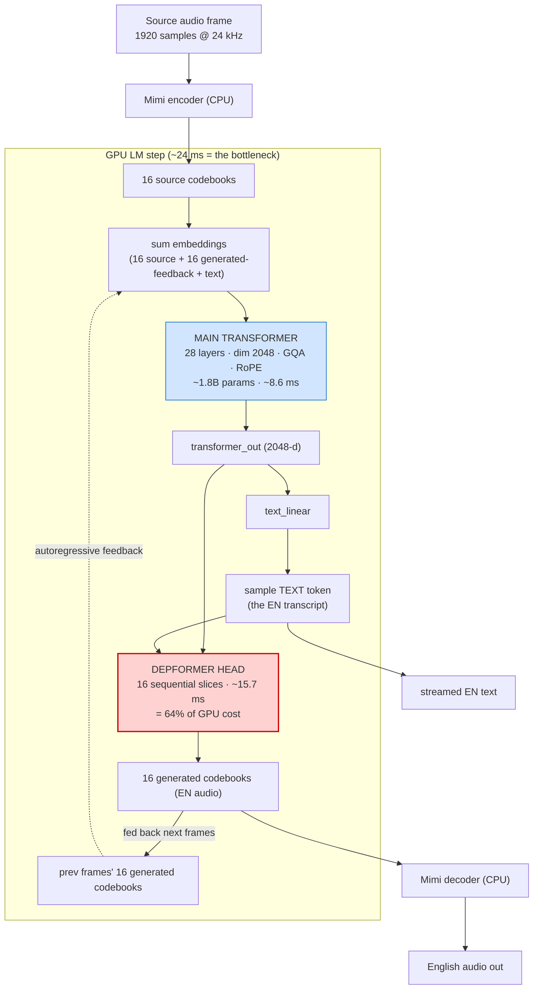
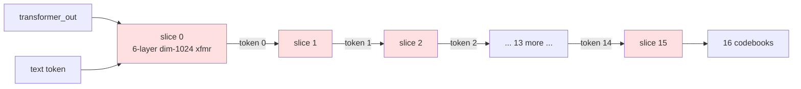
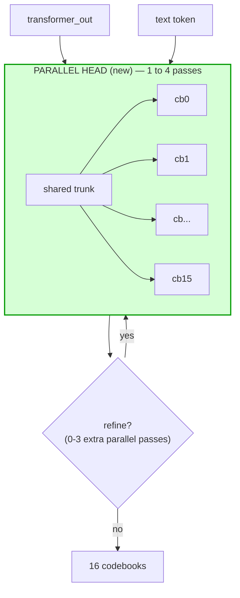
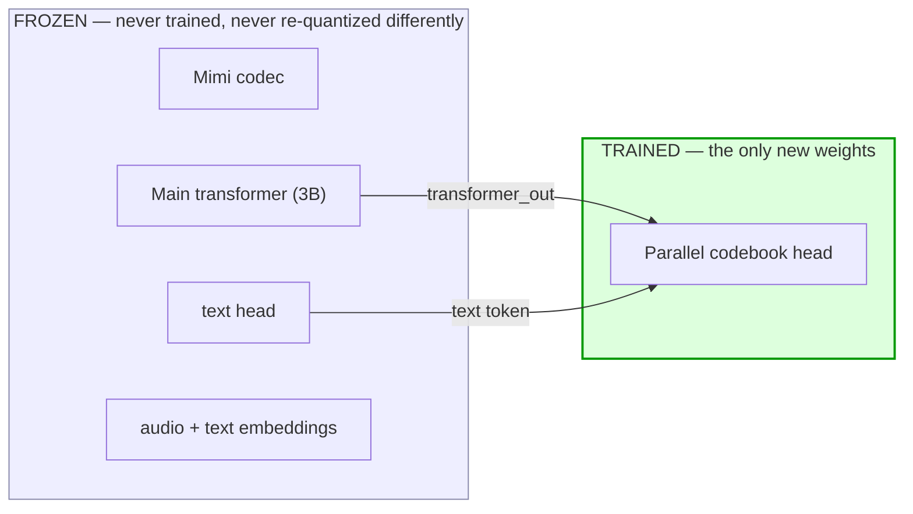
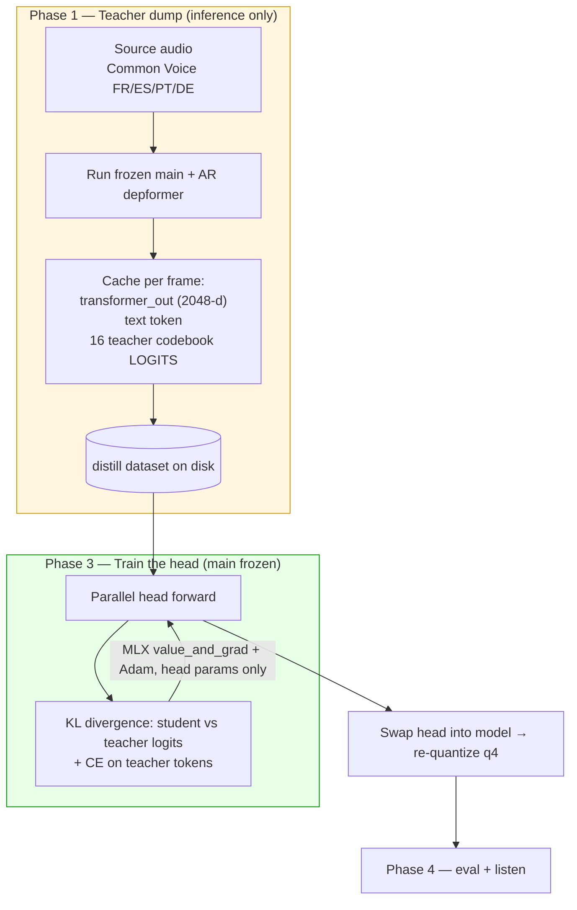
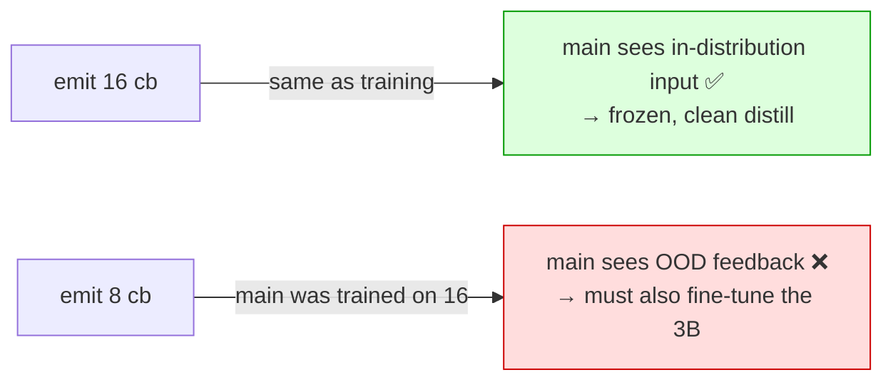
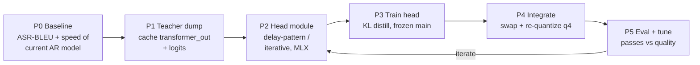
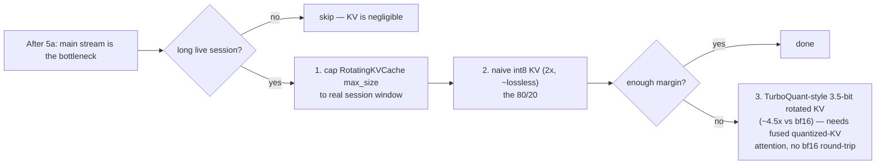

# Distilling a Parallel Codebook Head (5a) — Plan & Primer

Goal: make hibiki-zero fast enough for **real-time speech translation on iPhone** by
removing the depformer's 16 sequential passes, **without** retraining the 3B model or
needing the original training dataset.

This doc is both a **plan** and a **learning guide**. It explains the architecture,
*where* we cut, *how* we distil, the data, and the phase-by-phase steps.

---

## 0. TL;DR

- The model = a **frozen 3B "main" transformer** + a **small "depformer" head** that
  turns each frame's hidden vector into 16 audio codebooks **one at a time (16 GPU passes)**.
- Profiling showed that head is **64 % of the per-frame GPU cost** and is **launch-bound**
  (0.72 ms/slice × 16). No quantization fixes it — only making it **parallel** does.
- We **keep all 16 codebooks** (cb8 was tempting but breaks the frozen-main assumption — see §6),
  and replace the *autoregressive* head with a **parallel / few-step head**.
- We train *only the new head* by **self-distillation**: the existing model is the **teacher**,
  generating targets from monolingual source audio. Frozen main ⇒ no dataset, no full training stack.
- **Data:** Common Voice (bulk training) + Audio-NTREX-4L (eval + validation).

---

## 1. Current architecture (per 80 ms frame, 12.5 Hz)

**Key facts that drive the whole plan**
- `transformer_out` is one 2048-d vector per frame. Everything audio comes from it.
- The **text stream does not go through the depformer** — so our change cannot hurt
  translation text quality, only audio.
- The **16 generated codebooks feed back** into the main transformer on later frames.
  This feedback is why we must keep emitting 16 (see §6).

---

## 2. Why the depformer is the bottleneck

The depformer produces codebook *k* using the token it just sampled for codebook *k−1* —
a strict left-to-right recurrence **inside every frame**:

- 16 slices × 6 layers = **96 tiny single-token transformer passes** per frame → ~370 kernel
  launches. Measured **0.72 ms/slice, dead-linear** ⇒ latency/launch-bound, not compute or memory.
- Consequence (proven experimentally): **quantization gives 0 % speedup** here. The only fix is
  to stop doing 16 sequential passes.

---

## 3. The change: a parallel codebook head (5a)

Replace the 16-step recurrence with a head that emits all 16 codebooks in **1 — or a few —
passes**, preserving inter-codebook structure via a **delay pattern** (cross-frame conditioning)
and/or **iterative refinement** (MaskGIT/SoundStorm-style).

**The single knob to discover:** number of passes.
- **1 pass** (fully non-autoregressive) = fastest (~3 ms on M4), highest quality risk
  (loses within-frame inter-codebook dependency).
- **2–4 passes** (iterative) = still 4–8× fewer than 16, much safer quality.

Two well-trodden designs to choose between in Phase 2:
- **Delay pattern (MusicGen-style):** offset each codebook by a fixed delay so codebook *k*
  conditions on *already-decided* tokens from previous frames → parallel within a frame, no recurrence.
- **Iterative parallel (MaskGIT/SoundStorm):** predict all, mask the least-confident, re-predict,
  a fixed small number of rounds.

---

## 4. Where we cut: frozen vs trained

Because the main transformer is **frozen** and we **still emit 16 codebooks**, its input
distribution is unchanged. That is what makes this a *small, self-contained* training job
instead of a full retrain.

---

## 5. How we distil (self-distillation)

The current AR depformer is the **teacher**. We never need human translation labels because the
teacher produces the targets from any source-language audio.

Why this is cheap:
- **Phase 1 is plain inference** — run it in the background; the frozen main is used only to
  produce `transformer_out` once per frame, then thrown away (we train on the cache).
- **Phase 3 trains a small head** — runs in MLX on the same `lm.py` module, optimising only the
  head's parameters (`mlx.nn.value_and_grad` + `mlx.optimizers`, stop-grad on everything else).
  Fits on the M4 / one rented GPU, hours–days.
- **Loss = distillation**, so the student inherits the teacher's inter-codebook distribution as
  well as a parallel head can represent it.

---

## 6. Why we keep cb16 (and not cb8)

cb8 sounded acceptable in the codec test, but that test only measured **decoding** fewer codebooks —
it ignored the **feedback loop**:

- **cb16-parallel:** main transformer stays frozen → the whole plan above holds.
- **cb8:** changes what feeds back into the main transformer → it goes out-of-distribution →
  you must fine-tune the 3B too (bigger data, bigger compute, the expensive part no longer frozen).
- cb8 saves only ~5 ms/frame more than cb16-parallel. **Not worth turning a head-swap into a 3B
  fine-tune.** Decision: **cb16-parallel**.

---

## 7. Data plan

| Source | Role | Why |
|---|---|---|
| **Common Voice** FR/ES/PT/DE | Bulk teacher-dump (training) | Large, **real human speech**, monolingual source is all distillation needs. Start ~10–20 h, scale to ~100 h (≈4.5 M frames) if quality needs it. |
| **Audio-NTREX-4L** (test split) | **Held-out eval** | Has English `target_text` → ASR-BLEU. Never train on it. |
| **Audio-NTREX-4L** (val split) | Validation during training | Track distill quality vs the teacher. |

Notes:
- NTREX-4L is **TTS audio** — clean/synthetic. Keep the bulk training on Common Voice (real mic-like
  speech) so the head doesn't overfit a synthetic domain it won't see live.
- Distillation needs **only source audio**; the English references in NTREX are for *scoring*, not training.

---

## 8. Evaluation

Three gates, run before/after every head iteration:

1. **Speed** — `scripts/profile_mlx.py` + the per-slice harness: confirm depformer 15.7 ms → ~3–6 ms,
   and project the iPhone budget (target ≤ 80 ms/frame; ~40 ms gives 2× headroom).
2. **Audio sanity** — the **silence-in test** (zeros → rms < 0.10, peak < 1.1). Catches babble/clipping
   instantly, like the depformer-LayerNorm bug did.
3. **Translation quality** — **ASR-BLEU** on NTREX-4L test: Whisper-transcribe the EN audio, BLEU vs
   `target_text`. Compare student head vs teacher (AR depformer) — aim for ≤ small BLEU drop.
   (Text-stream quality is unaffected by construction — a useful invariant to assert.)

---

## 9. Phases & deliverables

| Phase | Deliverable | Notes |
|---|---|---|
| **P0** | `eval_asr_bleu.py` + baseline numbers | Establish the teacher's BLEU & speed to beat/match. |
| **P1** | `dump_teacher.py` → cached `(transformer_out, text_token, cb_logits)` shards | Inference only; resumable; start with 10–20 h. |
| **P2** | `parallel_head.py` (new `nn.Module`) | Pick delay-pattern vs iterative; configurable #passes. |
| **P3** | `train_head.py` (MLX, frozen main) | KL + CE loss; Adam; val on NTREX-val. |
| **P4** | new `hibiki.q4.safetensors` with parallel head + glue in `lm.py`/`generate.py` | Re-quantize; silence-in must pass. |
| **P5** | speed + ASR-BLEU report; chosen #passes | Walk passes 1→4, pick the knee of the quality/speed curve. |

---

## 10. Risks & mitigations

| Risk | Mitigation |
|---|---|
| Parallel head loses inter-codebook dependency → audio quality drop | Use delay-pattern or 2–4 iterative passes before going fully 1-pass; distill on **logits** (KL) not just tokens. |
| Training data too small / narrow | Scale Common Voice hours; mix accents/speakers; validate on NTREX-val each epoch. |
| TTS-domain overfit | Bulk-train on real speech (Common Voice), keep NTREX (TTS) for eval only. |
| Re-quantization regresses quality | Keep the new head bf16 first, verify, then q4; re-run silence-in + ASR-BLEU. |
| Licensing | Model is **CC BY-NC-SA 4.0**: derivatives are non-commercial + share-alike. Research/personal OK; no commercial ship. |

---

## 11. Optional post-5a phase — main-stream KV-cache quantization

**Separate from distillation** (training-free, no teacher). Only worth doing **after 5a**, when
the main transformer becomes the dominant cost, and only for **long live sessions** where the KV
cache grows large.

Why session length is the trigger (weight read is fixed ~0.88 GB/frame; KV read grows):

| session | KV cache (bf16, 28L · 8 kv-heads · d128 · k+v) | vs weight read |
|---|---|---|
| 10 s (125 fr) | ~29 MB | ~3% (skip it) |
| 64 s (800 fr) | ~183 MB | ~17% |
| cap 3000 (240 s) | ~688 MB | **~44% — worth halving** |

- **int8 KV:** store cached K/V as 1 byte → halve attention-read bandwidth (a *bandwidth* win →
  helps iPhone, not M4). Validate with silence-in + ASR-BLEU.
- **TurboQuant** (arXiv:2504.19874): random-rotation + per-coordinate Lloyd-Max scalar quant on the
  **KV cache**; data-oblivious/online (fits streaming). ~3.5 bits ≈ full precision, 2.5 bits marginal
  loss → ~4.5× vs bf16. Caveat: the win only lands if MLX/Metal consumes the sub-byte rotated K/V
  **without dequantizing to bf16 before `scaled_dot_product_attention`** — a fused quantized-KV
  attention is real engineering, and no turnkey path exists in MLX today. The rotation is a cheap
  fixed matmul.
- **Does NOT help** the depformer (launch-bound) or the per-frame weight read (already affine-q4).
  KV-only tool.

## 12. What we are NOT doing
- ❌ Retraining the 3B main transformer.
- ❌ Collecting parallel translation data (teacher provides targets).
- ❌ Re-implementing Kyutai's training pipeline (we write a ~few-hundred-line head trainer in MLX).
- ❌ Reducing codebooks (cb16 stays; that keeps the main frozen).

**Next concrete step:** P0 — write `eval_asr_bleu.py` and record the current AR model's BLEU + speed,
so every later change is measured against a fixed baseline.
