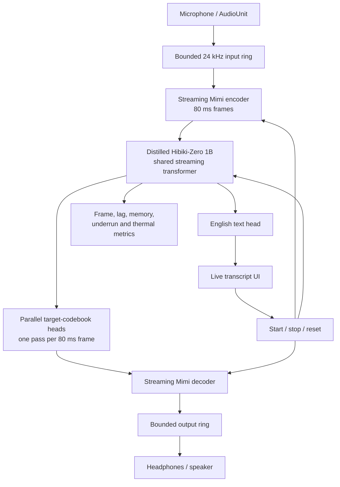
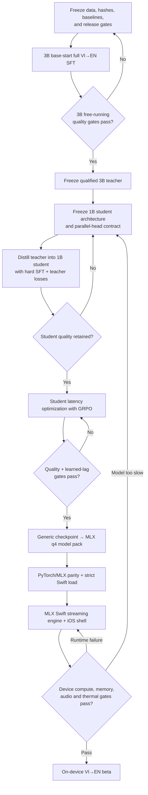

# Mobile real-time Vietnamese-to-English plan

Status: target plan based on repository state at commit `74f1b0f` on 2026-08-15.

## Decision

Ship one direction first: **Vietnamese speech in, English text and speech out,
fully on-device after model installation**. Bidirectional VI↔EN is a separate
model and training campaign; the current data layout, losses, and evaluator are
strictly VI→EN.

Use two models in sequence:

1. Fine-tune Hibiki-Zero 3B to establish the VI→EN quality ceiling and validate
   the data/training pipeline.
2. Distill that qualified Hibiki-Zero teacher into a purpose-built 1B
   Hibiki-Zero student with parallel target-codebook heads, optimize its learned
   translation latency, quantize it to q4, and run it through MLX Swift.

The 3B checkpoint is the teacher and Mac reference, not the phone artifact. The
mobile model is a smaller Hibiki-Zero architecture trained from that teacher,
not a separately pretrained translation family.

## Target and acceptance gates

The first supported device should be iPhone 16 Pro. Expand the device matrix
only after the on-device benchmark establishes actual headroom. The upstream
MLX Swift implementation has been tested on that device, but is explicitly a
proof of concept rather than a production app.

| Area | V1 gate |
|---|---|
| Direction | Vietnamese speech → English text + English speech |
| Privacy | No source audio leaves the phone during inference |
| Audio cadence | 24 kHz mono, one model frame every 80 ms |
| Compute | Sustained p95 model-frame work ≤64 ms, leaving 20% of the 80 ms budget |
| Streaming | No audio-callback blocking and no underruns in a 10-minute mixed speech/silence run |
| Learned lag | Median translated-word emission lag ≤3 s and p95 ≤6 s on a frozen long-form VI set |
| Text quality | Pass the existing nonempty/EOS/loop/length gates; 1B chrF must retain at least 95% of the qualified 3B teacher score |
| Speech quality | No clipping, silence collapse, persistent repetition, or semantic mismatch between emitted text and speech on the fixed listening set |
| Footprint | Peak RSS ≤3 GB, cold model load ≤10 s, and no jetsam or critical thermal state in the 10-minute run |
| Offline behavior | A complete, checksummed model pack loads and translates with networking disabled |

The latency and memory numbers are product targets, not claims about current
performance. `scripts/bench.py` only projects iPhone speed from a configurable
Mac scaling assumption; an actual device trace is the release gate.

## Current state

### What is already solid

- `main.py` and `hibiki_mlx/pipeline.py` implement the correct streaming shape:
  1,920 samples at 24 kHz per 80 ms frame, with separate Mimi encode, LM, and
  Mimi decode stages.
- The MLX runtime strictly loads q4 group-size-32 weights and contains the
  Hibiki architecture deltas needed by the 3B model.
- The CUDA trainer is deliberately simple: full-model, base-start SFT with fp32
  master weights, bf16 autocast, fused AdamW, exact full checkpoints, and
  deterministic length-sorted batches.
- Cached examples contain English text, English target audio codes, Vietnamese
  source audio codes, and a source EOS frame. PhoMT is streamed one parquet
  shard at a time instead of materializing the roughly 565 GB source dataset.
- Free-running evaluation already measures chrF/BLEU, nonempty output, EOS,
  length inflation, and repeated 4-grams. These are the right checkpoint
  selection signals; teacher-forced loss is diagnostic only.
- q4 artifact validation checks strict model reload, config keys, tokenizer,
  Mimi, and the group size expected by the stock Swift loader.

### What is not built yet

- No iOS project or Swift runtime integration exists in this repository.
- No 1B Hibiki-Zero student architecture or VI→EN student checkpoint exists.
- The vendored MLX model generates target audio through sequential DepFormer
  slices. It does not implement the student's parallel target-codebook heads.
- The current PyTorch-to-MLX converter is hardcoded to the upstream 3B base
  checkpoint, so it cannot promote an arbitrary teacher or student checkpoint.
- The current SFT optimizes translation/audio likelihood, not simultaneous
  translation latency. Hibiki-Zero's published recipe uses a coarse SFT stage
  followed by GRPO latency optimization.
- Checkpoint selection in `train.py` writes `model_best.safetensors` on raw chrF
  alone, even though `docs/validation_plan.md` says eligibility must be applied
  first. It also does not preserve the matching trainer state for that raw best.
- Swift compatibility currently proves artifact shape/load compatibility on a
  Mac. It does not prove numerical parity, live translation, frame deadlines,
  memory, audio I/O, or thermal stability on an iPhone.
- The checkout contains pair manifests but no weights, code caches, or run
  artifacts. The tracked manifests currently contain:

| Manifest | Rows | Vietnamese source hours | Role |
|---|---:|---:|---|
| `train.jsonl` | 1,449 | 4.44 | FLEURS train |
| `validation.jsonl` | 149 | 0.50 | FLEURS validation |
| `test.jsonl` | 347 | 1.24 | FLEURS final test |
| `val128.jsonl` | 128 | 0.44 | checkpoint selection |
| `phomt_train.jsonl` | 989 | 1.64 | already-processed PhoMT skip manifest, not the full dataset |

## Target system



The real-time audio callback must only move PCM through bounded rings. Model
work, allocation, tokenization, and UI updates stay off that callback. The
inference owner maintains one session state across Mimi encoder, LM KV cache,
and Mimi decoder and resets all three together at a session boundary.

The model pack is versioned as one atomic unit:

- q4 group-size-32 LM weights;
- matching `config.json`;
- matching Mimi weights;
- matching SentencePiece tokenizer;
- manifest with architecture, direction, version, file sizes, and SHA-256;
- qualification metrics and license files.

## Roadmap



### Phase 0 — Freeze the contract

Before spending on a full run:

1. Freeze the VI→EN product direction and the gates above.
2. Record the repository commit and SHA-256 for config, base model, Mimi,
   tokenizer, every pair manifest, and every completed cache shard.
3. Add a run fingerprint to `run_config.json`; reject resume when the
   fingerprint differs. `--resume-checkpoint` remains interruption recovery for
   the same run, never warm-starting another campaign.
4. Make free-running checkpoint selection gate-aware at its owner in
   `run_greedy_val`: promote only an eligible candidate and preserve its exact
   model/trainer pair before checkpoint rotation.
5. Establish base-model teacher-forced and free-running baselines on the frozen
   validation data before the first optimizer step.

Exit: a run can be reproduced from hashes, and an ineligible raw-chrF checkpoint
cannot be promoted or lose its matching trainer state.

### Phase 1 — Upcoming 3B full-model SFT

This phase is specified in full below. Its deliverable is a qualified 3B VI→EN
teacher, not an iPhone binary.

Exit: one exact 3B model/trainer pair passes the fixed free-running selection
gates, full validation, held-out test, and a speech-output listening check.

### Phase 2 — Distilled 1B parallel-head student

1. Freeze a roughly 1B-parameter Hibiki-Zero student architecture from the
   phone compute and memory budget. Preserve the teacher's Vietnamese-source,
   English-text, Mimi, tokenizer, delay, and source/target codebook contract.
   Reduce the shared transformer, and replace serial target-codebook generation
   with one independent output head per target codebook. No head may depend on
   another head's current-frame sampled token at inference.
2. Reuse the frozen 3B SFT code cache because the stream/codebook contract is
   deliberately preserved. Add student/teacher run metadata; do not create a
   second semantic cache format merely because the network is smaller.
3. Extend the PyTorch and MLX model definitions with the same explicit
   parallel-head architecture flag and tensor naming. Keep one trainer and one
   checkpoint invariant rather than creating a separate mobile trainer.
4. Train the full student against two signals in the same run:
   - hard English text and target-audio codebook CE from the existing cache;
   - distillation from the frozen qualified 3B teacher for English text and
     every target codebook.
5. Run the teacher in no-grad BF16 and consume its outputs in the current batch;
   do not materialize dense teacher logits for the full dataset. Log hard-SFT,
   text-distillation, and per-codebook distillation losses separately.
6. Ensure all codebook heads execute in parallel in the student benchmark. A
   Python loop that merely presents serial heads as a new module does not meet
   the mobile architecture contract.
7. Select a BF16 student checkpoint before latency tuning or quantization.
   Quantization must never hide a failed student.

Exit: the BF16 parallel-head student passes all generation-health and speech
gates, reaches at least 95% of qualified-teacher chrF, and demonstrates the
expected serial-DepFormer removal in a traced frame profile.

### Phase 3 — Learned-latency optimization

The SFT cache supplies coarse random target delays but has no objective that
directly rewards earlier correct translation. Implement the Hibiki-Zero
sequence explicitly instead of treating SFT loss as a latency metric:

1. Generate several streaming candidates per VI input from the qualified 1B
   distilled-student checkpoint.
2. Score intermediate English text at fixed source-time checkpoints against the
   reference and form process rewards.
3. Apply GRPO to the student so correct translation is emitted earlier while
   retaining the final-translation score.
4. Evaluate final chrF/generation health and timestamped emission lag after
   every candidate checkpoint.
5. Promote only checkpoints that pass both quality and lag gates.

Exit: median/p95 learned lag passes the target without breaking the SFT quality
or generation-health gates.

### Phase 4 — Reproducible q4 artifact

1. Replace the hardcoded conversion paths with one staging command that accepts
   config, arbitrary PyTorch checkpoint, Mimi, tokenizer, and output directory.
2. Convert the selected student PyTorch state into the parallel-head MLX
   naming/layout, quantize compatible tensors to 4 bits with group size 32, and
   write the atomic model pack.
3. Strict-reload the generated q4 state and validate sidecars.
4. Run the same frozen clips through BF16 PyTorch and q4 MLX. Compare text
   health/chrF, output duration, silence behavior, and audible speech. Use q4
   only if its regression stays inside the frozen tolerance.
5. Run the Mac q4 performance and silence gates. Treat the projected iPhone
   number as planning information only.

Exit: a checksummed q4 pack has strict load compatibility and measured
BF16→q4 quality parity.

### Phase 5 — MLX Swift engine and app

1. Pin an upstream `moshi-swift` commit and fork only the library/runtime pieces
   needed for Hibiki and Mimi. Add the distilled student's parallel-head model
   path; the stock sequential-codebook loader is not the target architecture.
2. Load the local model pack, verify hashes, and create the model session before
   enabling the microphone.
3. Implement the target-system graph above with bounded rings and a single
   session lifecycle. Mirror the logical Python encode→LM→decode boundary, but
   profile the Swift implementation rather than assuming the Mac's CPU/GPU
   overlap transfers to iOS.
4. Emit text incrementally and render only stable token pieces. Feed decoded PCM
   through an output ring; headphones are the first supported listening mode so
   model output cannot immediately re-enter the microphone.
5. Instrument every 80 ms frame: encode, LM, decode, callback underruns, queue
   depth, first-token/first-audio time, learned lag, RSS, and thermal state.
6. Add start, stop, interruption, route-change, and complete session reset. Do
   not silently retain Mimi or KV state across sessions.

Exit: the pinned model pack translates a fixed file and live microphone input
on iPhone with matching text/audio behavior.

### Phase 6 — Device qualification and beta

Run the frozen matrix on the minimum supported phone:

- clean speech, conversational speech, regional accents, code-switching,
  numbers/names, noise, long pauses, and end-of-stream flush;
- 10-minute live sessions with headphones;
- airplane-mode launch and translation after the pack is installed;
- repeated start/stop, calls/interruptions, Bluetooth route changes, background
  and foreground transitions;
- cold and warm load, p50/p95/p99 frame timing, underruns, RSS, energy, and
  thermal state;
- final text, generated speech, learned lag, silence, EOS, repetition, and
  crash/jetsam outcomes.

Ship the beta only when one exact app build and one exact model-pack hash pass
the complete matrix. A new model pack repeats parity and device qualification.

## Full upcoming fine-tune phase

### 1. Purpose and non-goals

The upcoming run is the existing **Hibiki-Zero 3B, base-start, full-model SFT**
campaign. It proves that the cached VI source stream can drive coherent English
text and English audio while preserving the base model's streaming structure.

It does not deliver:

- the distilled 1B parallel-head phone checkpoint;
- bidirectional EN→VI;
- q4/device qualification;
- a learned low-latency policy;
- a production iOS application.

### 2. Blocking preflight changes

Make only two training-control changes before launch:

1. **Gate-aware promotion.** Encode the four eligibility checks from
   `docs/validation_plan.md` in the free-running evaluator and promote the exact
   model/trainer pair only when eligible. Rank eligible pairs by chrF and apply
   the nonempty-chrF regression rule. Stop using raw `model_best.safetensors` as
   the campaign answer.
2. **Run identity.** Store and validate the base/config/Mimi/tokenizer/cache
   hashes, repository commit, and schedule/data arguments on start and resume.
   Resume must fail if any of them changed.

These fixes belong at checkpoint selection and resume, where the invariants are
owned. They avoid operator-only rules that checkpoint rotation can violate.

### 3. Freeze and audit data

1. Download/build FLEURS train, validation, and test pairs. Keep validation and
   test entirely out of training.
2. Cache FLEURS train and validation with the final 3B config, Mimi, tokenizer,
   cache seed `1234`, and target-delay policy. The training order uses seed `42`
   separately.
3. Stream the full PhoMT publication into cache shards. Use multiple independent
   workers, one parquet shard per worker, and `--skip-pairs
   finetune/pairs/phomt_train.jsonl` for rows already processed.
4. Check exact and normalized VI/EN text duplicates across PhoMT/FLEURS train
   versus validation/test. Remove leakage from training before the cache freeze.
5. Reject empty/invalid text, failed audio decode, wrong sample rate/codebook
   shapes, duplicate sample IDs, and non-finite PCM.
6. Record the distribution of source duration, target duration, target delay,
   assembled frames, text tokens, and source hours by corpus.
7. Apply the final `--max-frames 280` filter and record both kept and dropped
   rows. At 12.5 Hz this is 22.4 seconds of assembled codes; PhoMT's 25-second
   source filter does not guarantee the assembled example survives because
   target audio and target delay can make it longer.
8. Freeze a manifest containing every cache shard path, sample count, bytes,
   and SHA-256. Do not add or replace shards after the run starts.

Use the existing unweighted PhoMT + FLEURS pool for this first campaign. Do not
change mixture or sampling mid-run. If the qualified checkpoint later fails the
real-speech gate, change the frozen data mixture in a new base-start campaign.

### 4. Establish baselines

Before training, save these artifacts under a separate baseline directory:

1. Teacher-forced metrics on the full cached FLEURS validation split.
2. Deterministic free-running text metrics on `val128.jsonl` with temperature 0.
3. Free-running text and audio for a fixed listening subset covering short,
   long, male/female, fast, noisy, names, and numbers.
4. Generation-health metrics and wall-time/real-time factor.

The base may translate Vietnamese poorly; the baseline still proves the
evaluator and provides the denominator for improvement.

### 5. Run a mechanics smoke

Run 10 optimizer steps on a deterministic 160-row cache slice with the same
model, batch size, max frames, optimizer, loss weights, autocast, validation,
and checkpoint code as the full run. Use `--max-steps 10`, `--save-every 10`,
`--val-every 10`, `--eval-every 10`, and `--eval-limit 16`.

This smoke verifies mechanics, not the full-run schedule fractions. It passes
only if:

- all parameters are trainable;
- the logged loss is finite;
- the LR matches the 10-step smoke's `run_config.json`;
- model and trainer checkpoints both exist;
- a fresh process strict-loads the saved full model and optimizer;
- teacher-forced validation completes;
- free-running predictions/metrics are parseable, and a separate one-row audio
  evaluation produces non-corrupt output;
- a resume continues at step 10 with identical run identity.

Delete the smoke outputs after recording the result; never use the smoke model
to initialize the full run.

### 6. Capacity and step count

After the final frame filter, let `N` be the number of cached training rows.
With batch size 16, gradient accumulation 1, and two epochs:

`total_steps = 2 × ceil(N / 16)`

If all roughly 696,000 published PhoMT rows plus 1,449 FLEURS train rows
survived, the run would be about 87,182 optimizer steps. The actual frozen cache
count is authoritative.

Provision space for caches plus at least four complete model/trainer pair
footprints. The trainer notes that one full pair is roughly 35 GB. The add-only
Hub sync retains history, so remote quota must cover every pair it uploads.
Estimate wall time from the smoke's measured seconds/step and add the scheduled
greedy-evaluation time; do not estimate it from Mac inference speed.

### 7. Launch configuration

Use the maintained recipe after substituting only frozen absolute paths:

```bash
python finetune/train.py \
  --model-weight weights/hibiki-pytorch-77f82164@110.safetensors \
  --cache-dir finetune/cache/phomt_stream finetune/cache/train \
  --val-cache-dir finetune/cache/validation \
  --batch-size 16 --max-frames 280 --sort-by-length \
  --epochs 2 \
  --lr-schedule "1e-4@0,3e-5@0.5" --warmup-steps 500 \
  --text-weight-schedule "5@0,2@0.6" \
  --text-prefix-pad-weight 0.5 \
  --seed 42 \
  --val-every 2000 --val-batch-size 8 \
  --eval-every 9000 \
  --eval-pairs finetune/pairs/val128.jsonl \
  --eval-limit 128 --eval-batch-size 8 --eval-text-temp 0 \
  --save-every 3000 --keep-checkpoints 3 --log-every 10 \
  --out-dir finetune/runs/vi_base_full
```

Start `hf_sync.py` only after confirming repository/quota ownership and the
first complete pair. It is disaster recovery, not checkpoint selection.

### 8. Monitor the run

At launch, verify the printed sample count/source hours, trainable parameter
count, total steps, and `run_config.json` against the frozen record.

During training:

- every 10 steps: loss, text/audio components, active weights, LR, seconds per
  step, batch/frame exposure, and padding efficiency;
- every 2,000 steps: teacher-forced audio/text loss, content-only text loss and
  accuracy, and silence score;
- every 3,000 steps: exact model/trainer recovery pair and strict reload;
- every 9,000 steps: deterministic free-running `val128` predictions, all
  generation-health metrics, chrF, and gate-aware promotion;
- continuously: GPU memory, disk headroom, sync freshness, and process health.

Stop immediately on non-finite loss, a run-fingerprint mismatch, LR mismatch,
checkpoint reload failure, corrupt generated output, or loss of the cache/base
artifacts. Teacher-forced improvement never overrides failed free-running gates.

### 9. Select the 3B checkpoint

A checkpoint is eligible on the fixed 128 rows only if all four existing gates
pass:

| Gate | Requirement |
|---|---:|
| Nonempty | ≥122 / 128 |
| EOS | ≥116 / 128 |
| Repeated 4-gram failures | ≤12 |
| Mean prediction/reference word ratio | ≤2.0 |

Among eligible checkpoints, rank by corpus chrF. Reject a candidate when
nonempty chrF falls by more than one absolute point while corpus chrF rises.
Preserve the exact selected model/trainer pair, selection metrics, predictions,
and hashes outside rotating step checkpoints.

If no checkpoint is eligible, the campaign has no winner. Diagnose the frozen
data, target-delay distribution, loss balance, and collapse metrics, then start
a new base-start campaign; do not promote the final or raw-chrF-best checkpoint.

### 10. Final qualification

After selection and without using test results to change the choice:

1. Re-run deterministic free-running evaluation on all FLEURS validation rows.
2. Run it once on all FLEURS test rows.
3. Generate speech for the fixed listening set and check semantics against the
   text output, continuity, clipping, silence, repetition, pronunciation of
   names/numbers, and end-of-stream behavior.
4. Re-run strict full-checkpoint load in a fresh process.
5. Archive the selected model/trainer pair, base and data hashes, repository
   commit, environment, run config, logs, predictions, metrics, and listening
   samples.

Exit only when the selected 3B teacher is independently reloadable and its
qualification bundle is complete. Then begin parallel-head student distillation
using the same frozen code cache; do not spend time packaging the 3B model as
the final phone model.

## References

- Local runtime: [`main.py`](../main.py),
  [`hibiki_mlx/pipeline.py`](../hibiki_mlx/pipeline.py)
- Training: [`finetune/train.py`](../finetune/train.py),
  [`finetune/common.py`](../finetune/common.py),
  [`docs/training_plan.md`](training_plan.md),
  [`docs/validation_plan.md`](validation_plan.md)
- Data: [`finetune/cache_codes.py`](../finetune/cache_codes.py),
  [`finetune/cache_phomt_stream.py`](../finetune/cache_phomt_stream.py)
- Deployment checks: [`scripts/bench.py`](../scripts/bench.py),
  [`scripts/check_swift_compat.py`](../scripts/check_swift_compat.py),
  [`scripts/convert_mlx_q4.py`](../scripts/convert_mlx_q4.py)
- [Hibiki-Zero paper](https://arxiv.org/abs/2602.11072)
- [MLX Swift runtime and proof-of-concept iOS app](https://github.com/kyutai-labs/moshi-swift)
