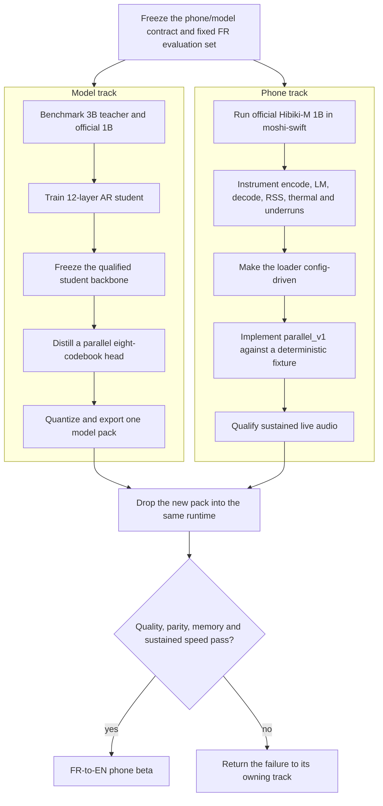
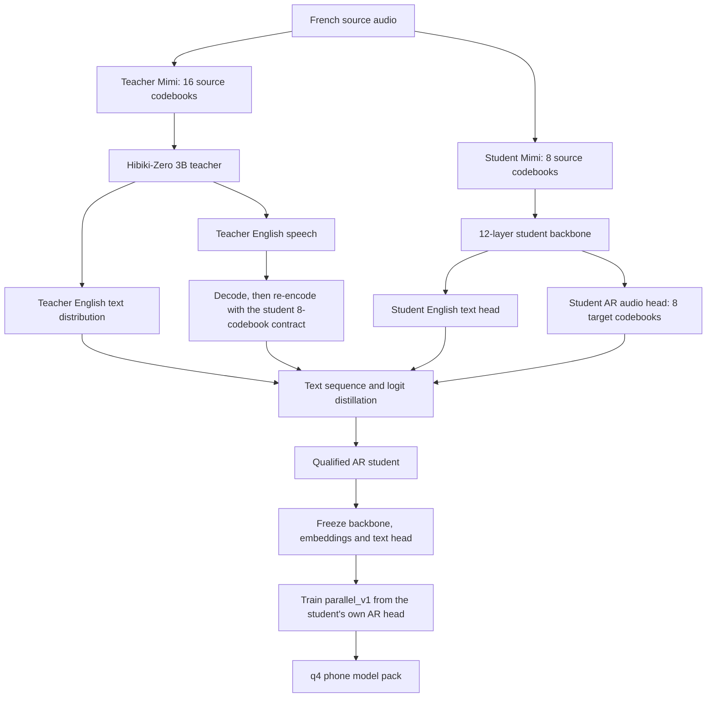
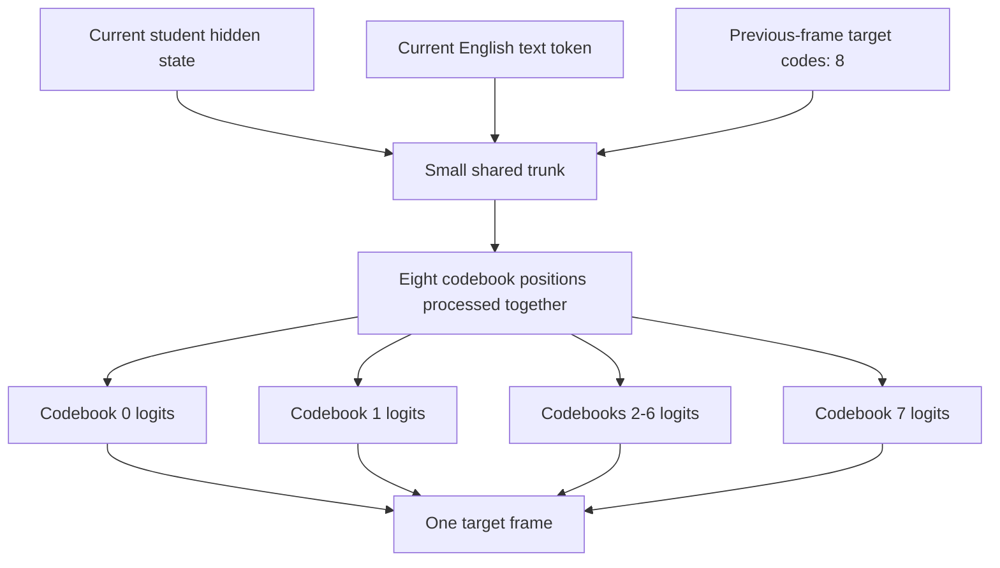
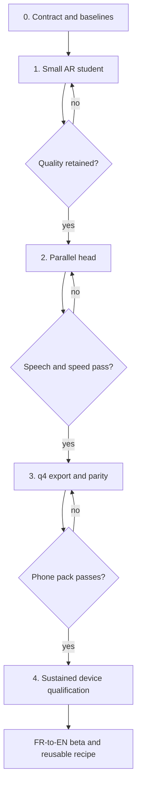

# Phone student plan: Hibiki-Zero 3B -> sub-1B FR-to-EN

Status: high-level execution plan. French-to-English is the first route; a
Vietnamese checkpoint is not a prerequisite.

## Decision

Use Hibiki-Zero 3B as the quality teacher, but use Kyutai's existing Hibiki-M
1B shape and phone runtime as the compatibility anchor. Do not physically prune
the 3B checkpoint into an arbitrary architecture.

The first trained candidate is:

- a 12-layer, width-2048 streaming backbone initialized from compatible
  Hibiki-M 1B weights and distilled from Hibiki-Zero 3B;
- the Hibiki-M phone stream contract: 24 kHz, 12.5 frames/s, eight source and
  eight target Mimi codebooks;
- an ordinary autoregressive eight-codebook head for the first quality gate;
- a compact parallel eight-codebook head trained only after the backbone is
  frozen;
- q4 group-size-32 weights for deployment.

This should land below the current 1B model without inventing a new width,
tokenizer, codec, or mobile protocol. Measure the exact parameter count and
device latency before naming the model by size.

The official 1B model is already an FR-to-EN, on-device Hibiki reference, and
the official MLX Swift implementation has been tested on an iPhone 16 Pro. It
therefore gives the phone engineer a working checkpoint on day one while the
new model is trained.

## Outcome and gates

The target is sustained faster-than-real-time translation on the first device,
not a good Mac projection.

| Area | Gate |
|---|---|
| Device | iPhone 16 Pro first; widen the matrix after it passes |
| Frame cadence | One 1,920-sample frame every 80 ms at 24 kHz |
| Sustained speed | p95 of each pipelined model stage <=64 ms during a 10-minute run |
| Stretch speed | p95 LM step <=40 ms, giving roughly 2x model headroom |
| Audio path | No callback blocking, underruns, or unbounded queues |
| Text quality | At least 95% of the better fixed-set score from 3B Zero and official 1B |
| Speech quality | No silence collapse, clipping, persistent loops, or text/speech mismatch |
| Footprint | q4 LM weights <=1.0 GB, complete pack <=1.5 GB, and peak app RSS <=2.5 GB |
| Parity | PyTorch, MLX, and MLX Swift agree on a frozen per-frame fixture |

The 64 ms gate leaves 20% of the 80 ms frame budget. Because encode, LM, and
decode are pipelined, the relevant steady-state budget is the slowest stage,
not the sum of all three.

## Two tracks that can run now

The tracks share an artifact contract, not source branches or internal training
code. The runtime engineer does not wait for a new checkpoint, and the model
engineer does not optimize Swift.

## Model shape and distillation boundary

There are two important boundaries:

1. **3B -> small AR student is full-model distillation.** This transfers
   translation and speech behavior while changing depth and the Mimi stream
   width.
2. **AR student -> parallel head is head-only self-distillation.** Its teacher
   is the qualified student's own AR head, because that teacher sees the exact
   student hidden states and eight-codebook contract.

If the student backbone changes, retrain the parallel head. This is the shared
invariant that prevents a stale head from being attached to a new main model.

Do not apply direct KL between all 16 teacher audio heads and eight student
heads. The owning boundary is waveform/code conversion: generate teacher
speech, then encode it using the student's Mimi stream contract. Direct
per-codebook KL is only valid after codebook identity has been demonstrated.

## Parallel head contract

`parallel_v1` has no dependency on another current-frame sampled codebook.
Every codebook position must be executed in one batched operation. Start with
one pass; add a fixed second refinement pass only if the listening and
intelligibility gates require it. Do not disguise eight serial Python or Swift
calls behind a parallel class name.

Keep this head compact. Its trunk and embeddings should be shared across
codebooks; only the final projections need codebook identity. A parallel head
that adds hundreds of millions of bandwidth-bound parameters has removed one
bottleneck by creating another.

## Phases

### Phase 0 - freeze the contract and remeasure

- Pin teacher, official 1B, Mimi, tokenizer, data, and repository revisions.
- Run the same FR set through 3B and official 1B. The 3B is not automatically a
  better FR teacher; use distillation only where it improves the fixed-set
  target.
- Record per-stage Mac timings, but make the official 1B phone trace the first
  device baseline.
- Count parameters and estimate q4 size for the 12-layer candidate before the
  first full run.
- Freeze one short per-frame parity fixture: input codes, previous state, text
  token, output logits, and next state.

Exit: the quality reference, latency bottleneck, student config, and exchange
format are fixed.

### Phase 1 - train the smaller AR student

- Initialize compatible embeddings, projections, and uniformly selected
  backbone layers from the official 1B model. Keep width 2048 and remove four
  backbone layers.
- Train the full student on French source audio with hard aligned targets plus
  teacher-generated targets.
- Use teacher text KL/sequence targets and student-contract audio codes. Do not
  cache full dense audio logits for a large corpus.
- Include student rollouts during the final stage so training covers the target
  codes that will feed back at inference, rather than only perfect teacher
  histories.
- Compare against both fixed references, not only against the 3B teacher.

Start with a small mechanics run, then one real run. Do not launch a grid of
student widths and depths. Only consider ten layers after the 12-layer model has
passed quality and the device trace shows that the main transformer still owns
the missed budget.

Exit: a BF16 AR student passes text, speech, EOS, silence, and loop gates.

### Phase 2 - replace the serial head

- Freeze the qualified student main, text head, and embeddings.
- Run its AR head over real French audio and capture the conditioning state,
  text token, prior-frame codes, teacher tokens, and compact top-k targets.
- Train `parallel_v1` with codebook CE plus teacher KL.
- Sweep only one and two passes. Select the fastest candidate that passes the
  fixed listening and intelligibility gates.
- Profile the compiled graph to confirm all eight output heads execute in
  parallel.

Exit: BF16 parallel audio stays inside the agreed quality delta and is faster
than the AR student on the target device or its exact MLX graph.

### Phase 3 - q4 pack and cross-runtime parity

- Export one config-driven pack containing q4 group-size-32 LM weights, Mimi,
  tokenizer, manifest, hashes, and qualification receipt.
- Quantize only after BF16 quality passes.
- Compare BF16 PyTorch, q4 MLX, and q4 MLX Swift on the same fixture and fixed
  clips.
- Reject silent tensor-name remapping and shape guessing; the pack config owns
  the architecture.

Exit: replacing the official 1B pack requires no app code change and preserves
the accepted BF16 behavior.

### Phase 4 - device qualification

- Run clean speech, accents, noise, silence, long pauses, and end-of-stream
  flushes.
- Measure p50/p95/p99 encode, LM, and decode time separately for ten minutes.
- Record RSS, queue depth, underruns, thermal state, energy, first text/audio,
  and translation lag.
- Test cold load, repeated reset, route changes, interruptions, and airplane
  mode.

Exit: one exact app build and one exact model-pack hash pass the full matrix.

## Shared model-pack contract

Freeze these fields before the tracks split:

| Contract item | Required value or rule |
|---|---|
| Audio | 24,000 Hz mono; 1,920 samples per frame |
| Frame rate | 12.5 Hz |
| Codec streams | `n_q=16`, `dep_q=8` for eight source + eight target codebooks |
| Vocabulary | Existing 48k SentencePiece model |
| Context | Read from config; never hardcode it in the app |
| Head | `ar` or `parallel_v1`; fixed `head_passes` in config |
| Quantization | q4, group size 32 |
| State | Explicit Mimi, LM KV, and head state shapes |
| Files | weights, config, Mimi, tokenizer, manifest, hashes, receipt |
| Parity | Frozen input/state/output fixture for each architecture revision |

The student cache must record the Mimi hash, `n_q`, `dep_q`, tokenizer hash, and
model config. A cache created for the 3B 16+16-codebook contract must not be
silently loaded by the eight+eight student.

## Work ownership and handoffs

| Owner | Work | First deliverable | Final deliverable |
|---|---|---|---|
| Model | student config, data conversion, full distillation, parallel head, q4 export | config + parity fixture + untrained shape-valid pack | qualified q4 pack |
| Phone | moshi-swift baseline, audio pipeline, config loader, parallel graph, profiling | sustained official-1B device trace | qualified app build |
| Shared | fixed clips, metrics schema, artifact manifest, release gates | signed-off contract | joint qualification receipt |

Handoffs happen at four stable points:

1. shape-valid untrained pack, for loader and memory work;
2. short-run BF16 pack, for numerical parity;
3. qualified AR q4 pack, for full pipeline measurement;
4. qualified parallel q4 pack, for final device selection.

## What FR-to-EN proves, and what it does not

FR-to-EN proves the student architecture, distillation loop, parallel head,
artifact contract, and phone runtime without waiting for Vietnamese training.
It does not prove Vietnamese quality.

When a Vietnamese 3B teacher qualifies, rerun Phase 1 on Vietnamese data and
then rerun Phase 2 against that final student backbone. If the same phone
contract is preserved, the application work carries over unchanged.

## Immediate next actions

1. Phone owner: build and profile the official Hibiki-M 1B checkpoint on the
   first device using the upstream MLX Swift path.
2. Model owner: write and freeze the 12-layer student config and parameter/size
   receipt, then run a short FR distillation smoke.
3. Both owners: agree on the model-pack manifest and one parity fixture before
   either track adds architecture-specific glue.

## References

- [Hibiki-Zero 3B](https://github.com/kyutai-labs/hibiki-zero)
- [Hibiki and Hibiki-M 1B](https://github.com/kyutai-labs/hibiki)
- [Experimental MLX Swift runtime and iOS app](https://github.com/kyutai-labs/moshi-swift)
- [Existing detailed VI-to-EN roadmap](mobile_realtime_vi_en_plan.md)
