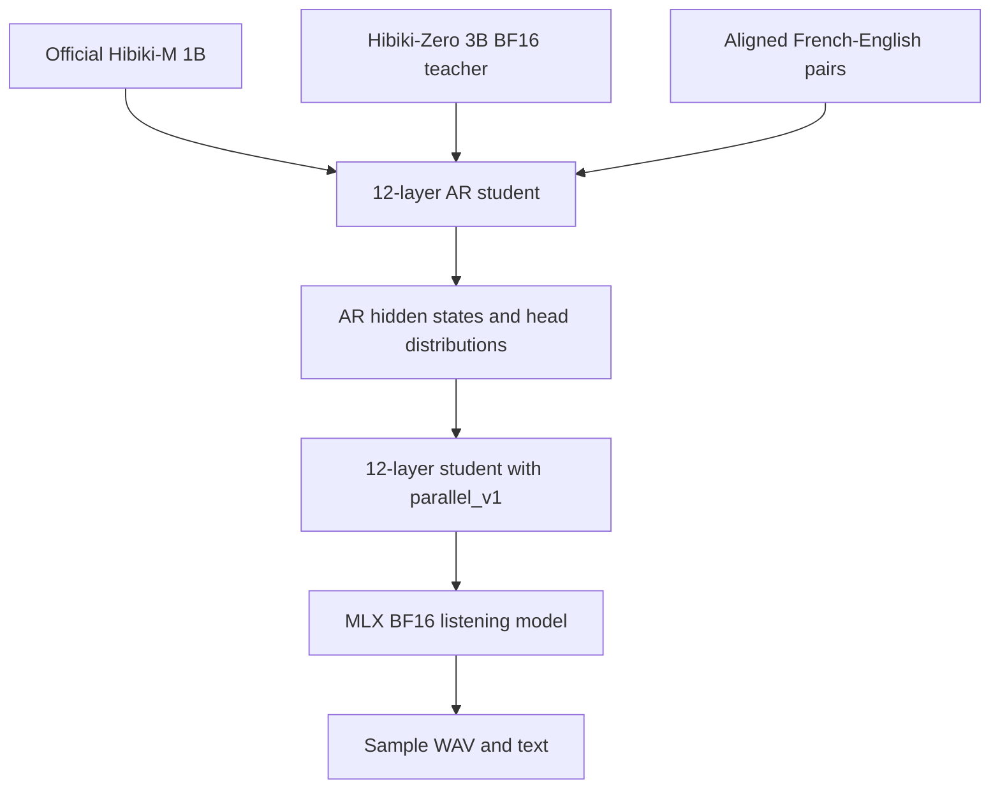
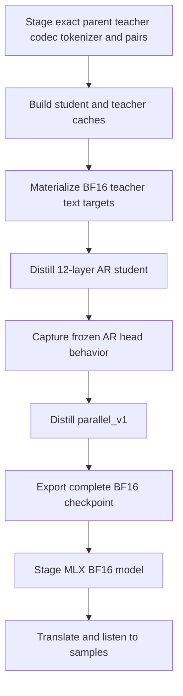

# Phone student plan: BF16 listening candidate

Status: implementation complete; CUDA execution and manual listening remain.

## Decision

Create one smaller Hibiki student and judge it by listening to sample
translations before adding deployment work.

- Initialize a 12-layer, width-2048 AR student from the official Hibiki-M 1B.
- Distill text behavior from the frozen Hibiki-Zero 3B teacher.
- Train hard target audio under the eight-codebook student Mimi contract.
- Freeze the AR model and distill its serial depformer into `parallel_v1`.
- Export and run the listening model in BF16.
- Keep training masters and optimizer state in FP32.

There is no automatic quality validation, benchmark, qualification receipt,
student q4 conversion, or phone release gate in this iteration. Those can be
added after a BF16 sample sounds worth deploying.

## Precision contract

Distillation uses BF16 compute, not BF16 optimizer masters:

| Part | Precision |
|---|---|
| Frozen 3B teacher inference | BF16 |
| Student forward/backward | BF16 autocast |
| CE and KL reduction | FP32 |
| Student master parameters | FP32 |
| AdamW state | FP32 |
| Recovery checkpoints | FP32 |
| Final listening checkpoint | BF16 |

This keeps H100 tensor-core execution while preserving small optimizer updates
and exact resume. `student.export_parallel` is the only boundary that casts the
complete listening model to BF16.

## Model flow

## Frozen architecture

The main transformer keeps the phone-oriented Hibiki-M contract:

- 12 transformer layers selected uniformly from the 16-layer parent;
- width 2048, 16 attention heads, and context 1500;
- 24 kHz audio at 12.5 frames/s;
- eight source and eight target Mimi codebooks;
- the existing 48k SentencePiece vocabulary;
- ordinary eight-codebook AR depformer during backbone distillation;
- a 7,346,176-parameter `parallel_v1` listening head after the backbone freezes.

The parallel head receives the current normalized transformer state, current
sampled English text embedding, and previous raw pre-undelay eight-token head
frame. All eight current-frame codebooks are emitted in one batched operation.

## Distillation boundary

The current implemented teacher contribution is text top-k distillation. Hard
English target audio trains the student audio stream directly. Teacher waveform
sequence distillation is disabled because this repository does not generate the
teacher speech needed to construct valid student-Mimi targets.

If teacher sequence training is enabled later, every selected sample must
contain actual teacher speech decoded and re-encoded by the student Mimi. The
trainer rejects partial coverage when its sequence weight is positive.

## Execution order

Use [`student/README.md`](../student/README.md) for exact commands.

## Structural invariants retained

Removing quality gates does not make artifact loading permissive. The workflow
still rejects:

- incompatible model configs or tensor shapes;
- changed parent, teacher, Mimi, tokenizer, cache, or checkpoint hashes;
- malformed, duplicate, or misaligned cache samples;
- partial checkpoint pairs and changed resume contracts;
- a parallel cache from a different AR checkpoint;
- a parallel head trained against a different base or config;
- incomplete PyTorch-to-MLX tensor loading.

## Current stopping point

Generate several clean, accented, noisy, silent, and long-form translations and
listen to them manually. Keep the chosen model hash and outputs. Do not change
depth, width, or add a second head pass until the samples identify a concrete
failure.

BF16 is intentionally a development/listening artifact. It is not yet the
final phone package; compression and device-specific runtime work are deferred.
