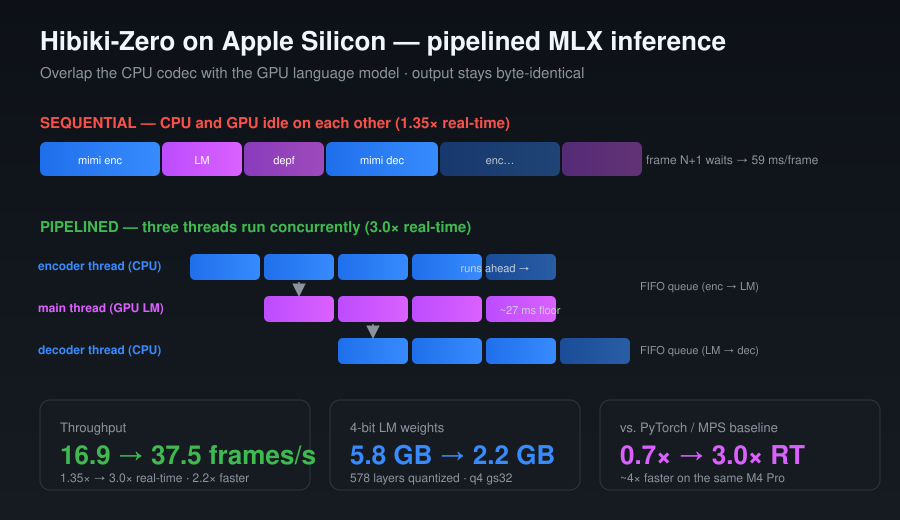

# Getting Kyutai's Hibiki-Zero to run 3× faster than real-time on a MacBook

*How I took a 3B speech-translation model from "NVIDIA-only" to 3× real-time on Apple Silicon — by porting it to MLX, fixing real bugs in `moshi-mlx` along the way, and pipelining the CPU codec against the GPU.*

---

Kyutai recently released **Hibiki-Zero**, a 3B real-time speech-to-speech translation model (French/Spanish/Portuguese/German → English) that translates *as you speak*, preserving the speaker's voice. It's genuinely impressive — but the reference inference code is NVIDIA-only. I wanted it on my MacBook (M4 Pro).

What started as "just change the device flag" turned into a small odyssey: a PyTorch/MPS port, a 4-bit MLX rewrite, four real bugs in the `moshi-mlx` runtime, and a threading trick that nearly doubled throughput again. Here's the journey.

## A bit of backstory — what makes Hibiki-Zero special

▶️ **[Watch the 30-second demo](https://kyutai.org/blog/2026-02-12-hibiki-zero)** — French → English, in the speaker's own voice (Kyutai's tech report, with samples).

Simultaneous interpretation is one of the hardest things humans do: you have to translate *while* the speaker is still talking, and languages don't line up word-for-word — German verbs land at the end of the sentence, French adjectives flip, and you constantly gamble on how much to *wait* before committing to a translation.

Most prior systems learned this from **word-level aligned data**, which is painful to collect and usually faked with brittle, language-specific heuristics. Hibiki-Zero's contribution (the "Zero" in the name) is that it **throws that requirement out entirely**. From the paper:

> *"We propose Hibiki-Zero, which eliminates the need for word-level alignments entirely… We first train on sentence-level aligned data to learn speech translation at high latency, then apply a novel reinforcement learning strategy using GRPO to optimize latency while preserving translation quality."*

In plain terms: first teach it to translate *well* (with generous latency), then use reinforcement learning to teach it to translate *fast* — to learn, on its own, exactly how long to wait for enough context before it starts speaking. The result is state-of-the-art across five X→English tasks on accuracy, latency, **voice transfer** (it keeps the original speaker's voice), and naturalness — and it can pick up a new input language with under 1,000 hours of speech.

Under the hood it's a 3B hierarchical transformer paired with the **Mimi** neural audio codec running at 12.5 Hz — which is exactly the part that makes the on-device performance story below interesting. ("Hibiki" — 響き — is Japanese for *echo / resonance*.)

Everything above is Kyutai's work. My contribution is getting that model to run *fast on a Mac*. So:

## Step 0 — Just get it running (PyTorch / MPS)

The first wall was trivial-looking and load-bearing: the CLI hard-requires CUDA. The fix was small — only bail on a missing GPU when the user actually asked for `cuda`, and guard the one `torch.cuda.synchronize()` call behind an availability check.

That was enough to translate a 64-second French Olympics clip into coherent English audio on the Mac GPU. But it ran at **~0.7× real-time** — fine for offline batch work, too laggy to feel "real-time." Apple's GPU isn't an H100, and bf16 on MPS leaves performance on the table.

## Step 1 — 4-bit, natively, with MLX

The faster path on Apple Silicon is **MLX** — Apple's own array framework — via Kyutai's `moshi-mlx` package, with the language model **quantized to 4-bit**. On paper this is a big win: the LM shrinks from **5.8 GB → 2.2 GB** and runs on MLX's tuned Metal kernels.

The catch: `moshi-mlx` targets the *original Moshi* (and an older Hibiki). Hibiki-Zero has architectural deltas the stock package silently ignores. Pointing it at the new checkpoint didn't crash — it produced **garbage audio**, which is the worst kind of bug. So I wrote `mlx_hibiki_patch.py`, a runtime monkey-patch that bolts the missing pieces onto `moshi-mlx`. Four of them turned out to matter.

### Bug 1–3: config, attention, and positional encoding

The first three were structural mismatches that the loader glossed over:

- **`hidden_scale` ignored** — the feed-forward width was hardcoded to `4 × dim`; Hibiki-Zero uses a different multiplier, and its depformer feed-forward was left unset entirely.
- **Grouped-query attention disabled** — the attention forward pass *asserted* `kv_repeat == 1`. Hibiki-Zero's main transformer uses `kv_repeat=2` (GQA), so I had to rewrite the attention call to split Q/K/V heads correctly and lean on MLX's `scaled_dot_product_attention`, which handles GQA natively.
- **Wrong RoPE variant** — only interleaved RoPE was wired up; Hibiki-Zero uses `rope_concat` (RoPE with `interleave=False`, i.e. MLX `traditional=False`).

Fix those and the **text** translation came out perfect. The **audio**, however, still babbled.

### Bug 4: the one that actually hurt — a missing LayerNorm

This was the satisfying one. The audio was a mess of overlapping, clipping voices, while the text stream was flawless. That asymmetry is the clue: text and audio diverge only inside the **depformer** — the small transformer that predicts the hierarchical audio codebook tokens.

Hibiki-Zero applies a *learned per-codebook output LayerNorm* (`depformer_norms.{i}`) to the depformer's output **before** each audio projection. `moshi-mlx` feeds the un-normalized features straight into the projection. The result: audio logits come out roughly **3× too small** and uncorrelated → out-of-distribution audio tokens → babbling and clipping.

I diagnosed it with a dead-simple **silence-in test**: feed the model zeros. A correct model stays near-silent (RMS ≈ 0.06, peak < 1.0); the broken one gave RMS ≈ 0.13 and peak ≈ 1.23 (clipping). That single number turned "the audio sounds wrong" into a falsifiable target.

The fix adds the LayerNorm to each depformer slice, applies it before the projection, and loads the `depformer_norms.{i}` weights out of the checkpoint. After that, the silence test passed and the translation was clean.

**Result:** native 4-bit MLX at **~1.3× real-time (16.5 tok/s)** — already faster than the bf16/MPS path, on the same laptop. The pre-quantized weights are published here: 👉 [**huybik/hibiki-zero-3b-mlx-q4**](https://huggingface.co/huybik/hibiki-zero-3b-mlx-q4).

> One non-obvious constraint: keep `group_size=32` for the q4 weights. Stock `moshi-mlx` (and the moshi-swift iOS loader) hardcode gs32 for `.q4.safetensors`. Larger groups save ~240 MB but break every downstream loader — not worth it for the Apple ecosystem.

## Step 2 — Stop the CPU and GPU from idling on each other

1.3× was good, but profiling told a frustrating story. I instrumented each frame with `mx.eval` barriers (`profile_mlx.py`) and found the **Mimi codec** — the audio tokenizer, which runs on **CPU** via the Rust `rustymimi` library — was eating **~58% of every frame** (encode ~30% + decode ~28%). The GPU language model was the other ~40%.

And critically: these ran **sequentially**. Encode (CPU) → LM (GPU) → decode (CPU), one after another, each waiting on the last. The CPU sat idle while the GPU worked, and vice versa.

The unlock: `rustymimi` **releases the GIL**. So I split the loop across three threads (`infer_mlx_fast.py`):

- an **encoder thread** that streams the entire file ahead through Mimi encode,
- the **main thread** running *only* the GPU LM step,
- a **decoder thread** turning audio tokens back into PCM.

FIFO queues between them preserve streaming order, so the output is **byte-identical** to the sequential path — this is pure scheduling, not an approximation. (One gotcha: each thread needs its *own* `rustymimi.Tokenizer` instance; sharing one triggers an "Already borrowed" panic.)

For an offline file, the encoder races ahead and decode hides underneath the GPU, so per-frame wall time collapses to roughly the LM cost alone:

| | frames/s | × real-time | ms/frame |
|---|---|---|---|
| PyTorch / MPS (bf16) | 8.8 | 0.7× | 114 |
| MLX q4, sequential | 16.9 | 1.35× | 59 |
| **MLX q4, pipelined** | **37.5** | **3.0×** | **27** |

**2.2× faster, zero quality change.** The codec is now hidden behind the GPU, and the ~27 ms LM step is the new floor.

## Where it landed

On a single MacBook (M4 Pro), starting from code that wouldn't even import:

- **0.7× → 3.0× real-time** — roughly **4× faster** end-to-end,
- LM footprint **5.8 GB → 2.2 GB**,
- output quality preserved (and audio *fixed* versus the naive MLX port).

Next stop is `mx.compile` on the depformer loop to chip away at that now-exposed ~27 ms LM floor — targeting 4–5× real-time.

The broader lesson: most of the speedup didn't come from a faster model, but from *making the hardware I already had stop waiting on itself* — and from trusting a weird symptom (clean text, broken audio) enough to chase it down to a single missing LayerNorm.

---

### Links

- ▶️ **Demo video & samples (FR→EN, voice preserved):** [kyutai.org/blog/2026-02-12-hibiki-zero](https://kyutai.org/blog/2026-02-12-hibiki-zero)
- 📄 **Paper:** [arXiv:2602.11072](https://arxiv.org/abs/2602.11072)
- 🍎 **This repo (MPS + MLX paths):** [github.com/huybik/hibiki-zero-mlx](https://github.com/huybik/hibiki-zero-mlx)
- 🤗 **Pre-quantized 4-bit MLX weights:** [huggingface.co/huybik/hibiki-zero-3b-mlx-q4](https://huggingface.co/huybik/hibiki-zero-3b-mlx-q4)
- 📦 **Upstream model (Kyutai):** [kyutai/hibiki-zero-3b-pytorch-bf16](https://huggingface.co/kyutai/hibiki-zero-3b-pytorch-bf16) · [github.com/kyutai-labs/hibiki-zero](https://github.com/kyutai-labs/hibiki-zero)

*Hibiki-Zero is CC BY-NC-SA 4.0. This is an independent port for running it on Apple Silicon.*

---

*#MachineLearning #AppleSilicon #MLX #SpeechTranslation #LLM #Quantization #OnDeviceAI*
