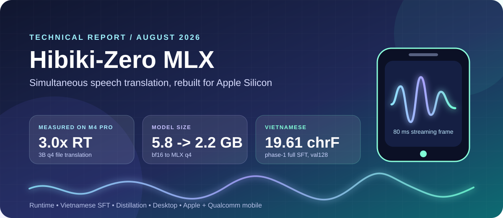
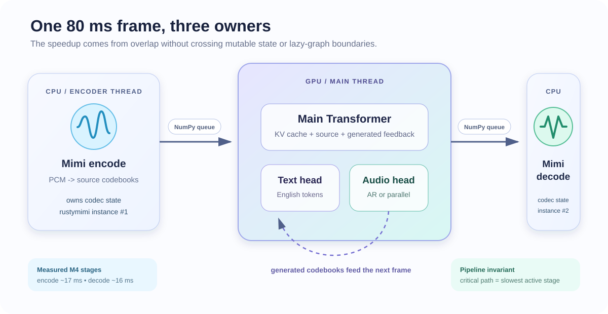
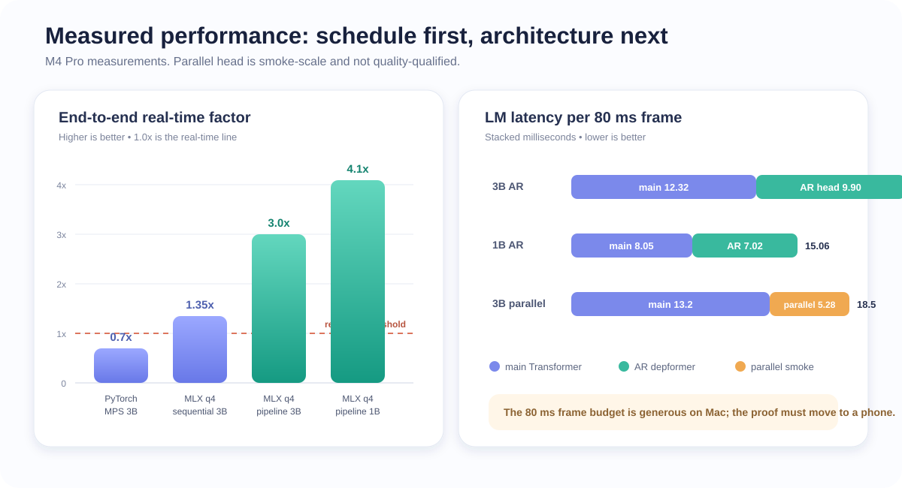
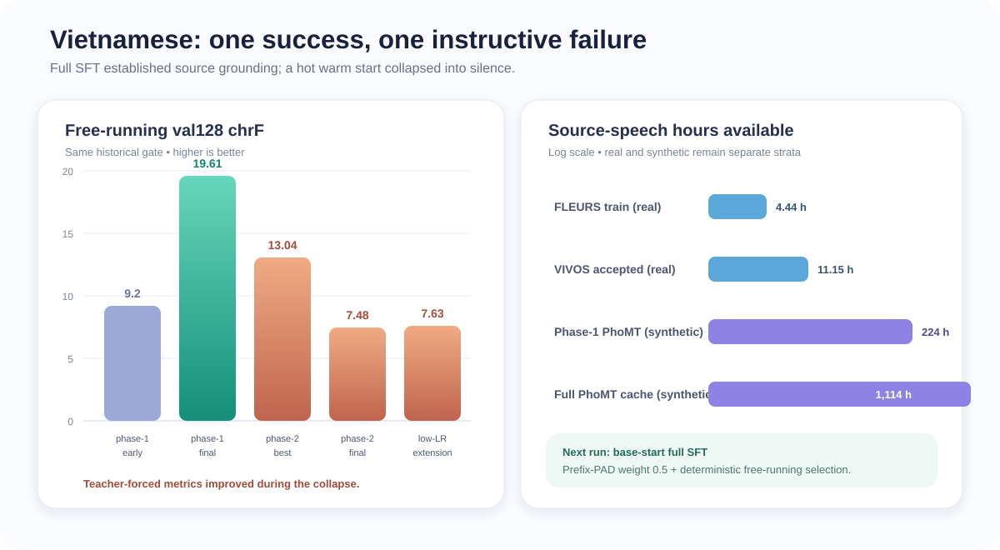
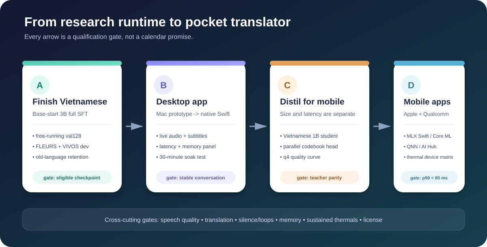

> **One-line result.** We ported Kyutai's 3B Hibiki-Zero simultaneous speech translator to Apple Silicon, fixed the architectural mismatches that made the first MLX output babble, reduced the model from 5.8 GB to 2.2 GB, pipelined the CPU codec around the GPU model to reach about 3x real-time on an M4 Pro, built a 1B phone candidate, and established the data and training machinery for Vietnamese. The remaining work is model quality, native product integration, and real-device validation - not another desktop inference rewrite.

| Evidence snapshot | Result | Confidence |
|---|---:|---|
| 3B q4 file inference, M4 Pro | about **3.0x real-time** | measured |
| 1B q4 file inference, M4 Pro | about **4.1x real-time** | measured |
| 3B LM step | **22.21 ms/frame** | measured |
| 1B LM step | **15.06 ms/frame** | measured |
| CoVoST2 fr->en, n=30 | 3B **25.7 BLEU**; 1B **28.4 BLEU** | measured, small set |
| Vietnamese phase-1 full SFT, val128 | **19.61 chrF** vs unsupported baseline about zero | measured |
| Vietnamese phase-2 warm start | **closed/no-go**; best 13.04 chrF, final 7.48 | measured |
| Parallel-head smoke, 3B | head **12.70 -> 5.28 ms**; LM **25.9 -> 18.5 ms** | measured, quality not qualified |
| 1B phone artifact | **7/7 loader checks pass** | compatibility only |
| 1B projected iPhone LM step | about **30 ms** at the stated 0.5x scale | projection, no phone measured |

**Repository state used for this report:** commit `3b8e394`; core evidence is linked throughout. Numbers are labeled **measured**, **derived**, or **projected**. A projection is never presented as a device result.

---

# 1. Problem, product, and starting point

Hibiki-Zero is Kyutai's 3B hierarchical Transformer for simultaneous speech-to-speech and speech-to-text translation. It consumes and emits Mimi audio tokens at 12.5 Hz, so one streaming frame represents 80 ms. The released model translates French, Spanish, Portuguese, and German speech into English while also emitting an English text stream and preserving voice characteristics. Kyutai's release requires an NVIDIA GPU; the model card describes a 3B backbone, 12.5 Hz generation, five-language support, and a non-commercial share-alike license [R1-R3].

The project goal is more ambitious than "make the demo run on a Mac":

1. run the model efficiently on Apple Silicon;
2. add Vietnamese as a new source language;
3. expose the model through a useful desktop application;
4. shrink and reshape it for mobile hardware; and
5. prove sustained real-time inference on Apple and Qualcomm devices.

The product experience is a conversation, not a sequence of recordings: a person speaks, translated English text and audio begin before the source sentence ends, and the entire loop can stay on-device.

## 1.1 What this project contributes

Kyutai contributed the model, training method, Mimi codec, reference inference stack, and original weights. This repository contributes:

- a native MLX q4 runtime and model-conversion path;
- Hibiki-Zero architectural support in the vendored `moshi-mlx` implementation;
- a three-stage streaming scheduler for Mimi encode, LM inference, and Mimi decode;
- reproducible speed, silence, translation, memory, and compatibility gates;
- a Vietnamese data, cache, full-SFT, and free-running evaluation stack;
- a smoke-proven parallel codebook head; and
- published MLX artifacts and research records for accepted and rejected experiments.

## 1.2 Current scope and non-claims

The report does **not** claim that Vietnamese training is finished, that the parallel head has production audio quality, or that an iPhone or Snapdragon device has already met the frame budget. The current iPhone table is a transparent projection from M4 Pro measurements. Qualcomm deployment is a roadmap backed by official tooling, not a completed port.

---

# 2. System architecture



At 24 kHz, Mimi consumes 1,920 PCM samples per frame. The runtime performs four logical operations:

1. **Mimi encode** turns source PCM into source audio codebooks.
2. **The main Transformer** combines source codebooks, prior generated audio, text feedback, and optional conditioning into one hidden state.
3. **The text head and codebook head** emit English text plus target-audio codebooks.
4. **Mimi decode** reconstructs 24 kHz English audio.

The runtime implementation is intentionally small. [`main.py`](../../main.py) handles the CLI and live audio callbacks; [`hibiki_mlx/pipeline.py`](../../hibiki_mlx/pipeline.py) owns model loading, quantization, the file pipeline, tail flushing, and the opt-in parallel head. Model-specific architecture support belongs in the vendored [`moshi-mlx`](../../moshi-mlx/) fork rather than in per-script monkey patches.

## 2.1 The hierarchical bottleneck

The main Transformer produces one hidden vector per 80 ms frame. The original autoregressive depformer then predicts 8 or 16 generated audio codebooks sequentially. That recurrence is expensive on an Apple GPU because it launches many tiny kernels. On the measured 3B path, the depformer consumed roughly half the LM frame and was launch-bound: quantizing it reduced storage but did not reduce the serial dependency.

This observation split optimization into two classes:

- **Scheduling and implementation wins:** quantized loading, fixed architecture support, compiled per-slice execution, bounded KV caches, and a CPU/GPU pipeline.
- **Architecture wins:** remove the within-frame codebook recurrence with a parallel head; for a Vietnamese phone model, also distil or train a smaller backbone.

## 2.2 Three independent state machines

The live runtime is easiest to reason about as three state machines connected by ordered queues:

- the encoder owns a `rustymimi.Tokenizer` and source-codec state;
- the LM owns MLX arrays, the Transformer KV cache, text history, and generated-codebook feedback; and
- the decoder owns a second `rustymimi.Tokenizer` and target-codec state.

The queues carry **NumPy arrays**, not lazy MLX arrays. MLX graphs are associated with the stream on which they were created; passing unevaluated arrays between threads caused cross-thread evaluation failures in newer MLX versions. Likewise, the encoder and decoder cannot share one Rust tokenizer: doing so triggers an `Already borrowed` panic. Both failures disappeared when ownership was made explicit at the pipeline boundary.

## 2.3 End-of-input behavior is part of correctness

Simultaneous translation intentionally lags the source by several seconds. Stopping inference when the input file ends truncates the target. The runtime therefore feeds up to eight seconds of silence, then stops after 12 consecutive text-pad frames. The text temperature defaults to 0.4: greedy sampling over-collapsed, while a hotter stream produced cold-start openers and feedback errors. This is not UI polish; the sampled text is fed back autoregressively and changes later audio and text.

---

# 3. Engineering journey and decisions

## 3.1 Stage 0 - a correct but slow PyTorch/MPS baseline

The reference path rejected non-CUDA execution. Small device guards were enough to produce coherent output on MPS, but the 64-second test clip ran at about 0.7x real-time. This baseline was useful because it proved Apple hardware could execute the graph and gave a known-good text/audio target. It was not a viable product runtime.

**Decision:** keep PyTorch for training and use MLX for Apple inference. MLX provides Apple-Silicon-native arrays, lazy execution, quantization, compilation, Swift bindings, and unified CPU/GPU memory [R4-R5].

## 3.2 Stage 1 - q4 MLX, and why the first "successful" load was wrong

The 3B LM was quantized from 5.8 GB bf16 to about 2.2 GB q4. The model loaded and generated output, but the audio babbled while the text was coherent. That asymmetry localized the error to the codebook path rather than the main Transformer's language reasoning.

The stock MLX runtime was missing four Hibiki-Zero details:

| Missing invariant | Symptom or risk | Owning fix |
|---|---|---|
| `hidden_scale` from config | wrong feed-forward widths | model configuration |
| `kv_repeat=2` grouped-query attention | wrong attention topology | attention implementation |
| `rope_concat` positional encoding | incorrect positions | RoPE implementation |
| learned per-slice `depformer_norms.{i}` | coherent text, babbling/clipping audio | depformer output boundary |

The decisive test was **silence in**. A healthy model should remain near silent when fed zeros. Without the learned depformer LayerNorm, the test produced roughly 0.13 RMS and 1.23 peak; after the correct normalization path was loaded, it passed the project gate. This converted a subjective audio complaint into a fast, falsifiable regression test.

**Decision:** architecture deltas belong in the vendored model implementation. The original published 3B artifact includes a portable patch shim, while the active repository owns the fixes in `moshi-mlx` [R6].

## 3.3 Stage 2 - stop serializing independent hardware

Profiling showed Mimi encode and decode ran on CPU while the LM ran on the GPU, but the original loop serialized all three. `rustymimi` releases the GIL, so the file and microphone runtimes now overlap:

```text
encoder thread:  PCM -> source codes  ─┐
main thread:             source codes -> LM -> target codes
decoder thread:                              └-> PCM
```

FIFO ordering preserves the stream. For a file, the encoder can race ahead; live input adds one frame of pipeline latency but reduces the repeating critical path to the slowest stage, normally the LM.

**Decision:** optimize the end-to-end schedule before rewriting kernels. This scheduling change moved the 3B q4 path from about 1.35x to about 3.0x real-time with no model approximation.

## 3.4 Stage 3 - reduce launches and bound memory

The depformer still executed sequential slices, but its per-slice cache setup and launch overhead could be reduced. A fixed-shape compiled step cut the 3B depformer from about 12.4 to 10.2 ms and the LM frame from 24.3 to 22.1 ms. It did not remove the recurrence; it made each recurrence cheaper.

The main Transformer KV cache was also capped at the model's actual attention context. This reduced dead live-window memory from 537 MB to 66 MB on the 1B model and from 470 MB to 344 MB on the 3B model. The cap preserves the attention window; it only stops retaining state the model cannot attend to.

## 3.5 Stage 4 - choose the phone artifact with evidence

The benchmark matrix made the product split explicit:

- **3B q4:** multilingual Mac runtime and Vietnamese teacher.
- **Hibiki-M 1B q4:** phone-sized candidate, currently FR->EN only.
- **q4-depq3:** storage option; only depformer slice Transformers use q3.
- **parallel head:** experimental until trained and audio-qualified at scale.

The 1B q4 model is smaller and faster, and on the n=30 French benchmark it scored better than the multilingual 3B because it is a dedicated FR->EN model. It is not yet a Vietnamese phone model.

**Decision:** keep q4 group size 32. Stock `moshi-mlx` and `moshi-swift` use this contract for `.q4.safetensors`; a different group size saves little and breaks the downstream loader. [`scripts/check_swift_compat.py`](../../scripts/check_swift_compat.py) reproduces the strict loader path and reports 7/7 checks for the staged artifact. This proves format compatibility, not iPhone speed [R7].

---

# 4. Performance and quality evidence



## 4.1 Model and quantization matrix

All stage timings below are M4 Pro measurements from the repository benchmark reports. Minor differences between tables reflect separate clean runs; no cross-run decimal should be interpreted as a statistically significant delta.

| Configuration | Main ms | Codebook-head ms | LM total ms | LM weights | Live/file result | Translation gate |
|---|---:|---:|---:|---:|---:|---|
| 3B q4, AR head | 12.32 | 9.90 | **22.21** | 2.41 GB artifact in matrix | about 3.0x file RT | BLEU 25.7 / chrF 49.4, n=30 |
| 3B q4-depq3 | about 11.9 | about 9.5 | **21.4** | 2.21 GB | about 3.7x LM budget | coherent short gate |
| 1B q4, AR head | 8.05 | 7.02 | **15.06** | 1.13 GB | about 4.1x file RT | BLEU 28.4 / chrF 54.6, n=30 |
| 1B q4-depq3 | about 7.4 | about 7.3 | **14.7** | 1.05 GB | about 4.1x file RT | BLEU 26.8 / chrF 53.7, n=30 |
| 3B + parallel smoke | 13.2 | **5.28** | **18.5** | +0.45 GB bf16 head | 4.3x live estimate | text coherent; audio not qualified |

The q3 experiment is a useful negative result. Quantizing the slice Transformers was acceptable, but quantizing depformer embeddings and output projections caused babbling, repetition, and failed tail stopping. The final predicate therefore fixes the shared invariant at the quantization boundary: only modules proven safe enter q3.

## 4.2 Why the parallel head matters

The smoke head predicts all codebooks in one forward pass using per-codebook projections, previous-frame token conditioning, and a shared bidirectional trunk. It contains 227M bf16 parameters and was trained on only 30 CoVoST2 clips, so it proves mechanism and speed, not production quality.

Measured on the 3B model:

- codebook head: **12.70 -> 5.28 ms** (-58%);
- LM total: **25.9 -> 18.5 ms** (-29%);
- live throughput: **3.1x -> 4.3x real-time**.

The head is now bandwidth-bound because it reads about 0.45 GB of bf16 parameters per frame. The next optimization is therefore architectural shrinkage and q4, after quality training. The implementation and smoke evidence live in [`distill/`](../../distill/) and [`parallel_head_smoke.md`](../vision/reports/parallel_head_smoke.md).

## 4.3 The gate stack

No single metric is allowed to stand in for the product:

| Gate | What it catches | Current implementation |
|---|---|---|
| strict model reload | missing/wrong tensor names, shapes, q4 contract | `check_swift_compat.py` |
| silence-in RMS/peak | babble, clipping, broken audio head | `bench.py --silence` |
| coherent known clip | obvious text/audio regressions | `verify_mlx_q4.py` |
| BLEU/chrF/WER | translation text | CoVoST2/FLEURS evaluation scripts |
| nonempty/EOS/loops/length | free-running collapse | `eval_lora.py` metrics |
| waveform/ASR/speaker similarity | TTS and generated-audio integrity | VIVOS QA pipeline |
| per-stage latency and memory | real-time feasibility | `bench.py` plus device reports |

The report deliberately keeps **text-stream quality** and **speech-output quality** separate. Text can remain coherent while the codebook head is broken; that exact failure produced the missing-LayerNorm discovery.

---

# 5. Vietnamese adaptation: what worked, what failed, and why



The upstream model does not support Vietnamese. The original FLEURS test produced about 0.26 BLEU, effectively the unsupported-language floor. Adding Vietnamese therefore requires the main Transformer to learn a new source-acoustic mapping; a tokenizer flag or a new output head cannot do it.

## 5.1 Data path

The training stack converts each paired example into a cached tensor:

```text
row 0       English text tokens
rows 1..N  English target Mimi codebooks
remaining  Vietnamese source Mimi codebooks
```

Mimi encoding happens once. The trainer then performs masked teacher-forced audio and text cross-entropy without re-running the codec. This made a 1,114-hour corpus practical to train repeatedly and forced the project to record alignment, prefix-pad, content, EOS, and tail-mask behavior explicitly.

The main data reservoirs are:

| Dataset/artifact | Role | Current evidence |
|---|---|---|
| FLEURS vi/en | real train/dev/test and fixed val128 | 1,449 train pairs; 4.44 VI train hours; speaker-disjoint splits [R8] |
| PhoMT text | large VI-EN parallel text source | 3.02M sentence pairs in the original corpus [R9] |
| PhoMT synthetic speech | broad supervised training reservoir | 696,243 uploaded pairs; 694,422 cached rows; 1,114 usable VI hours |
| VIVOS source speech | independent real-speech domain and future training stratum | source audit plus 7,757 accepted target pairs; 11.15 source hours after QA |
| CoVoST2 fr/en | regression and distillation smoke data | multilingual ST corpus; local n=30 report slice [R10] |

Project-published artifacts include the [PhoMT speech dataset](https://huggingface.co/datasets/anquachdev/PhoMT-en-vi-speech) and the model/dataset repository `huybik/hibiki-zero-vi-full-sft`. The original PhoMT terms are research/education-oriented and restrict redistribution of the original corpus; the generated artifact and every downstream release still require a license audit [R9].

## 5.2 Experiment 1 - LoRA proved plumbing, not Vietnamese grounding

The first adaptation trained rank-32 LoRA modules in the main Transformer, with optional text and audio heads. It could reduce loss, save/reload adapters, and overfit tiny examples, but free-running output remained generic, empty, or repetitive.

Teacher-forced reconstruction exposed the cause: later target tokens were predicted well, but the first source-grounded content was wrong. The model learned the English target-side language model while the frozen backbone still failed to route Vietnamese acoustics. This was evidence against LoRA capacity for a genuinely new source language, not evidence of a broken cache or evaluator.

**Decision:** LoRA remains a local plumbing probe. Scaled Vietnamese training uses full-model SFT on CUDA.

## 5.3 Experiment 2 - full SFT established Vietnamese routing

The first H100 full-model SFT started from the upstream base checkpoint and trained on about 147k cached samples / 224 VI hours plus FLEURS. Over three epochs and 55,284 steps, val128 chrF reached **19.61**. The final standalone greedy evaluation reported:

- 128/128 nonempty;
- 126/128 EOS;
- 8/128 repeated-4gram loops;
- about 1.9x output/reference length; and
- BLEU 0.22, showing chrF was the more informative low-resource progress signal.

The run cost roughly 4.5 hours on an H100 and demonstrated the central hypothesis: full SFT can make Hibiki route Vietnamese source speech where LoRA could not. The remaining weakness was data/domain quality and free-running behavior.

## 5.4 Experiment 3 - the warm-start run collapsed to silence

Phase 2 warm-started the successful checkpoint on the full 1,114-hour synthetic cache. It used a peak learning rate of 5e-5, higher than the prior run's final 3e-5. The model fell into a text-pad/silence attractor:

| Step | Corpus chrF | Nonempty chrF | Nonempty / 128 | Interpretation |
|---:|---:|---:|---:|---|
| 9k | 1.24 | 8.22 | 17 | early pad collapse |
| 18k | 11.40 | 12.52 | 113 | partial recovery |
| 36k | **13.04** | 14.55 | 107 | run best, still below warm start |
| 63k | 3.83 | 12.26 | 31 | second collapse |
| 86,258 | 7.48 | 13.67 | 55 | two-epoch final |
| 90k extension | 7.63 | 16.45 | 45 | low-LR continuation failed |

The alarming result was that **every teacher-forced metric improved while free-running generation got worse**. Teacher forcing feeds reference content and never enters the model's self-reinforcing pad history. Even the new content-only CE and `silence_score` ranked the collapsed checkpoint above the healthy one.

**Decision:** only deterministic free-running outputs can qualify a checkpoint. Teacher-forced metrics diagnose optimization and overfit; they do not select a model.

## 5.5 The next Vietnamese run

The current [`training_plan.md`](../training_plan.md) replaces warm-start continuation with a base-start full SFT on the complete cache:

- initialize from the upstream base weight, with no adapter or prior trainer state;
- fp32 master weights, CUDA bf16 autocast, batch 16;
- two-epoch hard budget;
- LR `1e-4 -> 3e-5` at 50%, warmup 500;
- text weight `5 -> 2` at 60%;
- prefix-pad weight 0.5, shifting measured effective text-loss mass from about 45/55 pad/content+EOS to about 29/71;
- val CE every 2k and deterministic val128 generation every 9k; and
- preserved model/trainer pairs for every eligible checkpoint.

Eligibility requires at least 122/128 nonempty, at least 116/128 EOS, at most 12 loop failures, mean length ratio at most 2.0, and strong corpus chrF without a material nonempty-chrF regression. Final selection also requires full FLEURS validation and an independent VIVOS development manifest. The test sets stay sealed until selection.

---

# 6. Data engineering: scale was necessary, but quality boundaries mattered more

## 6.1 The PhoMT campaign

PhoMT supplied broad Vietnamese-English text coverage. VieNeu generated Vietnamese source speech; Kokoro generated English target speech. The campaign eventually produced about 1,228 VI hours on the Hub and a 1,114-hour Mimi cache after the 25-second filter.

The throughput story mirrors the inference story: remove synchronization and shape churn before adding machines. On M4 Pro, the VI TTS path improved from about 4.2x to about 53x real-time in isolation through tensorized penalties, batched codec decode, static KV buffers, shape buckets, fused embeddings, and simpler sampling. Concurrent EN+VI production stabilized around VI 33x and EN 40-50x because the GPU was saturated.

The campaign also produced two distinct silent-audio failures:

1. mixed-length fp16 codec attention created fully masked rows, NaNs, and silent PCM;
2. later memory pressure caused Metal to return exactly zero rows for roughly 0.4% of outputs.

The fix was not "try again later." Every decoded row is now gated for finiteness and non-zero amplitude; suspicious rows are decoded with a CPU clone. The campaign then ran full silence and duration-ratio audits before upload.

## 6.2 Real speech: VIVOS translation and target synthesis

The VIVOS pipeline froze speaker-disjoint train/dev/test manifests, removed transcript overlap, translated 11,711 eligible Vietnamese transcripts through a versioned batch request, and excluded the single row that was repeatedly blocked. Qwen3-TTS was then used for reference-conditioned English target synthesis [R11].

The first MLX pilots failed their preregistered aggregate WER comparison even when voice similarity was strong. These reports remain no-go evidence; a later user-approved model-level waiver did not relabel them. Subsequent batching, recurrence, deterministic row RNG, active-lane compaction, and retry-policy experiments culminated in a clean validation:

- 50/64 accepted after one retry round;
- aggregate WER 0.07990;
- median speaker cosine 0.91954;
- zero prompt leaks.

Production generated 10,950 attempt-0 rows. QA revealed three reference-conditioned speaker failure clusters, so `VIVOSSPK07`, `VIVOSSPK11`, and `VIVOSSPK18` were excluded from release. Under the later no-retry decision, 8,254 rows passed row-level gates but aggregate WER was 0.09813. A deterministic minimum-row trim removed 497 high-error passing rows, leaving **7,757 accepted rows at WER 0.07998**. The PyTorch-Mimi cache contains 7,024 train rows / 10.00 hours and 733 dev rows / 1.15 hours across 43 speakers.

Hub publication is **not verified**. The publisher rejected the dev archive at a mandatory LFS-size check and did not create `release_report.json`. The local bundle and audit are complete; the remote claim is not.

---

# 7. The scar tissue: mishaps that changed the design

| Mishap | What it looked like | Root cause | Permanent design change |
|---|---|---|---|
| Naive MLX port babbled | text correct, audio broken | missing learned depformer LayerNorm | silence-in gate; architecture fixes in model boundary |
| Shared Rust tokenizer panicked | `Already borrowed` | encoder/decoder shared mutable state | one tokenizer per thread |
| MLX queue failed across threads | evaluation/stream error | lazy arrays escaped creating stream | queue evaluated NumPy arrays |
| Full depformer q3 looped | repeated text and bad tail flush | embeddings/output heads were not q3-safe | narrow quant predicate; keep those q4 |
| Combined LoRA run BSOD'd | memory grew near epoch end | longest sorted batches exceeded MPS cap | `--max-frames 280`; frame buckets |
| LoRA loss fell but translation failed | fluent generic English | frozen backbone never grounded VI | full-model SFT for new language |
| Warm-start full SFT went silent | empty greedy output | converged model perturbed by hot LR; pad attractor | base-start recipe; dense free-running gates |
| Resume ignored requested LR | log showed 2e-5 instead of 1e-5 | optimizer state restored old schedule metadata | reassert new schedule after optimizer restore; audit logs |
| Teacher-forced validation "improved" | collapsed model won every TF metric | reference history bypassed free-running attractor | TF is diagnostic only; greedy output selects |
| TTS produced silent WAVs | NaNs or exact zeros | padding attention and Metal memory pressure | per-row waveform gate plus CPU rescue |
| VIVOS failures clustered by speaker | repeated prompt-conditioned ASR failures | unstable shared reference prompt | speaker exclusions bound into provenance |
| Stopping a supervisor stopped QA child | interrupted at 8,745 rows | process-tree behavior differed from assumption | immutable row sidecars and resumable assembly |
| Release worker halted | no Hub report | dev archive below mandatory LFS check | publication is unverified until remote re-download audit |

These are not embarrassing footnotes. Each failure identified an ownership boundary that the next implementation no longer crosses casually.

---

# 8. Decision register

| Decision | Why | Rejected alternative | Revisit when |
|---|---|---|---|
| MLX q4 is the Apple product runtime | fastest measured path, unified memory, Swift route | PyTorch/MPS serving | only if another native backend wins a paired gate |
| q4 uses group size 32 | stock MLX/Swift loader contract | slightly smaller incompatible grouping | loader contract changes end-to-end |
| 3B stays desktop/teacher | multilingual and adaptable | forcing it into base-phone memory | measured 3B device memory/thermal pass |
| 1B is the phone-size base | 1.13 GB, faster, best FR n=30 score | 3B for all phones | Vietnamese 1B student quality fails |
| AR head remains default | qualified audio path | ship smoke parallel head | scaled distillation passes speech gates |
| Track A precedes Track B | main distribution changes during language training | distil a head before fine-tuning main | never; re-distil after each main change |
| Full SFT for Vietnamese | LoRA did not ground a new source language | larger LoRA as production bet | only with contrary matched evidence |
| Base-start next run | warm-start continuation collapsed | another rescue continuation | after a new eligible base-start checkpoint |
| Free-running output selects checkpoints | TF metrics missed silence collapse | selection by val CE | only if a proven free-running surrogate exists |
| Real speech is an explicit stratum | synthetic-only validation drift | another bulk identical TTS campaign | real-domain analysis supports more synthetic data |
| Apple mobile starts with MLX Swift/Metal | closest parity with the working runtime | promise ANE performance now | after a stateful Core ML conversion wins on device |
| Qualcomm uses QNN/AI Hub, not MLX | platform-native compiler/profile/deploy path | cross-compile the Apple runtime | if a portable runtime beats QNN on target devices |

---

# 9. Deployment plan: desktop first, then mobile



## 9.1 Milestone A - finish Vietnamese training

**Deliverable:** one base-start 3B checkpoint that passes the frozen free-running contract.

1. Freeze base, cache, pair, and repository hashes.
2. Recompute base and phase-1 val128 baselines on the training box.
3. Run the 10-step full-SFT smoke, reload the checkpoint, and verify logged LR.
4. Launch the two-epoch base-start run with artifact sync.
5. At every 9k step, run eligibility-aware standalone evaluation and protect the paired checkpoint.
6. At milestones, evaluate full FLEURS validation and all VIVOS dev rows.
7. Freeze one checkpoint before opening FLEURS and VIVOS test.
8. Convert the accepted checkpoint to MLX q4 and rerun the multilingual retention suite.

**Exit gate:** Vietnamese improves on phase-1 or credibly matches it while nonempty, EOS, loop, length, real-domain, generated-audio, and FR/ES/PT/DE retention gates pass.

## 9.2 Milestone B - create the desktop application

**Deliverable:** a presentable macOS application with file and live modes, subtitles, output-device selection, and an inspectable latency panel.

The fastest product sequence is:

1. **Prototype UI around the proven Python engine.** Keep inference in one local process and expose a narrow IPC contract: start/stop session, PCM input/output, partial text, model status, and per-stage timing. This gets user feedback without simultaneously rewriting the runtime.
2. **Make the session contract explicit.** Backpressure, audio-device changes, model warmup, interruption, input language, transcript export, and failure states should be visible rather than hidden.
3. **Move to a native Swift engine.** Port model deltas to `moshi-swift`/MLX Swift after UX stabilizes; run byte/metric comparisons against the Python engine. Kyutai's Swift repository already includes experimental Hibiki support and an iOS proof of concept [R7].
4. **Package responsibly.** The model license is CC BY-NC-SA 4.0; the app and model card must preserve attribution, non-commercial scope, and share-alike obligations.

**Exit gate:** a 30-minute live conversation on an M-series Mac without queue underflow, state corruption, memory growth, or audible discontinuity; transcript and WAV export reproduce the session.

## 9.3 Milestone C - distil the mobile model

There are **two different distillation jobs**:

### C1. Backbone/student distillation - size

The current 1B artifact is FR->EN only. A Vietnamese 3B checkpoint plus a parallel head does not produce a Vietnamese 1B model. Build a Vietnamese-capable 1B student by starting from Hibiki-M 1B and training on the qualified Vietnamese data with a mixture of:

- supervised English text/audio token losses;
- sequence-level targets generated by the accepted 3B Vietnamese teacher;
- teacher text-logit distillation where vocabularies align;
- audio-codebook KL/CE targets; and
- FR replay to preserve the 1B model's original capability.

The first experiment should compare **1B full SFT** against **1B teacher-distilled SFT** under identical data and selection gates. Hidden-state matching is optional and only valid where dimensions can be projected without dominating the loss.

### C2. Parallel-head distillation - latency

After the final 1B main is frozen, dump 10-20 hours of teacher states, train the parallel head at real scale, tune one to four refinement passes, then shrink and quantize it. The current scaffold stores full logits at about 2.9 GB/hour; add top-k storage before scaling beyond a few hours.

**Exit gate:** 1B student passes Vietnamese and FR retention; parallel head stays within an agreed ASR/translation and speaker-quality delta from the AR teacher; q4 artifact stays under the memory target and passes silence-in.

## 9.4 Milestone D - Apple mobile application

**First execution path:** MLX Swift on Metal, because it is closest to the measured Python MLX graph and `moshi-swift` already targets iOS. Use `AVAudioEngine` or Audio Units for 24 kHz capture/playback, preallocate ring buffers, keep encode/LM/decode ownership separate, and expose thermal/memory counters.

**Second execution path:** evaluate Core ML only after parity. Core ML can place work across CPU, GPU, and Neural Engine and supports state buffers for KV caches [R12-R13]. Conversion should be attempted module-by-module - main Transformer, parallel head, Mimi encoder, Mimi decoder - with static 80 ms frame shapes. The AR depformer is a poor first ANE target because its sequential tiny launches are exactly the architecture being removed.

**Device matrix:** at minimum test a base 6 GB iPhone and an 8 GB Pro device. Measure cold load, first audio, steady-state frame p50/p95/p99, memory high-water, dropped audio callbacks, battery, and 30-minute thermals. Do not promote the current 30 ms projection to a result until this matrix passes.

## 9.5 Milestone E - Qualcomm mobile application

MLX is Apple-specific. The Android path should preserve the model contract while using Qualcomm's native deployment stack:

1. export the accepted PyTorch student modules to ONNX/TorchScript with explicit state tensors;
2. compile and profile them with Qualcomm AI Hub / Qualcomm AI Engine Direct;
3. use fixed frame shapes and bounded KV state; isolate unsupported RoPE, SDPA, sampling, or codec operations;
4. map dense q4/q8 work to the HTP/NPU when supported, leaving narrow control/sampling code on CPU;
5. integrate with Android low-latency audio (`AAudio`) and the same three-stage scheduler; and
6. validate numerical parity and real-device latency on at least one flagship and one thermally constrained Snapdragon target.

Qualcomm AI Hub can convert PyTorch/ONNX models, run inference on provisioned physical devices, report latency/load/memory/compute-unit placement, validate numerical correctness, and export to QNN, TFLite, or ONNX Runtime [R14]. That makes it the right early feasibility gate; it does not remove the need for an Android app and long thermal test.

**Exit gate:** sustained p99 under 80 ms for every recurrent LM frame, no audio underruns, memory inside the OS budget, and quality parity against the desktop artifact.

---

# 10. Mobile budget: useful projection, unfinished proof

Hibiki emits at 12.5 Hz, so the recurrent work must finish inside 80 ms. The current Apple projection divides M4 latency by an assumed phone/M4 throughput scale of 0.4-0.6.

| Configuration | M4 LM ms | projected phone @0.6 | @0.5 | @0.4 | estimated AR memory |
|---|---:|---:|---:|---:|---:|
| 1B q4 AR | 15.06 | 25.1 | **30.1** | 37.7 | about 1.8 GB |
| 1B + current bf16 parallel upper bound | about 13.4 | 22.3 | **26.7** | 33.4 | about 2.3 GB |
| 3B q4 AR | 22.21 | 37.0 | **44.4** | 55.5 | about 3.4 GB |

The codec stages are about 17 ms each on M4 and are hidden only if the phone preserves the pipeline. A single-threaded port would serialize encode + LM + decode and can exceed the frame budget even when the LM alone fits.

The largest uncertainties are dispatch overhead on a phone GPU, sustained clocks, OS memory pressure, audio callback behavior, and actual CPU/GPU/NPU placement. Therefore the engineering statement is:

> **The 1B artifact is a credible device candidate with measured Mac headroom; phone real-time remains unproven.**

---

# 11. Reproducibility and project map

## 11.1 Key code boundaries

| Boundary | Source |
|---|---|
| CLI and live audio | [`main.py`](../../main.py) |
| model loading, quantization, pipeline | [`hibiki_mlx/pipeline.py`](../../hibiki_mlx/pipeline.py) |
| model architecture deltas | [`moshi-mlx/moshi_mlx/models`](../../moshi-mlx/moshi_mlx/models/) |
| benchmark and silence gate | [`scripts/bench.py`](../../scripts/bench.py) |
| Swift artifact contract | [`scripts/check_swift_compat.py`](../../scripts/check_swift_compat.py) |
| translation benchmarks | [`remote_dataset/`](../../remote_dataset/) |
| Vietnamese cache/train/eval | [`finetune/`](../../finetune/) |
| parallel-head distillation | [`distill/`](../../distill/) |
| synthetic and VIVOS data pipeline | [`training-data/`](../../training-data/) |
| immutable experiment reports | [`reports/benchmarks/`](../../reports/benchmarks/) |

## 11.2 Primary local evidence

- Runtime evidence: [inference optimization](../vision/reports/inference_matrix.md), [iPhone budget](../vision/reports/iphone_budget.md), and [parallel-head smoke](../vision/reports/parallel_head_smoke.md)
- [Vietnamese phase-2 post-mortem](../phase2_postmortem.md)
- [Next Vietnamese training plan](../training_plan.md)
- [Checkpoint validation contract](../validation_plan.md)
- [Vietnamese data generation plan](../data_generation_plan.md)
- [VieNeu/Kokoro optimization record](../vieneu_optimizations.md)
- VIVOS evidence: [retry-v6 report](../../reports/benchmarks/vivos_tts/2026-08-04_qwen_mlx_retry_v6/metrics.md), [speaker exclusion](../../reports/benchmarks/vivos_tts/2026-08-04_qwen_mlx_retry_v6/SPEAKER_EXCLUSION_2026-08-05.md), and [runtime repair/terminal selection](../../reports/benchmarks/vivos_tts/2026-08-04_qwen_mlx_retry_v6/RUNTIME_RESUME_2026-08-06.md)

## 11.3 Experiment-record contract

Every material run should preserve:

- repository commit and environment manifest;
- exact base/data/model revisions and SHA-256 hashes;
- command, config, seeds, inputs, outputs, and timings;
- raw and derived metrics with sample sizes;
- failures, interrupted states, corrective actions, and go/no-go decisions; and
- model/trainer pairs plus sync or remote-download verification.

Failed experiments are evidence: later success may supersede the decision, but must not rewrite its artifact.

---

# 12. Limitations, ethics, and licensing

- **License:** Hibiki-Zero weights are CC BY-NC-SA 4.0. Derived weights and bundled applications require attribution, non-commercial use, and share-alike treatment unless Kyutai grants different terms [R2].
- **Voice use:** voice transfer and cloning can be misused. Training and demos should use consented/licensed sources, preserve provenance, and avoid impersonation claims.
- **Evaluation size:** the CoVoST2 n=30 matrix is a fast engineering gate, not a publication-scale benchmark.
- **Audio evaluation:** the Vietnamese checkpoint still lacks a fully integrated English-ASR round-trip scorer for its generated Hibiki speech. Manual audition and waveform sanity are not sufficient for release.
- **Domain balance:** most available supervised hours are synthetic and short. VIVOS adds real source speech but only about 11 hours after QA.
- **Language retention:** Vietnamese full SFT can forget FR/ES/PT/DE. Release requires an automated multilingual suite.
- **Latency:** an 80 ms compute frame does not equal 80 ms conversational delay. Codec buffering, learned translation lag, audio I/O, Bluetooth, and target reordering all contribute to perceived latency.
- **Hardware:** no iPhone or Snapdragon measurement is yet in the repository. Platform claims remain plans or projections until physical-device reports exist.

---

# 13. Conclusion

The project has crossed the hardest early boundary: the model is no longer tied to an NVIDIA reference server, and the Apple runtime is fast enough that product work is rational. The most important engineering wins came from correctness and ownership - loading the exact architecture, keeping thread state local, scheduling CPU and GPU concurrently, and refusing to let convenient metrics overrule free-running behavior.

Vietnamese adaptation has also moved from speculation to evidence. LoRA was insufficient; full-model SFT established real source-language routing; an aggressive warm start failed; and the next base-start run now has frozen, reproducible qualification gates. The data pipeline can produce scale, and its failures have forced stronger provenance and audio QA.

The next chapter is a gated product sequence: finish and qualify Vietnamese, wrap the proven engine in a desktop app, distil a true Vietnamese 1B student and its parallel head, then earn the mobile claim separately on Apple and Qualcomm hardware. If each stage preserves the research discipline already learned, "real-time translation in your pocket" becomes an engineering program rather than a slogan.

---

# References and resource links

<a id="ref-1"></a>**R1.** Tom Labiausse, Romain Fabre, Yannick Esteve, Alexandre Defossez, and Neil Zeghidour. [*Simultaneous Speech-to-Speech Translation Without Aligned Data*](https://arxiv.org/abs/2602.11072), ICML 2026 / arXiv v2, 2026.

<a id="ref-2"></a>**R2.** Kyutai. [Hibiki-Zero model card and weights](https://huggingface.co/kyutai/hibiki-zero-3b-pytorch-bf16). Architecture, languages, training overview, and CC BY-NC-SA 4.0 license.

<a id="ref-3"></a>**R3.** Kyutai. [Hibiki-Zero reference repository](https://github.com/kyutai-labs/hibiki-zero).

<a id="ref-4"></a>**R4.** Apple ML Research. [MLX repository and documentation](https://github.com/ml-explore/mlx).

<a id="ref-5"></a>**R5.** Apple ML Research. [MLX unified memory documentation](https://github.com/ml-explore/mlx/blob/main/docs/src/usage/unified_memory.rst).

<a id="ref-6"></a>**R6.** Huybik. [Hibiki-Zero 3B MLX q4 artifact](https://huggingface.co/huybik/hibiki-zero-3b-mlx-q4).

<a id="ref-7"></a>**R7.** Kyutai. [`moshi-swift`](https://github.com/kyutai-labs/moshi-swift), experimental MLX Swift implementations for Moshi/Hibiki and an iOS proof of concept. Project 1B artifact: [Hibiki-M 1B MLX q4](https://huggingface.co/huybik/hibiki-1b-mlx-q4).

<a id="ref-8"></a>**R8.** Google. [FLEURS dataset card](https://huggingface.co/datasets/google/fleurs), speech in 102 languages, CC BY 4.0.

<a id="ref-9"></a>**R9.** Long Doan et al. [PhoMT: A High-Quality and Large-Scale Benchmark Dataset for Vietnamese-English Machine Translation](https://github.com/VinAIResearch/PhoMT), EMNLP 2021. Project-generated speech artifact: [PhoMT-en-vi-speech](https://huggingface.co/datasets/anquachdev/PhoMT-en-vi-speech).

<a id="ref-10"></a>**R10.** Changhan Wang, Anne Wu, and Juan Pino. [CoVoST 2: A Massively Multilingual Speech-to-Text Translation Corpus](https://github.com/facebookresearch/covost), 2020.

<a id="ref-11"></a>**R11.** Qwen team. [Qwen3-TTS 12 Hz 1.7B Base](https://huggingface.co/Qwen/Qwen3-TTS-12Hz-1.7B-Base) and [official code](https://github.com/QwenLM/Qwen3-TTS), 2026.

<a id="ref-12"></a>**R12.** Apple. [Deploy machine learning and AI models on-device with Core ML](https://developer.apple.com/videos/play/wwdc2024/10161/), WWDC 2024.

<a id="ref-13"></a>**R13.** Apple. [Explore machine learning on Apple platforms](https://developer.apple.com/videos/play/wwdc2024/10223/), WWDC 2024.

<a id="ref-14"></a>**R14.** Qualcomm. [Qualcomm AI Hub documentation](https://app.aihub.qualcomm.com/docs/index.html), model conversion, physical-device profiling, numerical validation, and deployment.

**Project links:** [GitHub repository](https://github.com/huybik/hibiki-zero-mlx) · [3B MLX q4](https://huggingface.co/huybik/hibiki-zero-3b-mlx-q4) · [1B MLX q4](https://huggingface.co/huybik/hibiki-1b-mlx-q4) · [Vietnamese model artifacts](https://huggingface.co/huybik/hibiki-zero-vi-full-sft) · [Vietnamese cache/data artifacts](https://huggingface.co/datasets/huybik/hibiki-zero-vi-full-sft)
