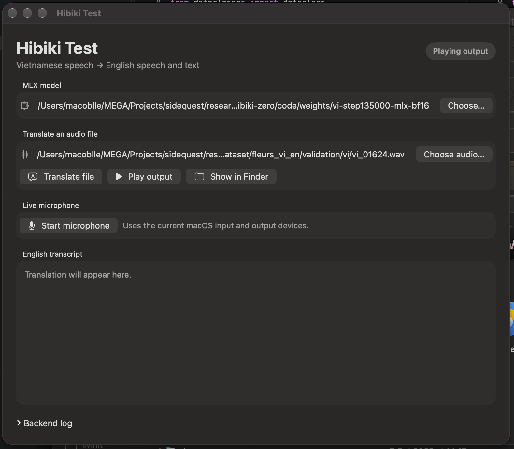

> **One-line result.** We ported Kyutai's 3B Hibiki-Zero simultaneous speech translator to Apple Silicon, reduced it from 5.8 GB to 2.2 GB, and reached about 3x real-time on an M4 Pro. The runtime now has a native macOS test shell, while co-contributor An Quách has built a separate native MLX Swift iOS prototype for the 1B French-to-English model. For Vietnamese, we produced 696,243 PhoMT speech pairs, introduced cross-lingual timbre matching for the final roughly 51%, built a grounded 719,120-row training receipt, and completed several full-model SFT campaigns. The latest direct run improved teacher-forced PhoMT fit but regressed on real FLEURS speech and still failed free-running PhoMT generation; no Vietnamese checkpoint is production-qualified yet.

| Evidence snapshot | Result | Confidence |
|---|---:|---|
| 3B q4 file inference, M4 Pro | about **3.0x real-time** | measured |
| 1B q4 file inference, M4 Pro | about **4.1x real-time** | measured |
| Native macOS prototype | file and live-microphone modes through the Python/MLX engine | implemented, not product-qualified |
| Co-contributor iOS prototype | native MLX Swift, offline 1B FR->EN file translation | implemented externally, device performance not qualified |
| 3B LM step | **22.21 ms/frame** | measured |
| 1B LM step | **15.06 ms/frame** | measured |
| CoVoST2 fr->en, n=30 | 3B **25.7 BLEU**; 1B **28.4 BLEU** | measured, small set |
| Vietnamese phase-1 full SFT, val128 | **19.61 chrF** vs unsupported baseline about zero | measured |
| Vietnamese phase-2 warm start | **closed/no-go**; best 13.04 chrF, final 7.48 | measured |
| PhoMT synthetic speech | **696,243 pairs / about 1,228 VI hours** | measured |
| PhoMT timbre-matched subset | **about 357k rows / 51%** | derived from frozen boundary |
| PhoMT raw-campaign elapsed time | **32.4 days**; optimized sprint **2.45 days** | derived from commit timestamps |
| PhoMT training-cache endpoint | **34.3 days from first pipeline commit** | derived from commit timestamps |
| Grounded-v2 direct-SFT receipt | **719,120 rows/epoch** | frozen and verified |
| Direct 3B S2ST run | best FLEURS teacher-forced loss at **18k**; stopped at **135k / about 3 epochs** | measured; no qualified checkpoint |
| Historical H100 full-SFT speed | phase 1 **4.5 h / 3 epochs**; phase 2 **6 h / 2 epochs** | measured on different receipts |
| Parallel-head smoke, 3B | head **12.70 -> 5.28 ms**; LM **25.9 -> 18.5 ms** | measured, quality not qualified |
| 1B phone artifact | **7/7 loader checks pass** | compatibility only |
| 1B projected iPhone LM step | about **30 ms** at the stated 0.5x scale | projection, no phone measured |

**Repository state used for this report:** commit `92f31b8`; core evidence is linked throughout. The external iOS implementation was inspected at `e149a27`. Numbers are labeled **measured**, **derived**, or **projected**. A projection is never presented as a device result.

---

# 1. Problem, product, and starting point

Hibiki-Zero is Kyutai's 3B hierarchical Transformer for simultaneous speech-to-speech and speech-to-text translation. It consumes and emits Mimi audio tokens at 12.5 Hz, so one streaming frame represents 80 ms. The released model translates French, Spanish, Portuguese, and German speech into English while also emitting an English text stream and preserving voice characteristics. Kyutai's release requires an NVIDIA GPU; the model card describes a 3B backbone, 12.5 Hz generation, five-language support, and a non-commercial share-alike license [R1-R3].

The project goal is more ambitious than "make the demo run on a Mac":

1. run the model efficiently on Apple Silicon;
2. add Vietnamese as a new source language;
3. expose the model through a useful desktop application;
4. shrink and reshape it for mobile hardware; and
5. prove sustained real-time inference on Apple and Qualcomm devices.

The product experience is a conversation, not a sequence of recordings: a person speaks, translated English text and audio begin before the source sentence ends, and the entire loop can stay on-device.

## 1.1 What this project contributes

Kyutai contributed the model, training method, Mimi codec, reference inference stack, and original weights. This repository contributes:

- a native MLX q4 runtime and model-conversion path;
- Hibiki-Zero architectural support in the vendored `moshi-mlx` implementation;
- a three-stage streaming scheduler for Mimi encode, LM inference, and Mimi decode;
- a native SwiftUI macOS prototype for file and live-microphone translation;
- reproducible speed, silence, translation, memory, and compatibility gates;
- a Vietnamese data, cache, full-SFT, and free-running evaluation stack;
- a smoke-proven parallel codebook head; and
- published MLX artifacts and research records for accepted and rejected experiments.

In a complementary repository, co-contributor [An Quách](https://github.com/anthoai97) has built **Hibiki Edge**, a native iOS application and clean MLX Swift implementation of the 1B French-to-English inference path [R15]. It is credited separately because it does not wrap or ship this repository's Python runtime.

## 1.2 Current scope and non-claims

The report does **not** claim that Vietnamese training is finished, that the parallel head has production audio quality, or that an iPhone or Snapdragon device has already met the frame budget. The current iPhone table is a transparent projection from M4 Pro measurements. Qualcomm deployment is a roadmap backed by official tooling, not a completed port.

---

# 2. System architecture


At 24 kHz, Mimi consumes 1,920 PCM samples per frame. The runtime performs four logical operations:

1. **Mimi encode** turns source PCM into source audio codebooks.
2. **The main Transformer** combines source codebooks, prior generated audio, text feedback, and optional conditioning into one hidden state.
3. **The text head and codebook head** emit English text plus target-audio codebooks.
4. **Mimi decode** reconstructs 24 kHz English audio.

The runtime implementation is intentionally small. [`main.py`](../../main.py) handles the CLI and live audio callbacks; [`hibiki_mlx/pipeline.py`](../../hibiki_mlx/pipeline.py) owns model loading, quantization, the file pipeline, tail flushing, and the opt-in parallel head. Model-specific architecture support belongs in the vendored [`moshi-mlx`](../../moshi-mlx/) fork rather than in per-script monkey patches.

## 2.1 The hierarchical bottleneck

The main Transformer produces one hidden vector per 80 ms frame. The original autoregressive depformer then predicts 8 or 16 generated audio codebooks sequentially. That recurrence is expensive on an Apple GPU because it launches many tiny kernels. On the measured 3B path, the depformer consumed roughly half the LM frame and was launch-bound: quantizing it reduced storage but did not reduce the serial dependency.

This observation split optimization into two classes:

- **Scheduling and implementation wins:** quantized loading, fixed architecture support, compiled per-slice execution, bounded KV caches, and a CPU/GPU pipeline.
- **Architecture wins:** remove the within-frame codebook recurrence with a parallel head; for a Vietnamese phone model, also distil or train a smaller backbone.

## 2.2 Three independent state machines

The live runtime is easiest to reason about as three state machines connected by ordered queues:

- the encoder owns a `rustymimi.Tokenizer` and source-codec state;
- the LM owns MLX arrays, the Transformer KV cache, text history, and generated-codebook feedback; and
- the decoder owns a second `rustymimi.Tokenizer` and target-codec state.

The queues carry **NumPy arrays**, not lazy MLX arrays. MLX graphs are associated with the stream on which they were created; passing unevaluated arrays between threads caused cross-thread evaluation failures in newer MLX versions. Likewise, the encoder and decoder cannot share one Rust tokenizer: doing so triggers an `Already borrowed` panic. Both failures disappeared when ownership was made explicit at the pipeline boundary.

## 2.3 End-of-input behavior is part of correctness

Simultaneous translation intentionally lags the source by several seconds. Stopping inference when the input file ends truncates the target. The runtime therefore feeds up to eight seconds of silence, then stops after 12 consecutive text-pad frames. The text temperature defaults to 0.4: greedy sampling over-collapsed, while a hotter stream produced cold-start openers and feedback errors. This is not UI polish; the sampled text is fed back autoregressively and changes later audio and text.

---

# 3. Engineering journey and decisions

## 3.1 Stage 0 - a correct but slow PyTorch/MPS baseline

The reference path rejected non-CUDA execution. Small device guards were enough to produce coherent output on MPS, but the 64-second test clip ran at about 0.7x real-time. This baseline was useful because it proved Apple hardware could execute the graph and gave a known-good text/audio target. It was not a viable product runtime.

**Decision:** keep PyTorch for training and use MLX for Apple inference. MLX provides Apple-Silicon-native arrays, lazy execution, quantization, compilation, Swift bindings, and unified CPU/GPU memory [R4-R5].

## 3.2 Stage 1 - q4 MLX, and why the first "successful" load was wrong

The 3B LM was quantized from 5.8 GB bf16 to about 2.2 GB q4. The model loaded and generated output, but the audio babbled while the text was coherent. That asymmetry localized the error to the codebook path rather than the main Transformer's language reasoning.

The stock MLX runtime was missing four Hibiki-Zero details:

| Missing invariant | Symptom or risk | Owning fix |
|---|---|---|
| `hidden_scale` from config | wrong feed-forward widths | model configuration |
| `kv_repeat=2` grouped-query attention | wrong attention topology | attention implementation |
| `rope_concat` positional encoding | incorrect positions | RoPE implementation |
| learned per-slice `depformer_norms.{i}` | coherent text, babbling/clipping audio | depformer output boundary |

The decisive test was **silence in**. A healthy model should remain near silent when fed zeros. Without the learned depformer LayerNorm, the test produced roughly 0.13 RMS and 1.23 peak; after the correct normalization path was loaded, it passed the project gate. This converted a subjective audio complaint into a fast, falsifiable regression test.

**Decision:** architecture deltas belong in the vendored model implementation. The original published 3B artifact includes a portable patch shim, while the active repository owns the fixes in `moshi-mlx` [R6].

## 3.3 Stage 2 - stop serializing independent hardware

Profiling showed Mimi encode and decode ran on CPU while the LM ran on the GPU, but the original loop serialized all three. `rustymimi` releases the GIL, so the file and microphone runtimes now overlap:

```text
encoder thread:  PCM -> source codes  ─┐
main thread:             source codes -> LM -> target codes
decoder thread:                              └-> PCM
```

FIFO ordering preserves the stream. For a file, the encoder can race ahead; live input adds one frame of pipeline latency but reduces the repeating critical path to the slowest stage, normally the LM.

**Decision:** optimize the end-to-end schedule before rewriting kernels. This scheduling change moved the 3B q4 path from about 1.35x to about 3.0x real-time with no model approximation.

## 3.4 Stage 3 - reduce launches and bound memory

The depformer still executed sequential slices, but its per-slice cache setup and launch overhead could be reduced. A fixed-shape compiled step cut the 3B depformer from about 12.4 to 10.2 ms and the LM frame from 24.3 to 22.1 ms. It did not remove the recurrence; it made each recurrence cheaper.

The main Transformer KV cache was also capped at the model's actual attention context. This reduced dead live-window memory from 537 MB to 66 MB on the 1B model and from 470 MB to 344 MB on the 3B model. The cap preserves the attention window; it only stops retaining state the model cannot attend to.

## 3.5 Stage 4 - choose the phone artifact with evidence

The benchmark matrix made the product split explicit:

- **3B q4:** multilingual Mac runtime and Vietnamese teacher.
- **Hibiki-M 1B q4:** phone-sized candidate, currently FR->EN only.
- **q4-depq3:** storage option; only depformer slice Transformers use q3.
- **parallel head:** experimental until trained and audio-qualified at scale.

The 1B q4 model is smaller and faster, and on the n=30 French benchmark it scored better than the multilingual 3B because it is a dedicated FR->EN model. It is not yet a Vietnamese phone model.

**Decision:** keep q4 group size 32. Stock `moshi-mlx` and `moshi-swift` use this contract for `.q4.safetensors`; a different group size saves little and breaks the downstream loader. [`scripts/check_swift_compat.py`](../../scripts/check_swift_compat.py) reproduces the strict loader path and reports 7/7 checks for the staged artifact. This proves format compatibility, not iPhone speed [R7].

---

# 4. Performance and quality evidence


## 4.1 Model and quantization matrix

All stage timings below are M4 Pro measurements from the repository benchmark reports. Minor differences between tables reflect separate clean runs; no cross-run decimal should be interpreted as a statistically significant delta.

| Configuration | Main ms | Codebook-head ms | LM total ms | LM weights | Live/file result | Translation gate |
|---|---:|---:|---:|---:|---:|---|
| 3B q4, AR head | 12.32 | 9.90 | **22.21** | 2.41 GB artifact in matrix | about 3.0x file RT | BLEU 25.7 / chrF 49.4, n=30 |
| 3B q4-depq3 | about 11.9 | about 9.5 | **21.4** | 2.21 GB | about 3.7x LM budget | coherent short gate |
| 1B q4, AR head | 8.05 | 7.02 | **15.06** | 1.13 GB | about 4.1x file RT | BLEU 28.4 / chrF 54.6, n=30 |
| 1B q4-depq3 | about 7.4 | about 7.3 | **14.7** | 1.05 GB | about 4.1x file RT | BLEU 26.8 / chrF 53.7, n=30 |
| 3B + parallel smoke | 13.2 | **5.28** | **18.5** | +0.45 GB bf16 head | 4.3x live estimate | text coherent; audio not qualified |

The q3 experiment is a useful negative result. Quantizing the slice Transformers was acceptable, but quantizing depformer embeddings and output projections caused babbling, repetition, and failed tail stopping. The final predicate therefore fixes the shared invariant at the quantization boundary: only modules proven safe enter q3.

## 4.2 Why the parallel head matters

The smoke head predicts all codebooks in one forward pass using per-codebook projections, previous-frame token conditioning, and a shared bidirectional trunk. It contains 227M bf16 parameters and was trained on only 30 CoVoST2 clips, so it proves mechanism and speed, not production quality.

Measured on the 3B model:

- codebook head: **12.70 -> 5.28 ms** (-58%);
- LM total: **25.9 -> 18.5 ms** (-29%);
- live throughput: **3.1x -> 4.3x real-time**.

The head is now bandwidth-bound because it reads about 0.45 GB of bf16 parameters per frame. The next optimization is therefore architectural shrinkage and q4, after quality training. The current implementation lives in [`student/`](../../student/), and the original smoke evidence remains in [`parallel_head_smoke.md`](../vision/reports/parallel_head_smoke.md).

## 4.3 The gate stack

No single metric is allowed to stand in for the product:

| Gate | What it catches | Current implementation |
|---|---|---|
| strict model reload | missing/wrong tensor names, shapes, q4 contract | `check_swift_compat.py` |
| silence-in RMS/peak | babble, clipping, broken audio head | `bench.py --silence` |
| coherent known clip | obvious text/audio regressions | `verify_mlx_q4.py` |
| BLEU/chrF/WER | translation text | CoVoST2/FLEURS evaluation scripts |
| nonempty/EOS/loops/length | free-running collapse | `eval_lora.py` metrics |
| waveform/ASR/speaker similarity | TTS and generated-audio integrity | VIVOS QA pipeline |
| per-stage latency and memory | real-time feasibility | `bench.py` plus device reports |

The report deliberately keeps **text-stream quality** and **speech-output quality** separate. Text can remain coherent while the codebook head is broken; that exact failure produced the missing-LayerNorm discovery.

---

# 5. Vietnamese adaptation: what worked, what failed, and why


The upstream model does not support Vietnamese. The original FLEURS test produced about 0.26 BLEU, effectively the unsupported-language floor. Adding Vietnamese therefore requires the main Transformer to learn a new source-acoustic mapping; a tokenizer flag or a new output head cannot do it.

## 5.1 From generated speech to a frozen training receipt

The data exists at several boundaries, and their counts should not be conflated. The published PhoMT speech campaign contains 696,243 VI-EN pairs. The first duration-filtered Mimi cache contains 694,422 rows. Grounded-v2 then rebuilt the supervision with English CTC timing and rejected 4,364 failed alignments, leaving 690,067 PhoMT rows before the training frame cap.

Each grounded cached example has aligned streams:

```text
English text         CTC-timed tokens ending in tokenizer EOS
English target audio Mimi codebooks with their native validity mask
Vietnamese source    Mimi codebooks ending in explicit codec-card EOS
```

Mimi encoding happens once. The trainer consumes these streams unchanged and performs masked teacher-forced audio and text cross-entropy without re-running the codec. Grounded-v2 requires an alignment score of at least 0.5, supervises English text EOS, and gives the source an explicit acoustic end boundary. These changes fixed grounding and termination at the cache boundary instead of adding trainer-side transforms.

The final direct-run receipt is:

| Boundary | Rows | Meaning |
|---|---|---|
| Published PhoMT speech | 696,243 | about 1,228 VI hours before the 25-second cache filter |
| First PhoMT Mimi cache | 694,422 | 1,114 VI hours; 1,821 long rows removed |
| Grounded-v2 PhoMT | 690,067 | 4,364 CTC-alignment failures rejected |
| Eligible PhoMT at 280 frames | 684,232 | pool before frozen sampling |
| Frozen PhoMT membership | 683,164 | unique rows selected per epoch |
| Grounded-v2 FLEURS | 1,448 train / 148 validation | 1,392 train and 138 validation rows eligible at 280 frames [R8] |
| Frozen FLEURS membership | 35,956 | repeated sampling from 1,392 unique eligible rows |
| **Total frozen epoch** | **719,120** | 95/5 PhoMT/FLEURS selection, seed 42 |

This distinction later mattered: “35,956 FLEURS rows per epoch” means about 25.8 presentations of each unique FLEURS training row per epoch, not 35,956 independent real-speech examples. Project-published artifacts include the [PhoMT speech dataset](https://huggingface.co/datasets/anquachdev/PhoMT-en-vi-speech) and the grounded-v2 cache under `huybik/hibiki-zero-vi-full-sft`. The original PhoMT terms are research/education-oriented and restrict redistribution of the original corpus; the generated artifact and every downstream release still require a license audit [R9].

## 5.2 Experiment 1 - LoRA proved plumbing, not Vietnamese grounding

The first adaptation trained rank-32 LoRA modules in the main Transformer, with optional text and audio heads. It could reduce loss, save/reload adapters, and overfit tiny examples, but free-running output remained generic, empty, or repetitive.

Teacher-forced reconstruction exposed the cause: later target tokens were predicted well, but the first source-grounded content was wrong. The model learned the English target-side language model while the frozen backbone still failed to route Vietnamese acoustics. This was evidence against LoRA capacity for a genuinely new source language, not evidence of a broken cache or evaluator.

**Decision:** LoRA remains a local plumbing probe. Scaled Vietnamese training uses full-model SFT on CUDA.

## 5.3 Experiment 2 - full SFT established Vietnamese routing

The first H100 full-model SFT started from the upstream base checkpoint and trained on about 147k cached samples / 224 VI hours plus FLEURS. Over three epochs and 55,284 steps, val128 chrF reached **19.61**. The final standalone greedy evaluation reported:

- 128/128 nonempty;
- 126/128 EOS;
- 8/128 repeated-4gram loops;
- about 1.9x output/reference length; and
- BLEU 0.22, showing chrF was the more informative low-resource progress signal.

The run cost roughly 4.5 hours on an H100 and demonstrated the central hypothesis: full SFT can make Hibiki route Vietnamese source speech where LoRA could not. It did not yet prove strong source dependence. A later calibrated test measured only **0.01 BLEU / 1.03 chrF** correct-minus-shuffled-source gaps, compared with **23.08 / 38.80** for healthy French. Much of the apparent translation quality could still come from English target history.

## 5.4 Grounding detours: what we tried before returning to direct S2ST

We used shuffled-source evaluation during this research phase as a causality diagnostic: if replacing Vietnamese audio barely changes the output, the model is not relying on it. It was later removed from the production recipe, but it exposed why low teacher-forced loss and plausible English were insufficient.

| Approach | Strongest evidence | Decision |
|---|---|---|
| Ordinary, high-delay, and contrastive pilots | Correct-minus-shuffled gaps stayed near zero despite falling losses; contrastive NLL gap reached 1.04 but free-running chrF gap was only 0.61 | Delay and contrastive loss did not produce usable S2ST grounding |
| Raw Vietnamese ASR preadaptation | Learned source dependence, but the English tokenizer used 4.14 pieces/word and emitted invalid-byte characters in 110/128 predictions | Tokenizer made raw VI text a dead end |
| ASCII Vietnamese ASR | 27.85 BLEU / 53.26 chrF, WER 0.514, with large source gaps | Proved the backbone can learn Vietnamese acoustics; not translation |
| Translation after ASCII-ASR, with and without ASR replay | At step 1,000, chrF was 8.44 without replay and 7.73 with replay; source gaps remained around zero | Preadaptation did not transfer into simultaneous translation |
| Post-source-EOS translation | Best at step 2,000: 2.06 BLEU / 18.27 chrF, source gaps 1.81 / 4.31 | First partial grounding, but missed the 1.0 BLEU / 5.0 chrF source gates |
| Full text-only run from the ASCII-ASR parent | 4.00 BLEU / 26.30 chrF versus shuffled 0.18 / 16.78 after one epoch | Proved partial text translation, but trained zero target-audio tokens and therefore was not S2ST |

The value of these branches was diagnostic. Their curriculum, replay, contrastive, anti-repetition, and post-source machinery was then deleted, restoring the simplest general boundary: upstream initialization, grounded source/target streams, and direct full-model speech-to-speech training.

## 5.5 The full-cache warm start collapsed to silence

Phase 2 warm-started the successful checkpoint on the full 1,114-hour synthetic cache. It used a peak learning rate of 5e-5, higher than the prior run's final 3e-5. The model fell into a text-pad/silence attractor:

| Step | Corpus chrF | Nonempty chrF | Nonempty / 128 | Interpretation |
|---:|---:|---:|---:|---|
| 9k | 1.24 | 8.22 | 17 | early pad collapse |
| 18k | 11.40 | 12.52 | 113 | partial recovery |
| 36k | **13.04** | 14.55 | 107 | run best, still below warm start |
| 63k | 3.83 | 12.26 | 31 | second collapse |
| 86,258 | 7.48 | 13.67 | 55 | two-epoch final |
| 90k extension | 7.63 | 16.45 | 45 | low-LR continuation failed |

The alarming result was that **every teacher-forced metric improved while free-running generation got worse**. Teacher forcing feeds reference content and never enters the model's self-reinforcing pad history. Even the new content-only CE and `silence_score` ranked the collapsed checkpoint above the healthy one.

**Decision:** only deterministic free-running outputs can qualify a checkpoint. Teacher-forced metrics diagnose optimization and overfit; they do not select a model.

## 5.6 Direct grounded-v2 S2ST: stable optimization, wrong stopping rule

The direct run removed every experimental curriculum and initialized only from upstream Hibiki-Zero 3B. Its frozen launcher recipe was:

- all parameters train with fp32 master weights and bf16 autocast;
- physical batch 16, no accumulation, and a 280-frame cap;
- fixed LR `1e-6` with fused AdamW, betas `(0.9, 0.95)`, weight decay 0.1;
- full English target-audio teacher forcing;
- loss `audio CE + (content text CE + 0.05 × prefix-PAD CE) / 1.05`; and
- five planned epochs / 224,725 steps, validating and saving every 9,000 steps.

Five epochs was the frozen plan, not the completed result. The pod was stopped at **step 135,000**, almost exactly three epochs, after the fixed FLEURS validation loss had worsened for thirteen consecutive checkpoints. Step 18,000 remained the best deterministic FLEURS teacher-forced checkpoint.

| Step | Epoch position | Rolling train loss | FLEURS validation loss | Unseen PhoMT loss |
|---:|---:|---:|---:|---:|
| 18,000 | 0.40 | 3.6674 | **5.8426** | 3.6814 |
| 36,000 | 0.80 | 3.5560 | 6.2577 | - |
| 90,000 | 2.00 | 3.0826 | 6.8838 | - |
| 135,000 | 3.00 | **2.7357** | 7.2782 | **3.1285** |

This was not numerical collapse. The model continued improving **teacher-forced loss** on a row-disjoint PhoMT holdout while regressing on held-out FLEURS. The 95% PhoMT mixture dominated optimization, while each of the 1,392 unique FLEURS training rows had been seen about 77 times on average by step 135,000. A fixed LR and five-epoch replay continued moving the model long after the FLEURS optimum.

Free-running evaluation showed that even the 18k checkpoint was not healthy:

| Metric | Upstream | Step 18k | Step 135k |
|---|---:|---:|---:|
| BLEU | 0.213 | **0.880** | 0.633 |
| chrF | 14.269 | **17.117** | 16.311 |
| WER | **1.130** | 1.329 | 1.951 |
| EOS found | 125/128 | 124/128 | 115/128 |
| Mean length ratio | 1.056 | 1.283 | 2.049 |
| Repeated-4-gram outputs | 16/128 | 22/128 | 32/128 |

A six-row correct-source check then tested step 135k on row-ID-disjoint PhoMT examples whose English targets were all marked timbre matched:

| PhoMT free-running metric | Step 135k |
|---|---:|
| Nonempty | 6/6 |
| EOS found | 4/6 |
| BLEU | 2.07 |
| chrF | 18.85 |
| WER | 159.18% |
| Generation health | **Fail** |

All six rows used the correct Vietnamese source, seed 42, audio temperature 0.8, text temperature 0.4, and top-k 250 for both streams. Their English targets were all marked `cross_lingual_timbre_matched=true` in grounded-v2.

### The six unseen-PhoMT cases

#### `phomt_s01071r00154`

- Vietnamese: Tránh sử dụng tiếng lóng.
- English reference: Avoid using slang.
- Step-135k output: Avoid snoring , You've been in snooze. ":
- EOS: yes

#### `phomt_s01071r00260`

- Vietnamese: Bạn có thể tìm kiếm bằng chứng chống lại suy nghĩ này.
- English reference: You can look for evidence to the contrary.
- Step-135k output: You can look for a katyl, taeky, "I" in "-no" ways. ""). ")))
- EOS: yes

#### `phomt_s01071r00217`

- Vietnamese: Cố gắng không vội vã đưa ra kết luận.
- English reference: Try not to jump to conclusions.
- Step-135k output: Try to be sure you're not giving your ⌘ ☘ ⌘ ⌘ ⌘ ⌘ ⌘ ⌘ ⌘ ⌘ ⌌ ⌌ The best of ⌘ ☌ people ⌘) but ⌄Well - ⌘) the other way around ⌘) See, you're doing it. ⌘. ⊞)
- EOS: **no**

#### `phomt_s01071r00340`

- Vietnamese: Nếu muốn buộc tóc sau lưng, bạn chỉ nên buộc hoặc tết lỏng.
- English reference: When pulling your hair back, style it in a loose braid.
- Step-135k output: So if you want to get your hair's back, you'll say, "------------- -- or - - - - - - ------re-use"? ,'------------- 'to-intro your yourself '" ----- - ----o- do - - - - - - '---------or - / - - - - -------or" ---
- EOS: **no**

#### `phomt_s01071r00474`

- Vietnamese: Hàn the rất độc đối với con người và thú cưng.
- English reference: Borax is very toxic to humans and pets as well.
- Step-135k output: We're going to make a lot of money. ", " -----------sit-top- cold - - - - - and - - - -------knucks------------nation-- - -------knose -----------
- EOS: yes

#### `phomt_s01071r00299`

- Vietnamese: Không siết các cơ bụng, chân hoặc mông.
- English reference: Do n't squeeze other muscles like your abs, legs, or butt.
- Step-135k output: Do not sting , The muscles, , shiver , The muscles, sting. sting .. '"
- EOS: yes

Several outputs began with a related phrase and then drifted into corrupted, repetitive, or unterminated text. The lower unseen-PhoMT teacher-forced loss therefore measures improved in-domain next-token fit under gold history, not healthy free-running PhoMT translation.

Step 18k should be preserved as the FLEURS-selected artifact and step 135k as a **teacher-forced PhoMT-specialized** research artifact. Neither passes the generation-health gate, and neither is a production Vietnamese S2ST checkpoint.

## 5.7 Making full-model SFT fast enough on H100

The H100 work optimized **samples per second**, not merely seconds per optimizer step. Batch 16 takes longer per step than batch 8 but processes twice as many examples, which is why the phase-2 change from 0.196 to 0.281 seconds/step was still a 1.39x throughput win.

| Run | H100 and physical batch | Measured optimizer speed | Memory and wall time |
|---|---|---:|---|
| Phase-1 smoke | SXM 80 GB, B8 | about 0.28 s/step | 68/80 GB; 240 steps; full save about one minute |
| Phase-1 full | SXM 80 GB, B8 | about 0.20 s/step / 5 step/s | 59 GB; 55,284 steps / 3 epochs in about 4.5 h; about $9 |
| Phase-2 baseline | NVL 94 GB, B8 | 0.196 s/step / 40.8 samples/s | per-step speed essentially matched the SXM |
| Phase-2 B16 benchmark | NVL 94 GB, B16 | 0.281 s/step / **56.9 samples/s** | **1.39x** B8 sample throughput; B24 OOMed |
| Phase-2 production | NVL 94 GB, B16 | about 0.25 s/step / 64 samples/s | 93-94/93.6 GiB; 86,258 steps / 2 epochs in about 6 h; about $15 |
| Grounded-v2 direct | H100 with at least 90 GiB, B16 | **not committed** | 44,945 steps/epoch planned; stopped at 135,000 |

The final row is intentionally incomplete. The grounded-v2 trainer logs `sec_per_step` every ten steps, but the stopped run did not commit an aggregate speed, exact H100 SKU, epoch wall time, or total rental cost. Phase-2's 0.25 s/step must not be reused as if it measured the direct run.

### Cache once; never run Mimi in the optimizer loop

Vietnamese and English audio are encoded once. Training reads cached English target Mimi codes, CTC-timed English text, and Vietnamese source codes, so neither Mimi encoder runs during forward/backward. The phase-1 eight-way H100 cache build converted 224 VI hours in about **40 minutes**. The full caches stay in host RAM as int32—about half the footprint of int64—and only the active batch is cast to long during collation. The current pod preflight therefore requires at least 110 GiB host RAM.

This is an intentionally simple in-memory loader: `num_workers=0`, no pinned-memory prefetch, no persistent workers, and no non-blocking H2D copy. Those paths were never implemented or benchmarked, so they are not credited as optimizations.

### Use BF16 for matrix work, FP32 where small updates matter

The model runs forward/backward under CUDA bf16 autocast while parameters, gradients, Adam moments, recovery checkpoints, and CE logits remain fp32. Compared with the earlier fp32 forward path, this measured at roughly **2x throughput with about half the activation memory**. BF16 master weights were rejected because Adam updates around `1e-5` could round away; BF16 autocast needs no fp16-style GradScaler.

CUDA also uses fused AdamW. `torch.set_float32_matmul_precision("high")` enables TF32 tensor-core work for remaining fp32 matmuls without changing fp32 state. No isolated fused-AdamW or TF32 gain was recorded, so the report treats them as parts of the final stack rather than independent benchmark claims.

### Spend VRAM on physical batch, not recomputation

The main phase-2 gain was using the NVL's extra memory for physical batch 16. It raised throughput from 40.8 to 56.9 samples/s; batch 24 OOMed. The current direct recipe therefore requires at least 90 GiB, freezes physical B16 with accumulation 1, and disables gradient checkpointing. When B16 fits, accumulation or checkpoint recomputation would serialize extra work instead of increasing sample throughput.

Rows are capped at **280 Mimi frames**, about 22.4 seconds, then length-sorted into homogeneous B16 blocks. This bounds quadratic attention memory and reduces padding. The blocks are shuffled in the frozen manifest for deterministic resume. Exact one-frame buckets were **1.6x slower** because CUDA repeatedly autotuned new shapes; phase 2 used 32-frame buckets, and the direct run uses 16-frame buckets to balance padding against stable compiled shapes.

### Make the kernels compile and stay on device

Torch 2.12's Moshi compile path returned invalid backward gradient shapes, so phase 1 correctly disabled it. Torch 2.13 fixed the failure; phase 2 measured `torch.compile` at roughly **10% faster** and made it the default. The direct launcher pins Torch `2.8.0+cu128`, requires compile, and gates it on the longest-row save/resume smoke, although no isolated gain is committed for that exact stack.

Two smaller loop fixes each measured about 1% on CUDA:

- verified lower-triangular masks are replaced with `scaled_dot_product_attention(..., is_causal=True)`, allowing the fused causal SDPA/Flash path;
- loss sums, token counts, and non-finite checks remain on GPU and convert to host only every ten log steps instead of synchronizing every microbatch.

Condition tensors are also cached by physical batch size. None of these small changes replaces the primary gains from BF16, B16, frame control, and compilation, but together they remove steady-state launch and synchronization tax.

### Overlap recovery I/O without pretending it is kernel speed

The direct run validates and saves every 9,000 steps rather than interrupting the loop every few thousand steps. Historical full recovery pairs were roughly 12.5 GB of model plus 25 GB of trainer state and took about one minute to write. Best-checkpoint promotion uses a hard link instead of copying the model again.

`hf_sync.py` runs as a separate supervised process, so Hub upload overlaps optimizer work. It stages through hard links, publishes the model first and trainer second as the completion marker, keeps the newest two complete recovery pairs plus the current best, and uploads final logs after training exits. Phase 2 recorded roughly 16 MB/s over one connection with `hf_transfer`. This reduces network-induced idle time and makes pod replacement practical; it does not make a CUDA step faster.

### Run at the memory edge only after the worst case passes

Preflight verifies the H100, driver and package pins, hashes, 1,428 cache shards, frozen 719,120-row manifest, at least 110 GiB host RAM, and 190 GiB free disk. The direct smoke trains the longest B16 rows for ten steps, saves and validates, reloads the complete model and optimizer, resumes for step 11, and exercises the longest non-shuffled validation row. It requires at least 2 GiB VRAM headroom and binds `SMOKE_OK` to the Git commit.

These checks cost setup time but prevent an optimized configuration from failing hours later on the longest batch or first recovery. They are reliability gates around the fast path, not throughput results.

## 5.8 What the next run must change

The evidence now supports a shorter upstream-start experiment, not another long continuation: cap the first controlled run at 27k-36k steps, validate every 3k through the early optimum, and stop after two consecutive regressions. PhoMT and FLEURS must remain separate validation domains. LR decay or a fixed `5e-7` should be tested only after the shorter stopping rule is reproduced, so data mixture and optimizer effects are not confounded.

Checkpoint promotion must combine teacher-forced diagnostics with correct-source free-running health: at least 122/128 nonempty, at least 116/128 EOS, at most 12 repeated-4-gram failures, mean length ratio at most 2.0, and no material chrF regression. Generated English must also pass content, audio-quality, and source-speaker-similarity checks on a verified timbre-matched set. The test sets stay sealed until selection.

## 5.9 Next-phase targets: data scale-up, voice-matched fine-tune, and GRPO

The Hibiki-Zero paper [R1] closes its exposure gap not in supervised training but in two later stages: a natural-pause TTS fine-tune whose targets are voice-transferred onto the source speaker, and GRPO reinforcement learning on free-running outputs scored by BLEU process rewards. Its supervised stage trains on 40,000 hours of real multi-speaker audio per source language; this project's entire supervised signal is about 1,114 synthetic PhoMT hours plus 1,392 unique FLEURS rows. The next phase therefore has three targets, planned in detail in [`vi_en_parity_plan.md`](../vi_en_parity_plan.md):

| Phase | Target | Key numbers |
|---|---|---|
| Data scale-up | grow total Vietnamese source speech to **about 40,000 h**, matching the paper's per-language volume | scripted-EN corpora (Common Voice first, then LibriSpeech/MLS/GigaSpeech-class) → Gemini EN→VI translation → TTS voice-transfer onto the original clip speaker → grounded-v2 cache; every new row verifiably timbre matched; FLEURS single pass, no reuse |
| Voice-matched fine-tune | paper stage-4 analog: audio CE restricted to verified timbre-matched rows only | ~1–2k steps, batch 16, LR `1e-6`; unmatched PhoMT rows keep text CE only; speaker-cosine gate added to eval |
| GRPO reinforcement learning | paper stage-5 analog: train in the free-running regime that inference actually uses | G=4 samples/input, reward r_t = (1−α)·BLEU(partial) + α·BLEU(full), α=0.4, rewards every 8 input words, batch 32, LR `2e-7`, start 500–1000 updates |

Sequencing is deliberate: data first because RL on a weak base rewards noise and generation is the longest-lead item; then the fixed stopping-rule SFT run; then the cheap voice-matched fine-tune before RL locks in a policy; then GRPO against the repetition/EOS failures measured in Section 5.6. Success criteria and risks are maintained in the parity plan.

---

# 6. Data engineering: scale was necessary, but quality boundaries mattered more

## 6.1 The PhoMT campaign

PhoMT supplied broad Vietnamese-English text coverage. VieNeu generated Vietnamese source speech and Kokoro generated English target speech. The goal was not merely bilingual audio: for voice-preserving S2ST, the English target should provide both the translated content and a usable proxy for the Vietnamese source timbre.

### Timeline and honest wall-clock accounting

The first PhoMT speech-pipeline commit was recorded on **29 June 2026 at 12:52 +07**. The raw Hub campaign completed on **31 July at 22:45 +07**: **32 days 9 hours 52 minutes**, or **32.4 elapsed days across 33 calendar dates**. This is the defensible whole-project duration. It includes the original pipeline, the first 148k rows, voice-bank work, optimization, failed paths, QA, regeneration, packing, and upload—not 32 days of uninterrupted synthesis.

The heavily optimized production sprint began on **29 July at 11:59 +07** and ended **2 days 10 hours 47 minutes later**, spanning three calendar dates. It began with 148,148 rows already on the Hub, so “696k rows in 2.45 days” would be false. The sprint planned 556,800 new pairs, accepted 548,095, and dropped 8,705. The training-ready Mimi cache finished on **2 August at 20:43 +07**, **34.3 days** after the first pipeline commit and just under 46 hours after raw-data completion.

| Date | Milestone | Cumulative or tranche result |
|---|---|---|
| 29 June | First paired PhoMT speech pipeline | project clock starts |
| 29 July | Optimized sprint starts | 148,148 existing rows / about 234 VI hours |
| 30 July, 00:37 | Tranche 1 uploaded | 96,000 planned; Hub at about 239.8k rows / 400 VI hours |
| 30 July, 22:24 | Tranches 1 and 2 validated | 337,519 exact rows / about 568 VI hours; 189,371 accepted and 2,629 dropped across the two tranches |
| 31 July, 17:15 | Tranche 3 audio complete locally | 364,800 planned; 8,225 duration outliers retried once |
| 31 July, 22:45 | Raw campaign complete | 358,724 accepted from tranche 3; **696,243 total rows / about 1,228 VI hours** |
| 2 August, 20:43 | Mimi cache complete | **694,422 rows / 1,114 VI hours / 1,377 shards** |

The exact accepted split between tranches 1 and 2 was not recorded, so the report preserves their combined result rather than inventing per-tranche counts. No monetary or electricity cost was logged for generation.

### Building and qualifying the voice pools

The final Vietnamese pool contained **40 voices**: 12 VieNeu presets and 28 VIVOS-derived clones. We removed eight candidates before production: three were unstable under repeated PhoWhisper CER checks and five synthesized slower than 12 characters per second. The first matching implementation embedded the raw Vietnamese enrollment clips; this was wrong because it measured the reference speaker more directly than the actual VieNeu clone. The mapping was rebuilt from synthesized Vietnamese calibration WAVs, fixing the invariant at the generated-audio boundary.

For each Vietnamese voice, the matcher searched a same-gender grid of **34 English candidates** built from seven Kokoro voices and pair blends at 25%, 50%, and 75%. VieNeu's 192-dimensional speaker encoder supplied the cross-lingual cosine space. Nearest-cosine selection produced roughly 14 distinct English target timbres; the worst selected cosine improved from **0.03 to 0.17**, and the best mapping reached **0.64**. This was a practical timbre proxy, not proof that the English voice was perceptually identical to the Vietnamese speaker.

### The partial-matching boundary

Timbre matching arrived midway through production. Only tranche 3, source index **345,600 and above**, used the mapping: roughly **357k rows / 51%** of the published dataset. The earlier roughly 339k rows retained independently selected English voices; a sample showed about 95% would choose a different English voice under the later map. We implemented a retrofit path but did not run it without evidence that re-synthesizing half the corpus would materially improve end-to-end speaker consistency.

The correct claim is therefore **partially timbre-matched PhoMT**, not fully voice-preserving PhoMT. The metadata records the boundary so training and evaluation can stratify matched and unmatched rows.

### Production QA and scale

The campaign eventually published **696,243 pairs / about 1,228 VI hours**. Tranche 3 generated 364,800 candidate pairs; 8,225 duration-ratio outliers were regenerated once and 6,076 were finally dropped. Every uploaded row had to contain finite, non-zero waveforms and pass an English/Vietnamese duration ratio of 0.4-1.8.

### Optimizing generation on the Mac

Generation ran on an Apple **M4 Pro**; related benchmark records identify the machine as having **48 GiB unified memory**, although the exact chassis and core count were not preserved. One tranche needed roughly 80-82 GB, so working data moved to `/Volumes/data/datasets` to keep the system disk available for swap.

The early path was dispatch- and memory-churn-bound, not compute-bound. Different benchmarks used different row mixes, so only like-for-like deltas should be read as one speed curve:

| Stage | Vietnamese throughput | English throughput | Material change |
|---|---:|---:|---|
| Initial Apple path | 3.1x sequential | 22x Kokoro MPS | functional baseline |
| Native VI batching | 6.1x at batch 8 | - | amortized model calls |
| First custom MPS engine | 4.2x -> about 25x warm | about 5.4x per CPU worker | removed host synchronization; batched codec decode |
| VI hyper-optimization | **52.8x sustained** over 256 real rows | 25.8x aggregate compiled CPU | static KV, shape buckets, fused embeddings, faster sampling |
| Kokoro Core ML path | about 53x VI solo | **70-75x EN solo aggregate** | Metal iSTFTNet decoder, 12.7x decoder speedup |
| Final concurrent production | **about 33x VI** | **about 40-50x EN** | one VI plus seven EN workers at the GPU-saturation ceiling |

The main gains came in dependency order:

1. **Remove CPU/GPU synchronization.** VieNeu's stock repetition penalty performed about 153,000 `.item()` synchronizations per batch. A persistent device-side seen-token mask, device-side EOS state, and an eight-frame completion check removed that traffic.
2. **Batch across voices and lengths.** Rows were globally sorted by phoneme length, synthesized across all voices, and decoded through the codec once per batch. This reduced tail waste and per-row launches.
3. **Bound MPS memory behavior.** `torch.mps.empty_cache()` after each batch stopped the allocator retaining many KV and shape classes until the machine swap-thrashed.
4. **Replace dynamic backbone state.** Preallocated Qwen KV buffers, 64-frame attention buckets, 128-frame allocation buckets, and fused grouped-query SDPA cut the backbone decode step from **27 to 7 ms/frame**.
5. **Simplify the acoustic loop.** Precomputed constant embeddings, mask-free one-token steps, fused 16-codebook embedding gathers, and top-k exponential-race sampling cut sampling from **2.94 to 1.22 ms**. Static KV was deliberately not used for the tiny acoustic decoder because it measured 3x slower.
6. **Make codec batching safe.** Short rows repeat their final valid code instead of zero-padding into fully masked attention, then trim after decode. The codec moved from fp16 to bf16; the language model remained fp16. Broadcasting one shared attention mask saved about 330 MB per 100-frame batch and cut the codec microbenchmark 26%, although the end-to-end gain was within noise.
7. **Move English around the Vietnamese long pole.** Kokoro first moved to CPU workers so VI could own MPS. Folding weight normalization and compiling iSTFTNet reached 25.8x aggregate; replacing that decoder with Core ML/Metal reduced a representative six-second decode from 927 ms to 73 ms and reached 70-75x solo. Cached compilation took about 50 seconds per worker when warm and roughly eight minutes from a cold cache.

Solo headline numbers did not survive real concurrency. One VI worker plus seven Core ML EN workers fully occupied the M4 Pro: VI fell from roughly 53x solo to 33x, while EN settled at 40-50x. Even so, a 96,000-pair tranche fell from about **17 hours to 5.3 hours**. A second VI worker achieved only about 34x combined and added roughly 6 GB of swap; batch 64 did not improve over batch 32; five versus seven EN workers barely changed the ceiling. CPU codec offload was slower under EN load, and asynchronous MPS decode from another thread crashed because Metal command encoding was not thread-safe in that path. Free-threaded Python 3.14 matched Python 3.12, confirming that the GIL was not the bottleneck. Other measured EN dead ends included ONNX variants at roughly 1.8-3x slower than PyTorch eager, fp16/bf16 CPU convolutions around 186x slower, and a 26-minute ANE compile that was no faster than eager CPU.

The campaign also produced two distinct silent-audio failures:

1. mixed-length fp16 codec attention created fully masked rows, NaNs, and silent PCM;
2. later memory pressure caused Metal to return exactly zero rows in **232 of 21,000 VI clips (0.44%)**, biased toward longer utterances.

The fix was not "try again later." Uniform-length repeat-last padding plus a bf16 codec eliminated the NaN mechanism; a 256-row validation produced zero NaNs, zero silent clips, and a 1.000 median duration ratio against the prior path. Every decoded row was then gated for finiteness and non-zero amplitude, with corrupt Metal rows regenerated through a lazy CPU codec clone. Full silence and duration-ratio audits ran before upload.

The operational path was also made resumable. Manifests appended after every batch, limiting a hard-kill loss to one batch per worker, and uploads resumed at 500-row shard granularity. Overlapping packing with upload saved about 50 minutes on a 325-shard run but initially exceeded Hugging Face's 128-commits/hour limit and hit HTTP 429; batching five Parquet files per commit lowered the rate to roughly 30 commits/hour.

## 6.2 Mimi and grounding caches

The first full Mimi pass produced **1,377 shards / 694,422 rows / 1,114 VI hours** after filtering 1,821 rows longer than 25 seconds. The 6.3 GB int32 cache had zero degenerate rows. We kept the PyTorch-MPS Mimi backend: the MLX port was only 0.74x as fast in the tested path and agreed on roughly 42% of codes, so mixing backends would have silently changed the token distribution.

Grounded-v2 then used Wav2Vec2 CTC word timing to place English text on the acoustic timeline, appended English tokenizer EOS, and appended explicit Vietnamese codec-card EOS. It accepted 690,067 PhoMT rows and rejected 4,364 alignment failures. At the 280-frame training cap, 684,232 PhoMT rows, 1,392 unique FLEURS train rows, and 138 FLEURS validation rows remained eligible. The published grounded-v2 cache, frozen manifest, and exact receipt made later run-to-run comparisons possible.

## 6.3 Real speech: VIVOS translation and target synthesis

The VIVOS pipeline froze speaker-disjoint train/dev/test manifests, removed transcript overlap, translated 11,711 eligible Vietnamese transcripts through a versioned batch request, and excluded the single row that was repeatedly blocked. Qwen3-TTS was then used for reference-conditioned English target synthesis [R11].

The first MLX pilots failed their preregistered aggregate WER comparison even when voice similarity was strong. These reports remain no-go evidence; a later user-approved model-level waiver did not relabel them. Subsequent batching, recurrence, deterministic row RNG, active-lane compaction, and retry-policy experiments culminated in a clean validation:

- 50/64 accepted after one retry round;
- aggregate WER 0.07990;
- median speaker cosine 0.91954;
- zero prompt leaks.

Production generated 10,950 attempt-0 rows. QA revealed three reference-conditioned speaker failure clusters, so `VIVOSSPK07`, `VIVOSSPK11`, and `VIVOSSPK18` were excluded from release. Under the later no-retry decision, 8,254 rows passed row-level gates but aggregate WER was 0.09813. A deterministic minimum-row trim removed 497 high-error passing rows, leaving **7,757 accepted rows at WER 0.07998**. The PyTorch-Mimi cache contains 7,024 train rows / 10.00 hours and 733 dev rows / 1.15 hours across 43 speakers.

Hub publication is **not verified**. The publisher rejected the dev archive at a mandatory LFS-size check and did not create `release_report.json`. The local bundle and audit are complete; the remote claim is not.

---

# 7. The scar tissue: mishaps that changed the design

| Mishap | What it looked like | Root cause | Permanent design change |
|---|---|---|---|
| Naive MLX port babbled | text correct, audio broken | missing learned depformer LayerNorm | silence-in gate; architecture fixes in model boundary |
| Shared Rust tokenizer panicked | `Already borrowed` | encoder/decoder shared mutable state | one tokenizer per thread |
| MLX queue failed across threads | evaluation/stream error | lazy arrays escaped creating stream | queue evaluated NumPy arrays |
| Full depformer q3 looped | repeated text and bad tail flush | embeddings/output heads were not q3-safe | narrow quant predicate; keep those q4 |
| Combined LoRA run BSOD'd | memory grew near epoch end | longest sorted batches exceeded MPS cap | `--max-frames 280`; frame buckets |
| LoRA loss fell but translation failed | fluent generic English | frozen backbone never grounded VI | full-model SFT for new language |
| Raw enrollment matching misranked clones | selected EN voice did not match synthesized VI output | matcher embedded the reference, not the generated clone | embed synthesized VI calibration audio |
| Only half of PhoMT was timbre matched | older rows reproduced unrelated EN voices | matching arrived after 345,600 source rows | preserve match metadata; stratify audio supervision |
| Warm-start full SFT went silent | empty greedy output | converged model perturbed by hot LR; pad attractor | upstream-start recipe; dense free-running gates |
| Resume ignored requested LR | log showed 2e-5 instead of 1e-5 | optimizer state restored old schedule metadata | reassert new schedule after optimizer restore; audit logs |
| Teacher-forced validation "improved" | collapsed model won every TF metric | reference history bypassed free-running attractor | TF is diagnostic only; greedy output selects |
| TTS produced silent WAVs | NaNs or exact zeros | padding attention and Metal memory pressure | per-row waveform gate plus CPU rescue |
| Direct run improved PhoMT TF loss but failed generation | PhoMT TF loss fell while FLEURS rose 13 times; six unseen PhoMT generations failed health | domain conflict plus teacher-forcing exposure gap, fixed LR, excessive duration | separate domain/free-running gates; early stop; shorter run |
| Audio CE implied the wrong voice objective | unmatched pairs reward reproducing an unrelated EN speaker | exact-target reconstruction is not source-voice preservation | audio CE only on verified timbre-matched pairs |
| VIVOS failures clustered by speaker | repeated prompt-conditioned ASR failures | unstable shared reference prompt | speaker exclusions bound into provenance |
| Stopping a supervisor stopped QA child | interrupted at 8,745 rows | process-tree behavior differed from assumption | immutable row sidecars and resumable assembly |
| Release worker halted | no Hub report | dev archive below mandatory LFS check | publication is unverified until remote re-download audit |

These are not embarrassing footnotes. Each failure identified an ownership boundary that the next implementation no longer crosses casually.

---

# 8. Decision register

| Decision | Why | Rejected alternative | Revisit when |
|---|---|---|---|
| MLX q4 is the Apple product runtime | fastest measured path, unified memory, Swift route | PyTorch/MPS serving | only if another native backend wins a paired gate |
| q4 uses group size 32 | stock MLX/Swift loader contract | slightly smaller incompatible grouping | loader contract changes end-to-end |
| 3B stays desktop/teacher | multilingual and adaptable | forcing it into base-phone memory | measured 3B device memory/thermal pass |
| 1B is the phone-size base | 1.13 GB, faster, best FR n=30 score | 3B for all phones | Vietnamese 1B student quality fails |
| AR head remains default | qualified audio path | ship smoke parallel head | scaled distillation passes speech gates |
| Track A precedes Track B | main distribution changes during language training | distil a head before fine-tuning main | never; re-distil after each main change |
| Full SFT for Vietnamese | LoRA did not ground a new source language | larger LoRA as production bet | only with contrary matched evidence |
| H100 uses BF16 compute with FP32 state | about 2x throughput / half activation memory without losing small Adam updates | pure FP32 forward or BF16 masters | only with matched numerical evidence |
| Direct H100 requires physical B16 | B16 measured 1.39x B8 sample throughput; B24 OOMed | accumulation or checkpoint recomputation while B16 fits | on a different memory class |
| Use 16-frame training buckets | exact-length buckets measured 1.6x slower from autotune churn | one compiled shape per exact length | compiler shape handling materially changes |
| Short upstream-start next run | warm start collapsed and five planned epochs overfit FLEURS | resume 135k or repeat a long receipt | after an early optimum and decay are measured separately |
| Separate PhoMT and FLEURS validation | the direct run improved one domain while regressing the other | one aggregate or FLEURS-only score | only if deployment and data domains converge |
| Free-running output gates checkpoints | TF metrics missed both pad collapse and exposure-gap failures | selection by val CE alone | only if a proven free-running surrogate exists |
| Audio CE only on verified timbre matches | exact reconstruction of an unrelated EN speaker is not voice preservation | label every paired target voice-preserving | when a better cross-lingual speaker target exists |
| Real speech is an explicit stratum | synthetic-only validation drift | another bulk identical TTS campaign | real-domain analysis supports more synthetic data |
| Apple mobile starts with MLX Swift/Metal | closest parity with the working runtime | promise ANE performance now | after a stateful Core ML conversion wins on device |
| Qualcomm uses QNN/AI Hub, not MLX | platform-native compiler/profile/deploy path | cross-compile the Apple runtime | if a portable runtime beats QNN on target devices |

---

# 9. Deployment plan: desktop first, then mobile


## 9.1 Milestone A - finish Vietnamese training

**Deliverable:** one upstream-start 3B checkpoint that translates Vietnamese into healthy English text and audio while preserving speaker timbre on a verified matched set.

1. Preserve step 18k as the FLEURS-selected artifact and step 135k as teacher-forced PhoMT-specialized evidence; do not resume either.
2. Audit the 1,068-row PhoMT complement for cross-ID duplicates, freeze it as the same-domain holdout, and continue reporting FLEURS separately.
3. Run an upstream-start 27k-36k-step experiment with the same batch and frame cap, validating every 3k and stopping after two consecutive FLEURS regressions.
4. Reproduce the early optimum before separately testing LR decay toward `1e-7` or fixed `5e-7`; do not change mixture and LR in the same causal experiment.
5. Apply English target-audio CE only to verified timbre-matched rows; retain all semantically valid rows for English text CE.
6. At recovery points, run correct-source free generation, English ASR/content checks, audio-quality checks, and Vietnamese-source/generated-English speaker cosine.
7. Increase unique real Vietnamese speech or cap FLEURS reuse; do not treat repeated samples as new domain coverage.
8. Freeze one eligible checkpoint before opening test sets, convert it to MLX q4, and rerun FR/ES/PT/DE retention.

**Exit gate:** FLEURS and PhoMT held-out metrics no longer diverge materially; nonempty, EOS, repetition, length, BLEU/chrF, English audio, and source-speaker similarity pass; and the multilingual retention suite does not regress beyond its frozen tolerances.

## 9.2 Milestone B - desktop prototype implemented

**Current deliverable:** a native SwiftUI macOS 14 test application that wraps the proven local Python/MLX engine for file and live-microphone translation.



The screenshot shows the repository-built prototype running with the Vietnamese MLX checkpoint and a FLEURS validation clip; it demonstrates application integration, not Vietnamese model qualification. [`macos/HibikiTestApp/`](../../macos/HibikiTestApp/) implements the first desktop stage as a small native shell. It locates the repository, launches [`main.py`](../../main.py) through the project's fixed conda Python, and keeps inference in a separate local process. The prototype provides:

- selection of a staged q4 or bf16 MLX model and a WAV, MP3, or FLAC input;
- file translation with English transcript capture, output playback, and Finder reveal;
- live translation through the current macOS input and output devices, with start/stop control and streaming English text;
- visible run status and an expandable combined backend log; and
- a release-mode build script that produces an ad-hoc-signed `Hibiki Test.app` bundle.

This is intentionally a development prototype, not a standalone product. It still depends on a repository checkout and `/opt/homebrew/Caskroom/miniconda/base/bin/python`; process output and files act as the integration contract; output-device selection, framed IPC, latency instrumentation, robust partial-text events, and portable model/runtime packaging remain open.

The next desktop sequence is:

**1. Make the session contract explicit.** Add structured events for warmup, partial text, timing, backpressure, interruption, audio-device changes, and failures instead of parsing combined process output.

**2. Complete the product controls.** Add output-device selection, transcript/session export, and an inspectable per-stage latency panel.

**3. Package the runtime.** Remove the fixed checkout and conda-path assumptions while retaining a reproducible model-selection boundary.

**4. Move to a native Swift engine after UX stabilizes.** Port model deltas to `moshi-swift`/MLX Swift and run byte/metric comparisons against the Python engine. Kyutai's Swift repository already includes experimental Hibiki support and an iOS proof of concept [R7].

**5. Package responsibly.** The model license is CC BY-NC-SA 4.0; the app and model card must preserve attribution, non-commercial scope, and share-alike obligations.

**Exit gate:** a 30-minute live conversation on an M-series Mac without queue underflow, state corruption, memory growth, or audible discontinuity; transcript and WAV export reproduce the session.

## 9.3 Milestone C - distil the mobile model

There are **two different distillation jobs**:

### C1. Backbone/student distillation - size

The current 1B artifact is FR->EN only. A Vietnamese 3B checkpoint plus a parallel head does not produce a Vietnamese 1B model. Build a Vietnamese-capable 1B student by starting from Hibiki-M 1B and training on the qualified Vietnamese data with a mixture of:

- supervised English text/audio token losses;
- sequence-level targets generated by the accepted 3B Vietnamese teacher;
- teacher text-logit distillation where vocabularies align;
- audio-codebook KL/CE targets; and
- FR replay to preserve the 1B model's original capability.

The first experiment should compare **1B full SFT** against **1B teacher-distilled SFT** under identical data and selection gates. Hidden-state matching is optional and only valid where dimensions can be projected without dominating the loss.

### C2. Parallel-head distillation - latency

After the final 1B main is frozen, dump 10-20 hours of teacher states, train the parallel head at real scale, tune one to four refinement passes, then shrink and quantize it. The current scaffold stores full logits at about 2.9 GB/hour; add top-k storage before scaling beyond a few hours.

**Exit gate:** 1B student passes Vietnamese and FR retention; parallel head stays within an agreed ASR/translation and speaker-quality delta from the AR teacher; q4 artifact stays under the memory target and passes silence-in.

## 9.4 Milestone D - native iOS prototype implemented

**Current deliverable:** co-contributor An Quách's [Hibiki Edge](https://github.com/anthoai97/hibiki-inference) app runs the 1B French-to-English path through a clean native MLX Swift implementation, without Python or a network inference service [R15]. This is a separate implementation from the macOS shell in Section 9.2.

The external repository contains two explicit layers.

**`HibikiCore`.** A reusable Swift package that validates and loads a pinned artifact bundle, implements Mimi encode/decode and the Hibiki temporal/depth Transformers in MLX, owns KV and delayed-stream state in an inference session, and carries numerical parity fixtures.

**`HibikiEdge`.** An iOS application that downloads the pinned q8 bundle, selects and plays bundled French recordings, performs inference off the main thread, streams English text and audio, displays source/target timelines and model-versus-compute timing, and replays the generated English result.

This closes the architectural question of whether the 1B graph can be expressed as an iOS-native MLX application. It does **not** close the mobile product or performance gates. At the inspected revision `e149a27`, the app is FR->EN rather than Vietnamese, the Simulator deliberately disables inference, live microphone capture is not wired, and no load-time, peak-memory, p95/p99, battery, or thermal receipt is available to this report. The app's native runtime and UI are implemented; sustained real-time operation on the target phone remains unqualified.

The next Apple-mobile sequence is:

1. **Import a device receipt.** Run the file workflow on physical target devices and preserve cold load, first audio, per-frame p50/p95/p99, memory high-water, underruns, battery, and 30-minute thermals.
2. **Add live audio safely.** Wire 24 kHz microphone capture into the existing chunk/session boundary, keep inference out of callbacks, and resolve speaker-to-microphone feedback through headphones, echo cancellation, or half duplex.
3. **Move the accepted Vietnamese student into the native contract.** The current app proves FR->EN integration; it should not be described as a Vietnamese app until a qualified Vietnamese 1B artifact passes the same parity and generation gates.
4. **Evaluate Core ML only after MLX Swift is measured.** Core ML can place work across CPU, GPU, and Neural Engine and supports state buffers for KV caches [R12-R13]. Convert the main Transformer, parallel head, Mimi encoder, and Mimi decoder separately with static 80 ms frame shapes; the serial AR depformer is a poor first ANE target.

**Exit gate:** the qualified Vietnamese 1B artifact runs on at least one base 6 GB iPhone and one 8 GB Pro device, sustains p99 below 80 ms without audio underruns or memory growth, and passes the 30-minute thermal and quality suites.

## 9.5 Milestone E - Qualcomm mobile application

MLX is Apple-specific. The Android path should preserve the model contract while using Qualcomm's native deployment stack:

1. export the accepted PyTorch student modules to ONNX/TorchScript with explicit state tensors;
2. compile and profile them with Qualcomm AI Hub / Qualcomm AI Engine Direct;
3. use fixed frame shapes and bounded KV state; isolate unsupported RoPE, SDPA, sampling, or codec operations;
4. map dense q4/q8 work to the HTP/NPU when supported, leaving narrow control/sampling code on CPU;
5. integrate with Android low-latency audio (`AAudio`) and the same three-stage scheduler; and
6. validate numerical parity and real-device latency on at least one flagship and one thermally constrained Snapdragon target.

Qualcomm AI Hub can convert PyTorch/ONNX models, run inference on provisioned physical devices, report latency/load/memory/compute-unit placement, validate numerical correctness, and export to QNN, TFLite, or ONNX Runtime [R14]. That makes it the right early feasibility gate; it does not remove the need for an Android app and long thermal test.

**Exit gate:** sustained p99 under 80 ms for every recurrent LM frame, no audio underruns, memory inside the OS budget, and quality parity against the desktop artifact.

---

# 10. Mobile budget: useful projection, unfinished proof

Hibiki emits at 12.5 Hz, so the recurrent work must finish inside 80 ms. The current Apple projection divides M4 latency by an assumed phone/M4 throughput scale of 0.4-0.6.

| Configuration | M4 LM ms | projected phone @0.6 | @0.5 | @0.4 | estimated AR memory |
|---|---:|---:|---:|---:|---:|
| 1B q4 AR | 15.06 | 25.1 | **30.1** | 37.7 | about 1.8 GB |
| 1B + current bf16 parallel upper bound | about 13.4 | 22.3 | **26.7** | 33.4 | about 2.3 GB |
| 3B q4 AR | 22.21 | 37.0 | **44.4** | 55.5 | about 3.4 GB |

The codec stages are about 17 ms each on M4 and are hidden only if the phone preserves the pipeline. A single-threaded port would serialize encode + LM + decode and can exceed the frame budget even when the LM alone fits.

The largest uncertainties are dispatch overhead on a phone GPU, sustained clocks, OS memory pressure, audio callback behavior, and actual CPU/GPU/NPU placement. Therefore the engineering statement is:

> **The 1B artifact is a credible device candidate with measured Mac headroom; phone real-time remains unproven.**

---

# 11. Reproducibility and project map

## 11.1 Key code boundaries

| Boundary | Source |
|---|---|
| CLI and live audio | [`main.py`](../../main.py) |
| native macOS prototype | [`macos/HibikiTestApp/`](../../macos/HibikiTestApp/) |
| external native iOS runtime and app | [An Quách's `hibiki-inference`](https://github.com/anthoai97/hibiki-inference) |
| model loading, quantization, pipeline | [`hibiki_mlx/pipeline.py`](../../hibiki_mlx/pipeline.py) |
| model architecture deltas | [`moshi-mlx/moshi_mlx/models`](../../moshi-mlx/moshi_mlx/models/) |
| benchmark and silence gate | [`scripts/bench.py`](../../scripts/bench.py) |
| Swift artifact contract | [`scripts/check_swift_compat.py`](../../scripts/check_swift_compat.py) |
| translation benchmarks | [`remote_dataset/`](../../remote_dataset/) |
| Vietnamese cache/train/eval | [`finetune/`](../../finetune/) |
| student and parallel-head training | [`student/`](../../student/) |
| historical synthetic and VIVOS data pipeline | [`training-data/` at `b4ba8b8`](https://github.com/huybik/hibiki-zero-mlx/tree/b4ba8b8/training-data) |
| historical VIVOS experiment reports | [`reports/benchmarks/` at `70eaead`](https://github.com/huybik/hibiki-zero-mlx/tree/70eaead/reports/benchmarks) |

## 11.2 Primary local evidence

- Runtime evidence: [inference optimization](../vision/reports/inference_matrix.md), [iPhone budget](../vision/reports/iphone_budget.md), and [parallel-head smoke](../vision/reports/parallel_head_smoke.md)
- Native app evidence: this repository's [`HibikiTestApp`](../../macos/HibikiTestApp/) and An Quách's external [Hibiki Edge repository at `e149a27`](https://github.com/anthoai97/hibiki-inference/tree/e149a279996851f5ed736b6c9d79a6ecfc1f1a96)
- Current training evidence: [direct-run validation-collapse analysis](../analysis/validation_collapse_analysis.md), [exact loss function](../analysis/loss_function.md), [frozen direct recipe](../training_plan.md), [validation contract](../validation_plan.md), and [H100 handoff](../finetune.md). The six unseen-PhoMT free-running examples and their aggregate metrics are embedded in Section 5.6.
- Historical dataset evidence: [pipeline README at `6749a9a`](https://github.com/huybik/hibiki-zero-mlx/blob/6749a9a/training-data/README.md), [data generation plan at `6749a9a`](https://github.com/huybik/hibiki-zero-mlx/blob/6749a9a/docs/data_generation_plan.md), [VieNeu/Kokoro optimization record at `6749a9a`](https://github.com/huybik/hibiki-zero-mlx/blob/6749a9a/docs/vieneu_optimizations.md), [timbre matcher at `d0ccf84`](https://github.com/huybik/hibiki-zero-mlx/blob/d0ccf84/training-data/match_voices.py), and [unexecuted retrofit plan at `77884e0`](https://github.com/huybik/hibiki-zero-mlx/blob/77884e0/training-data/RETROFIT_PLAN.md)
- Raw-campaign timing is derived from the timestamped milestones `fc6b770`, `557ce36`, `012566b`, `d1d65dc`, `ce0ece7`, `2b4c88e`, and `9bb5d12`; throughput changes are recorded in `193a83f`, `8f956af`, and `cc128d5`
- Historical training evidence: [phase-1 H100 record at `b4ba8b8`](https://github.com/huybik/hibiki-zero-mlx/blob/b4ba8b8/CONTEXT.md), [phase-2 benchmark at `45624db`](https://github.com/huybik/hibiki-zero-mlx/blob/45624db/CONTEXT.md), [phase-2 post-mortem at `1250f1d`](https://github.com/huybik/hibiki-zero-mlx/blob/1250f1d/docs/phase2_postmortem.md), and the direct-run receipts in commits `385d0cf`, `4b164ee`, and `97f8214`
- VIVOS evidence at `70eaead`: [retry-v6 report](https://github.com/huybik/hibiki-zero-mlx/blob/70eaead/reports/benchmarks/vivos_tts/2026-08-04_qwen_mlx_retry_v6/metrics.md), [speaker exclusion](https://github.com/huybik/hibiki-zero-mlx/blob/70eaead/reports/benchmarks/vivos_tts/2026-08-04_qwen_mlx_retry_v6/SPEAKER_EXCLUSION_2026-08-05.md), and [runtime repair/terminal selection](https://github.com/huybik/hibiki-zero-mlx/blob/70eaead/reports/benchmarks/vivos_tts/2026-08-04_qwen_mlx_retry_v6/RUNTIME_RESUME_2026-08-06.md)

## 11.3 Experiment-record contract

Every material run should preserve:

- repository commit and environment manifest;
- exact base/data/model revisions and SHA-256 hashes;
- command, config, seeds, inputs, outputs, and timings;
- raw and derived metrics with sample sizes;
- failures, interrupted states, corrective actions, and go/no-go decisions; and
- model/trainer pairs plus sync or remote-download verification.

Failed experiments are evidence: later success may supersede the decision, but must not rewrite its artifact.

---

# 12. Limitations, ethics, and licensing

- **License:** Hibiki-Zero weights are CC BY-NC-SA 4.0. Derived weights and bundled applications require attribution, non-commercial use, and share-alike treatment unless Kyutai grants different terms [R2].
- **Voice use:** voice transfer and cloning can be misused. Training and demos should use consented/licensed sources, preserve provenance, and avoid impersonation claims.
- **Evaluation size:** the CoVoST2 n=30 matrix is a fast engineering gate, not a publication-scale benchmark.
- **Timbre coverage:** only roughly 51% of PhoMT has a matched English target. Earlier PhoMT and independently paired FLEURS rows do not establish source-voice preservation.
- **Audio objective:** exact English target-audio CE measures reconstruction of that recording. On an unmatched pair it can reward conversion to an unrelated English speaker rather than preservation of the Vietnamese source.
- **Audio evaluation:** neither direct-run checkpoint passes free-running health, and the project still needs integrated English-ASR, audio-quality, and cross-lingual speaker-similarity gates. Manual audition and waveform sanity are not sufficient for release.
- **Domain balance:** most supervised hours are synthetic and short. The direct run improved unseen-PhoMT teacher-forced loss while regressing on FLEURS, but its six-row unseen-PhoMT free-running check still failed generation health. VIVOS adds real source speech but only about 11 hours after QA.
- **Language retention:** Vietnamese full SFT can forget FR/ES/PT/DE. Release requires an automated multilingual suite.
- **Latency:** an 80 ms compute frame does not equal 80 ms conversational delay. Codec buffering, learned translation lag, audio I/O, Bluetooth, and target reordering all contribute to perceived latency.
- **Hardware:** the external Hibiki Edge repository implements the native iOS graph and application surface, but no physical-iPhone performance receipt is available to this report. iPhone speed remains a projection, and no Snapdragon measurement exists. Platform performance claims remain open until physical-device reports are preserved.

---

# 13. Conclusion

The project has crossed the hardest early boundary: the model is no longer tied to an NVIDIA reference server, and the Apple runtime is fast enough that product work is rational. A native SwiftUI macOS prototype now exercises both file and live-microphone workflows through that local Python/MLX runtime. In parallel, An Quách's Hibiki Edge demonstrates the deeper native direction with an independent MLX Swift 1B runtime and iOS file-translation interface. The most important engineering wins came from correctness and ownership - loading the exact architecture, keeping thread state local, scheduling CPU and GPU concurrently, and refusing to let convenient metrics overrule free-running behavior.

Vietnamese adaptation has also moved from speculation to evidence. We learned how to synthesize and cache at scale, how to match timbre using the audio the clone actually produces, and why that match must be recorded per row. LoRA was insufficient; full-model SFT established Vietnamese routing; the warm start collapsed; the grounding curricula proved diagnostic but not deployable; and the clean direct run improved teacher-forced PhoMT fit while overfitting away from FLEURS and still failing free-running PhoMT generation. Five planned epochs became a measured stop at 135k steps, with 18k preserved as the FLEURS best. Neither checkpoint is production-qualified.

The next chapter begins with a shorter, early-stopped 3B experiment, separate PhoMT/FLEURS selection, audio supervision restricted to verified timbre matches, and free-running content/audio/speaker gates. Only after a Vietnamese 3B checkpoint clears those gates should the project distil a true Vietnamese 1B student and its parallel head, then earn the mobile claim separately on Apple and Qualcomm hardware. If each stage preserves the research discipline already learned, "real-time translation in your pocket" becomes an engineering program rather than a slogan.

---

# References and resource links

<a id="ref-1"></a>**R1.** Tom Labiausse, Romain Fabre, Yannick Esteve, Alexandre Defossez, and Neil Zeghidour. [*Simultaneous Speech-to-Speech Translation Without Aligned Data*](https://arxiv.org/abs/2602.11072), ICML 2026 / arXiv v2, 2026.

<a id="ref-2"></a>**R2.** Kyutai. [Hibiki-Zero model card and weights](https://huggingface.co/kyutai/hibiki-zero-3b-pytorch-bf16). Architecture, languages, training overview, and CC BY-NC-SA 4.0 license.

<a id="ref-3"></a>**R3.** Kyutai. [Hibiki-Zero reference repository](https://github.com/kyutai-labs/hibiki-zero).

<a id="ref-4"></a>**R4.** Apple ML Research. [MLX repository and documentation](https://github.com/ml-explore/mlx).

<a id="ref-5"></a>**R5.** Apple ML Research. [MLX unified memory documentation](https://github.com/ml-explore/mlx/blob/main/docs/src/usage/unified_memory.rst).

<a id="ref-6"></a>**R6.** Huybik. [Hibiki-Zero 3B MLX q4 artifact](https://huggingface.co/huybik/hibiki-zero-3b-mlx-q4).

<a id="ref-7"></a>**R7.** Kyutai. [`moshi-swift`](https://github.com/kyutai-labs/moshi-swift), experimental MLX Swift implementations for Moshi/Hibiki and an iOS proof of concept. Project 1B artifact: [Hibiki-M 1B MLX q4](https://huggingface.co/huybik/hibiki-1b-mlx-q4).

<a id="ref-8"></a>**R8.** Google. [FLEURS dataset card](https://huggingface.co/datasets/google/fleurs), speech in 102 languages, CC BY 4.0.

<a id="ref-9"></a>**R9.** Long Doan et al. [PhoMT: A High-Quality and Large-Scale Benchmark Dataset for Vietnamese-English Machine Translation](https://github.com/VinAIResearch/PhoMT), EMNLP 2021. Project-generated speech artifact: [PhoMT-en-vi-speech](https://huggingface.co/datasets/anquachdev/PhoMT-en-vi-speech).

<a id="ref-10"></a>**R10.** Changhan Wang, Anne Wu, and Juan Pino. [CoVoST 2: A Massively Multilingual Speech-to-Text Translation Corpus](https://github.com/facebookresearch/covost), 2020.

<a id="ref-11"></a>**R11.** Qwen team. [Qwen3-TTS 12 Hz 1.7B Base](https://huggingface.co/Qwen/Qwen3-TTS-12Hz-1.7B-Base) and [official code](https://github.com/QwenLM/Qwen3-TTS), 2026.

<a id="ref-12"></a>**R12.** Apple. [Deploy machine learning and AI models on-device with Core ML](https://developer.apple.com/videos/play/wwdc2024/10161/), WWDC 2024.

<a id="ref-13"></a>**R13.** Apple. [Explore machine learning on Apple platforms](https://developer.apple.com/videos/play/wwdc2024/10223/), WWDC 2024.

<a id="ref-14"></a>**R14.** Qualcomm. [Qualcomm AI Hub documentation](https://app.aihub.qualcomm.com/docs/index.html), model conversion, physical-device profiling, numerical validation, and deployment.

<a id="ref-15"></a>**R15.** An Quách. [Hibiki Inference / Hibiki Edge](https://github.com/anthoai97/hibiki-inference), native MLX Swift Hibiki 1B runtime and iOS application; inspected at commit [`e149a27`](https://github.com/anthoai97/hibiki-inference/tree/e149a279996851f5ed736b6c9d79a6ecfc1f1a96).

**Project links:** [GitHub repository](https://github.com/huybik/hibiki-zero-mlx) · [Hibiki Edge iOS](https://github.com/anthoai97/hibiki-inference) · [3B MLX q4](https://huggingface.co/huybik/hibiki-zero-3b-mlx-q4) · [1B MLX q4](https://huggingface.co/huybik/hibiki-1b-mlx-q4) · [Vietnamese model artifacts](https://huggingface.co/huybik/hibiki-zero-vi-full-sft) · [Vietnamese cache/data artifacts](https://huggingface.co/datasets/huybik/hibiki-zero-vi-full-sft)
