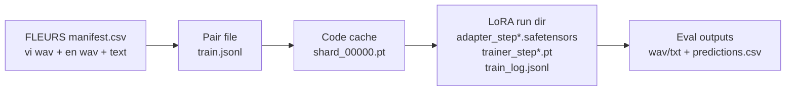
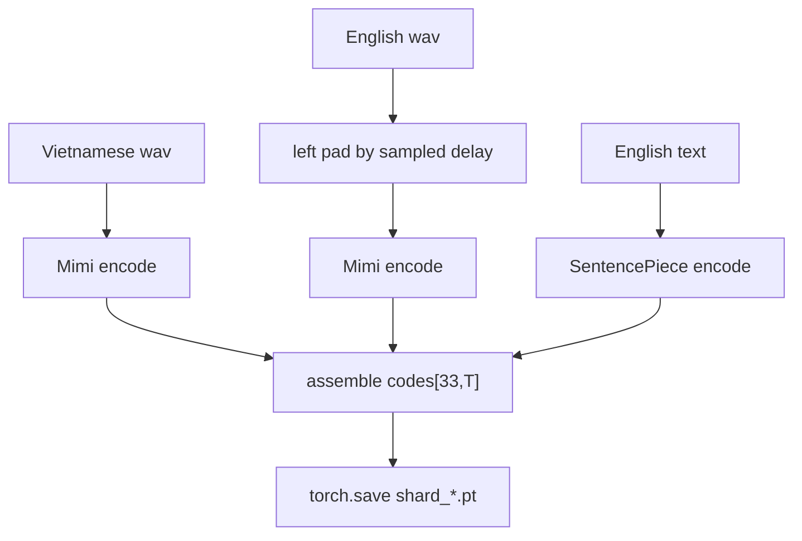
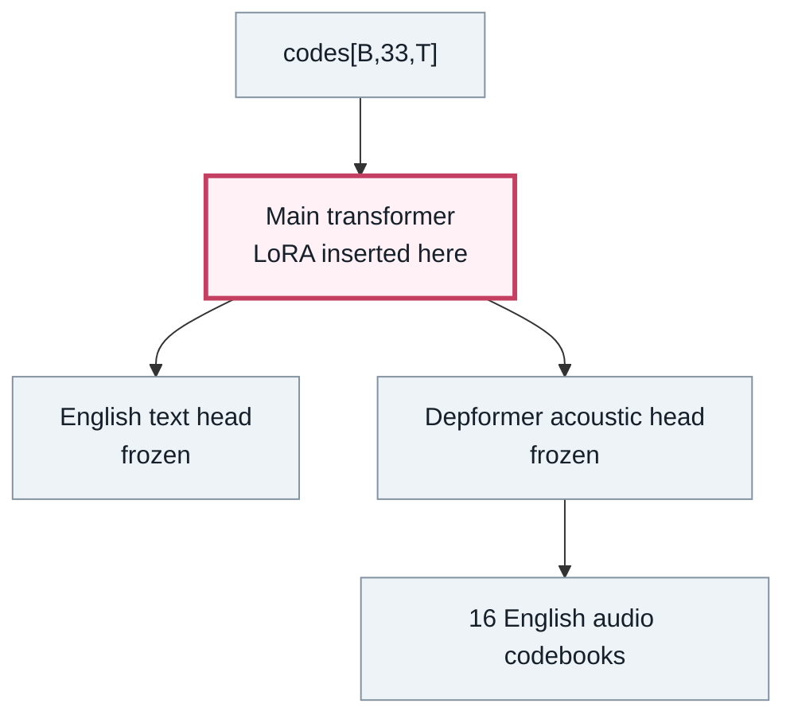
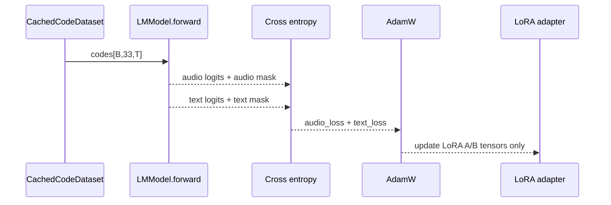
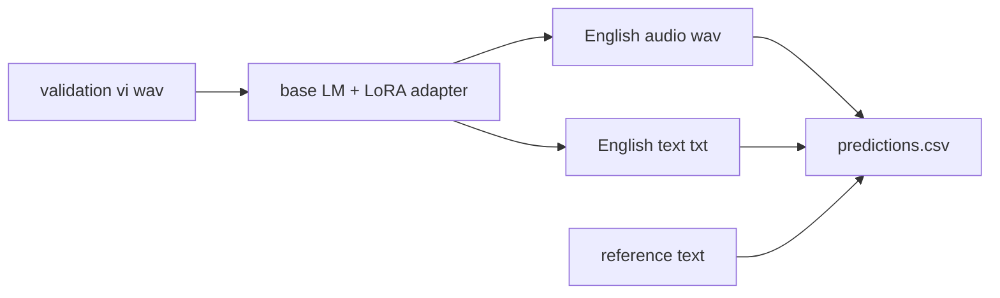
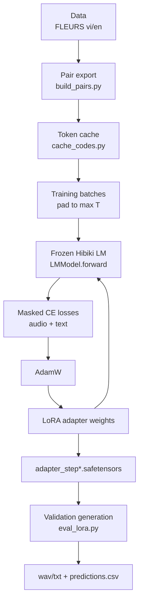

# How The Vietnamese LoRA Training Works

This doc explains the current `finetune/` scaffold in this repo. It is a mechanics guide:
what the data looks like, what the model sees, which weights move, how loss is computed, and
why the current FLEURS run is only a small water test.



If your Markdown viewer freezes SVG animation, open
[`docs/assets/training_loop.svg`](assets/training_loop.svg) directly in a browser.

## Mental Model

Hibiki-Zero is already a simultaneous speech-to-speech and speech-to-text model for
FR/ES/PT/DE -> EN. It already knows how to speak English and how to emit English text. What it
does not know is how Vietnamese source speech should map into those English outputs.

The current experiment does not retrain the whole model. It freezes almost everything and adds
a small LoRA adapter inside the main transformer. Training asks:

> Can a small main-transformer adapter make the frozen model react differently to Vietnamese
> source tokens?

That is why this is cheap and limited. It is useful for proving the pipeline and seeing whether
loss moves. It is not expected to create a strong Vietnamese model from 6 hours of FLEURS.

## Files In The Scaffold

| File | Role |
|---|---|
| [`finetune/build_pairs.py`](../finetune/build_pairs.py) | Converts FLEURS manifests into deterministic vi->en pair files. |
| [`finetune/cache_codes.py`](../finetune/cache_codes.py) | Converts audio/text into cached token tensors. |
| [`finetune/train_lora.py`](../finetune/train_lora.py) | Loads the frozen PyTorch LM, inserts LoRA, trains cross-entropy losses, saves adapters. |
| [`finetune/eval_lora.py`](../finetune/eval_lora.py) | Loads one adapter and generates small validation outputs. |
| `finetune/runs/vn_lora/train_log.jsonl` | Scalar training log: loss, audio loss, text loss, lr. |

## The Four Artifacts

Training moves through four artifact types:



The important point: the model does not train directly on `.wav` files. It trains on discrete
tokens produced once up front.

## Step 1: Build Pair Files

`build_pairs.py` reads:

```text
remote_dataset/fleurs_vi_en/{train,validation,test}/manifest.csv
```

Each manifest row already contains:

| Column | Meaning |
|---|---|
| `vi_audio` | Vietnamese source speech. |
| `en_audio` | English target speech. |
| `text_vi` | Vietnamese transcript. |
| `text_en` | English reference text. |
| `vi_duration_s`, `en_duration_s` | Durations used for filtering and delay sampling. |

The pair file is just a clean, deterministic copy of the rows we want to train or validate on.
It exists so later steps do not keep re-reading and re-filtering the full dataset.

## Step 2: Cache Mimi And Text Codes

Hibiki works at 12.5 frames per second. At each frame the model sees a stack of tokens:

```text
codes[33, T]

row 0       English text token stream
rows 1-16   English target audio Mimi codebooks
rows 17-32  Vietnamese source audio Mimi codebooks
```

Illustrated as a matrix:

```text
time/frame      0      1      2      3      ...      T
             +------+------+------+------+--------+------+
text         | pad  | the  | U.N. | also |  ...   | eos  |
target cb 1  | 831  | 144  | 090  | 541  |  ...   | -1   |
target cb 2  | 020  | 337  | 662  | 118  |  ...   | -1   |
...          | ...  | ...  | ...  | ...  |  ...   | ...  |
target cb16  | 778  | 019  | 450  | 201  |  ...   | -1   |
source cb 1  | 612  | 245  | 983  | 177  |  ...   | EOS  |
source cb 2  | 040  | 954  | 136  | 801  |  ...   | EOS  |
...          | ...  | ...  | ...  | ...  |  ...   | ...  |
source cb16  | 530  | 714  | 228  | 409  |  ...   | EOS  |
             +------+------+------+------+--------+------+
```

Details that matter:

- `-1` means "no audio token here"; the model masks those positions out.
- Text is padded with Hibiki's text pad id.
- Source audio gets an EOS frame using `card`, the audio vocabulary size.
- English text gets a SentencePiece EOS token.

### Why Cache Codes?

Mimi audio encoding is expensive and deterministic. Doing it inside the training loop would waste
time recomputing the same audio tokens every epoch. So `cache_codes.py` does this once:



The trainer then loads `shard_*.pt` files, pads batches to the longest sequence, and never touches
Mimi during training.

## Step 3: Coarse Target Delay

The paper trains simultaneous translation with coarse target alignment: the target should not
start at frame zero as if the translation were available instantly.

This scaffold approximates that at FLEURS scale:

```text
delay_s = random value in [0, target_delay_ratio * vi_duration_s]
default target_delay_ratio = 0.5
```

Then:

- English target audio is left-padded by `delay_s`.
- English text begins at `round(delay_s * 12.5)` frames.

Timeline:

```mermaid
gantt
    title Coarse target delay
    dateFormat X
    axisFormat %s
    section Source
    Vietnamese speech :active, vi, 0, 12
    Source EOS        :milestone, eos, 12, 0
    section Target
    Wait / lag        :delay, 0, 4
    English speech    :en, 4, 11
    English text      :txt, 4, 10
```



This is not true word-level alignment. It is a cheap way to avoid teaching the model an impossible
"translate before hearing anything" behavior.

## Step 4: Load The Model And Freeze Almost Everything

At training time we load the PyTorch Hibiki LM. Mimi is not loaded in the loop because codes are
already cached.



Freeze map:

| Component | Action | Reason |
|---|---|---|
| Mimi codec | Not part of trainer loop | Audio was already converted to codes. |
| Embeddings | Frozen | We are not changing token vocabularies. |
| Main transformer | LoRA trainable | This is where source-language interpretation should adapt. |
| Depformer | Frozen | It already knows how to produce English audio codebooks. |
| Text output head | Frozen | Output language remains English. |

## What LoRA Means Here

A normal linear layer computes:

```text
y = W x
```

LoRA freezes `W` and adds a small trainable low-rank update:

```text
y = W x + scaling * B(Ax)
```

Where:

- `W` is the original frozen matrix.
- `A` maps down to a tiny rank, such as 16.
- `B` maps back up.
- Only `A` and `B` are trained.

In this repo, LoRA is inserted only under:

```text
LMModel.transformer
```

The adapter file stores only LoRA tensors, not the full 5.8 GB model. That is why adapter files
are small and named like:

```text
adapter_step000005.safetensors
```

## Step 5: Forward Pass And Loss

The training loop is short:



`LMModel.forward` handles the internal shifting, delays, and masks. The trainer only selects
the target rows:

```python
audio_targets = codes[:, lm.audio_offset : lm.audio_offset + lm.dep_q]
text_targets = codes[:, :1]
```

Then it computes:

```text
loss = audio_loss_weight * audio_loss + text_loss_weight * text_loss
```

Current defaults use both weights at `1.0`.

### Why Masks Matter

Not every frame has a valid target. Padding and empty positions should not count as mistakes.
The masks returned by `LMModel.forward` define exactly which logits should be scored.

```text
valid target token      -> included in cross entropy
padding / -1 / no token -> ignored
```

## Step 6: Backward Pass

Backprop flows through the frozen model, but gradients are applied only to LoRA tensors.

That sounds contradictory, but it is normal:

```text
loss
  -> depformer/text head math is used to compute gradients
  -> main transformer activations receive gradient signal
  -> frozen base weights ignore gradients
  -> LoRA A/B weights update
```

The frozen parts still participate in the computation. They just do not change.

## Step 7: Checkpoints And Logs

Each save writes:

```text
finetune/runs/vn_lora/
  adapter_step000050.safetensors
  trainer_step000050.pt
  run_config.json
  train_log.jsonl
```

The important file for quick monitoring is `train_log.jsonl`:

```json
{"step":1,"loss":21.02,"audio_loss":10.15,"text_loss":10.88,"lr":0.0001}
{"step":2,"loss":15.50,"audio_loss":7.76,"text_loss":7.74,"lr":0.0001}
```

Interpretation:

| Signal | Meaning |
|---|---|
| `loss` decreases | The adapter can fit the cached targets at least mechanically. |
| `audio_loss` decreases | It is learning target audio code prediction. |
| `text_loss` decreases | It is learning English text token prediction. |
| `NaN` or `inf` | Bad run; current trainer fails loudly instead of saving silently. |

On MPS, `float16` went non-finite after one optimizer step. The trainer default is now
`bfloat16`.

## Step 8: Tiny Validation Generation

`eval_lora.py` loads:

- The frozen base LM.
- One transformer-only adapter.
- The Mimi codec for decoding generated audio.
- A validation pair file.

Then it generates wav/txt outputs and records:

```text
predictions.csv
```



For the 5-step smoke adapter, getting bad text such as `.` is expected. That adapter only proves
the plumbing works. It is not a trained Vietnamese model.

## What The Latest Smoke Test Proved

The verified local path is:

```text
build 20 train pairs
cache 10 samples with Mimi on MPS
train 5 LoRA steps in bfloat16
run 1 validation generation with the adapter
```

Observed smoke loss:

```text
step 1: loss 21.02
step 5: loss  9.91
```

This proves:

- The conda Python can import `moshi` and `sphn`.
- Pair export works.
- Mimi caching works.
- Code layout is accepted by `LMModel.forward`.
- LoRA parameters are trainable.
- Loss and masks are wired.
- Adapter save/load works.
- Eval generation can run with the adapter.

It does not prove translation quality.

## Why FLEURS Is Only A Water Test

The available FLEURS vi/en data here is small:

```text
train: 1449 pairs, about 6.19 h Vietnamese audio
val:    149 pairs
test:   347 pairs
```

The Hibiki-Zero paper's new-language adaptation was much larger: about 850 hours for Italian,
plus RL-style work after supervised training. So FLEURS is good for:

- catching code bugs,
- checking whether loss moves,
- testing adapter save/load,
- making sure validation generation runs.

FLEURS is not enough to conclude that LoRA-on-main can build a strong Vietnamese model.

## Commands To Reproduce The Small Path

Use the mandated conda Python:

```bash
PY=/opt/homebrew/Caskroom/miniconda/base/bin/python
```

Build pair files:

```bash
$PY finetune/build_pairs.py --splits train validation test
```

Cache a tiny sample first:

```bash
$PY finetune/cache_codes.py \
  --pairs finetune/pairs/train.jsonl \
  --out-dir finetune/cache/train \
  --limit 10 \
  --shard-size 10 \
  --device mps \
  --overwrite
```

Run a smoke train:

```bash
$PY finetune/train_lora.py \
  --cache-dir finetune/cache/train \
  --out-dir finetune/runs/vn_lora \
  --max-steps 5 \
  --save-every 0 \
  --batch-size 1 \
  --device mps
```

Run tiny validation:

```bash
$PY finetune/eval_lora.py \
  --pairs finetune/pairs/validation.jsonl \
  --adapter finetune/runs/vn_lora/adapter_step000005.safetensors \
  --out-dir finetune/runs/vn_lora/eval \
  --limit 1 \
  --device mps
```

## The Whole Loop In One Picture



## Practical Next Step

The next useful experiment is not architectural. It is a slightly larger controlled run:

1. Cache all FLEURS train.
2. Train for about 100 steps.
3. Run validation generation on 10 samples.
4. Check whether `text_loss` keeps dropping and whether generated text becomes more than trivial
   punctuation or generic English.

If that does not move, the cheap LoRA-main-only hypothesis is probably too weak and the next phase
should use much more data or unfreeze more of the model.
