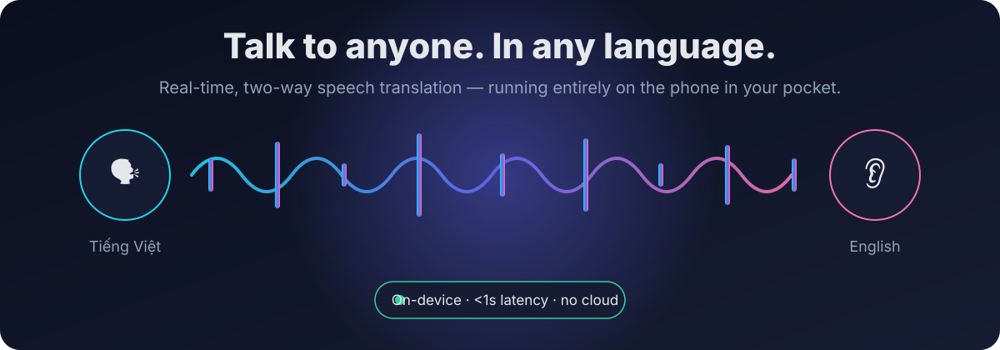
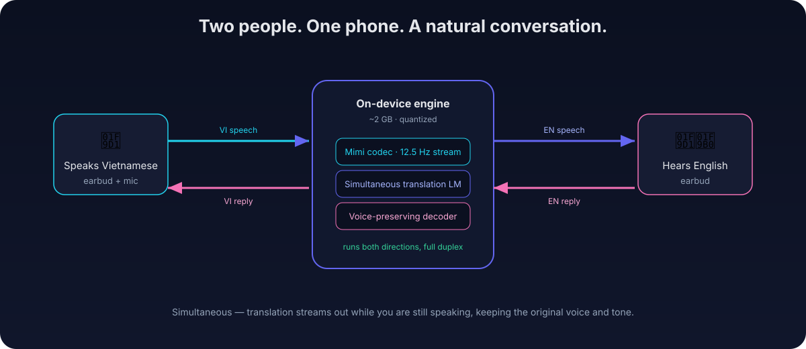
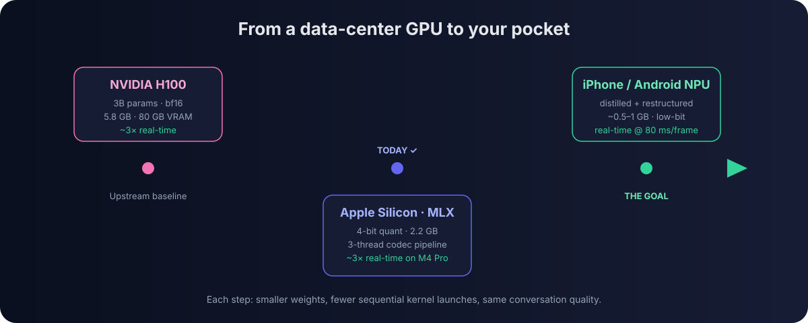
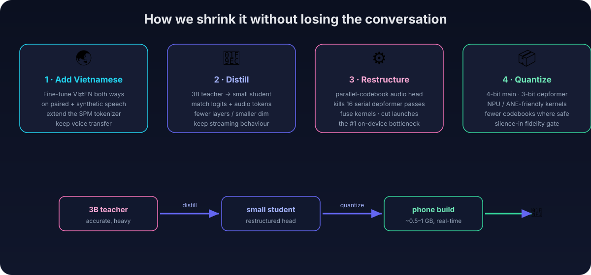
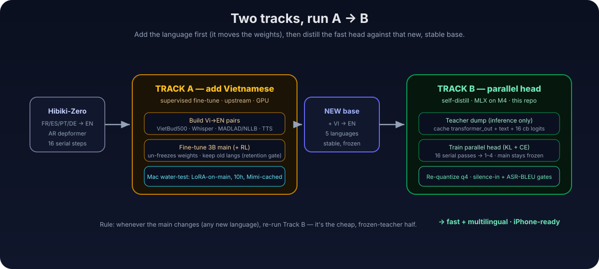
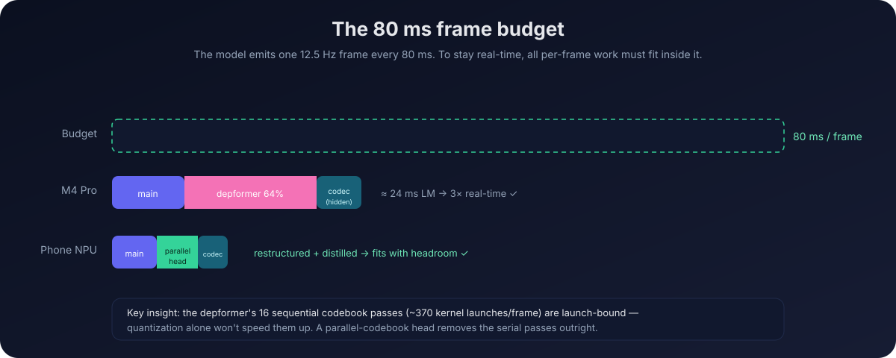
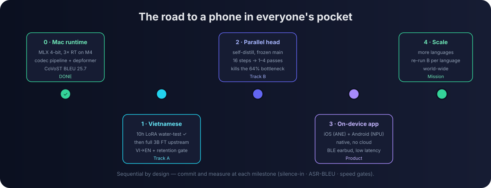

# Vision — Erase the Language Barrier, On Your Phone

### ▶ See it in motion

*One engine, many conversations — the loop cycles through Vietnamese→English, English→Spanish,
French→English, Japanese→English. Each translation streams back out **before the sentence is even
finished** (codec → translation LM → voice decoder), all on-device. (Open the SVG in a browser, or
view this file on GitHub, to watch it loop.)*

> **Mission:** let any two people hold a natural, two-way spoken conversation across a
> language barrier — in real time, on the phone already in their pocket, with no cloud,
> no subscription to a data center, and no awkward "speak… wait… read the screen" dance.

We start from [**Hibiki-Zero**](https://github.com/kyutai-labs/hibiki-zero), Kyutai's *simultaneous*
speech translation model — it streams a translation **while you are still talking**, and even
carries your voice and tone across the language gap. Today it translates FR/ES/PT/DE → EN and
needs a serious GPU. Our work makes it **multilingual (starting with Vietnamese)** and small enough
to run **natively, in real time, on a phone**.

---

## 1. Why this matters

A billion conversations never happen because the two people don't share a language. Existing
"translator apps" break the moment the conversation gets natural:

- **They are turn-based.** You speak, you stop, you wait, it plays back. Real conversation overlaps,
  interrupts, and flows — translation has to be *simultaneous*, not transactional.
- **They live in the cloud.** That means latency, dropped signal abroad, roaming costs, and your
  private conversations leaving your device.
- **They flatten you.** A robotic voice strips out who you are. Hibiki-Zero's voice transfer keeps it.

The model that fixes the first and third problems already exists. The missing piece is **making it
run, in real time, on a device you already own** — and **teaching it the languages people actually
need**. That is this project.

---

## 2. What the experience feels like

Put one earbud in, hand the other to the person across from you (or let your phone's mic and speaker
do it). You speak Vietnamese; they hear English in your voice, *as you talk*. They reply in English;
you hear Vietnamese back. Nobody stares at a screen. Nobody waits for a turn. The phone is doing all
of it locally — on an airplane, in a market with no signal, in a clinic where privacy is everything.

- **Two-way and simultaneous** — full duplex, ~1 s lag, not press-to-talk.
- **On-device** — nothing leaves the phone; works offline.
- **Voice-preserving** — the translation sounds like *you*, not a robot.
- **Low-latency earbud** — pairs with ordinary Bluetooth earphones; the heavy lifting is on the phone.

---

## 3. The technical bet: from H100 to pocket

Hibiki-Zero is a 3B-parameter model that upstream expects an NVIDIA GPU to run in real time.
We have **already** brought it to Apple Silicon: a native **MLX 4-bit** runtime that shrinks the LM
from 5.8 GB → 2.2 GB and hits **~3× real-time on an M4 Pro** via a 3-thread codec pipeline. That
proves the architecture *can* be cheap. The remaining gap — M4 laptop → phone NPU — is closed by
**changing the model's shape**, not just buying faster silicon.

### The four levers

1. **Add Vietnamese** — fine-tune the main transformer on synthesized Vi→EN speech pairs, keeping the
   existing languages and the voice-transfer behavior.
2. **Distill** — use the big, accurate model as a *teacher* to train a smaller, faster *student* head
   that behaves the same.
3. **Restructure** — replace the part of the model that is slow *by design* (see §5) with a parallel
   one. This is the single biggest on-device win.
4. **Quantize** — push weights to 4-bit (and the head to 3-bit where it's safe), targeting the NPU,
   with a fidelity gate that catches any audio degradation instantly.

---

## 4. Two tracks, run A → B

The work splits cleanly into two *different kinds of job*, and the order matters.

| | **Track A — add Vietnamese** | **Track B — make it phone-fast** |
|---|---|---|
| What changes | the 3B **main transformer** | **only a new head** on a frozen main |
| 3B frozen? | **No** — supervised fine-tune | **Yes** — never retrained |
| Targets from | real Vi→EN data (Whisper · MADLAD · TTS) | **self-distilled** from the existing model |
| Compute | upstream PyTorch + GPU | **MLX on the Mac** (cheap) |
| Output | English | English, same 16 codebooks |

**Why A before B.** Track B's whole trick is that the main transformer is *frozen*, so its output
distribution never moves — that's what lets the student head learn from the teacher with no labels.
Adding a language *moves* that distribution. So we add Vietnamese first to get a new, stable base,
then distill the fast head against it. Reverse the order and the head goes stale the moment the
language fine-tune lands. **Rule: whenever the main changes, re-run Track B** — it's the cheap half.

> A Mac-side "water test" de-risks Track A before the expensive upstream run: a **LoRA-on-main,
> Mimi-cached, 10-hour** fine-tune that answers a single yes/no — *can a frozen-depformer adapter
> even learn a new source language?* — for the price of a few hours on the M4.

---

## 5. The one bottleneck that rules the phone

The model emits one frame every **80 ms**. To be real-time on a phone, *all* per-frame work must fit
in that budget. We profiled exactly where the time goes on the M4:

- **Main transformer:** ~8.6 ms/frame.
- **Depformer head:** ~15.7 ms/frame — **64% of the GPU cost.** It builds the 16 audio codebooks
  **one at a time**, a strict 16-step recurrence = ~370 tiny kernel launches per frame.
- **Codec:** fully hidden behind the LM by the 3-thread pipeline.

The crucial finding: the depformer is **launch-bound, not compute-bound** — it scales dead-linearly
at 0.72 ms/slice, and **quantization gives it zero speedup**. The *only* fix is architectural:
replace the 16 sequential passes with a **parallel codebook head** that emits all 16 in **1–4 passes**
(delay-pattern or iterative/MaskGIT-style), trained by self-distillation against the original head.
That is Track B, and it is what turns "3× real-time on a laptop" into "real-time with headroom on a
phone."

---

## 6. The product

Native apps on both platforms, with the model running **on the device's own neural accelerator** —
Apple Neural Engine on iOS, the NPU on Android — never the cloud.

- 📱 **iOS & Android, native on-device** — `~0.5–1 GB` quantized model; works offline; private by design.
- 🎧 **Low-latency Bluetooth earbuds** — ordinary earphones; the phone is the compute, the earbud is the I/O.
- 🔁 **Conversation mode** — split-earbud or speakerphone, full-duplex, no turn-taking.
- 🗣️ **Voice-preserving** — keeps the speaker's voice across languages.
- 🌍 **Expanding language set** — Vietnamese first, then each new language is one Track-A fine-tune
  followed by a cheap Track-B re-distill.

---

## 7. Roadmap

| Milestone | What | Status |
|---|---|---|
| **0 · Mac runtime** | MLX 4-bit, 3× real-time on M4, codec pipeline, CoVoST BLEU 25.7 | ✅ Done |
| **1 · Vietnamese (Track A)** | 10h LoRA water-test → full 3B fine-tune upstream → VI→EN with old-language retention | ▶ In progress |
| **2 · Parallel head (Track B)** | Self-distill the 16-step head → 1–4 passes; kill the 64% bottleneck | ◻ Next |
| **3 · On-device app** | iOS (ANE) + Android (NPU) native; Bluetooth earbud; conversation mode | ◻ Planned |
| **4 · Scale** | More languages; re-run Track B per language; world-wide reach | ◻ Mission |

Every milestone commits behind hard gates: the **silence-in** audio test (zeros → rms < 0.10,
peak < 1.1, catches babble/clipping), **ASR-BLEU** vs the teacher, and the **80 ms speed budget**.

---

## 8. Principles

- **On-device or it doesn't count.** Privacy, offline, zero marginal cost — these are the point, not extras.
- **Simultaneous, not turn-based.** The magic is talking *over* the barrier, not through it.
- **Keep the person in the voice.** Translation shouldn't erase who's speaking.
- **Measure every step.** Speed, fidelity, and translation quality each have a gate; nothing ships on vibes.
- **Cheap where we can, expensive only where we must.** Freeze the big model; train small heads; reuse
  the teacher. The costly fine-tune is confined to adding a language.

---

*Foundation model: [Hibiki-Zero](https://github.com/kyutai-labs/hibiki-zero) (CC BY-NC-SA 4.0) ·
[paper](https://arxiv.org/abs/2602.11072) · [tech report](https://kyutai.org/blog/2026-02-12-hibiki-zero).
Engineering plans: [`docs/finetune.md`](../docs/finetune.md) (Track A water-test),
[`docs/distill_plan.md`](../docs/distill_plan.md) (Track A + B in depth).*
